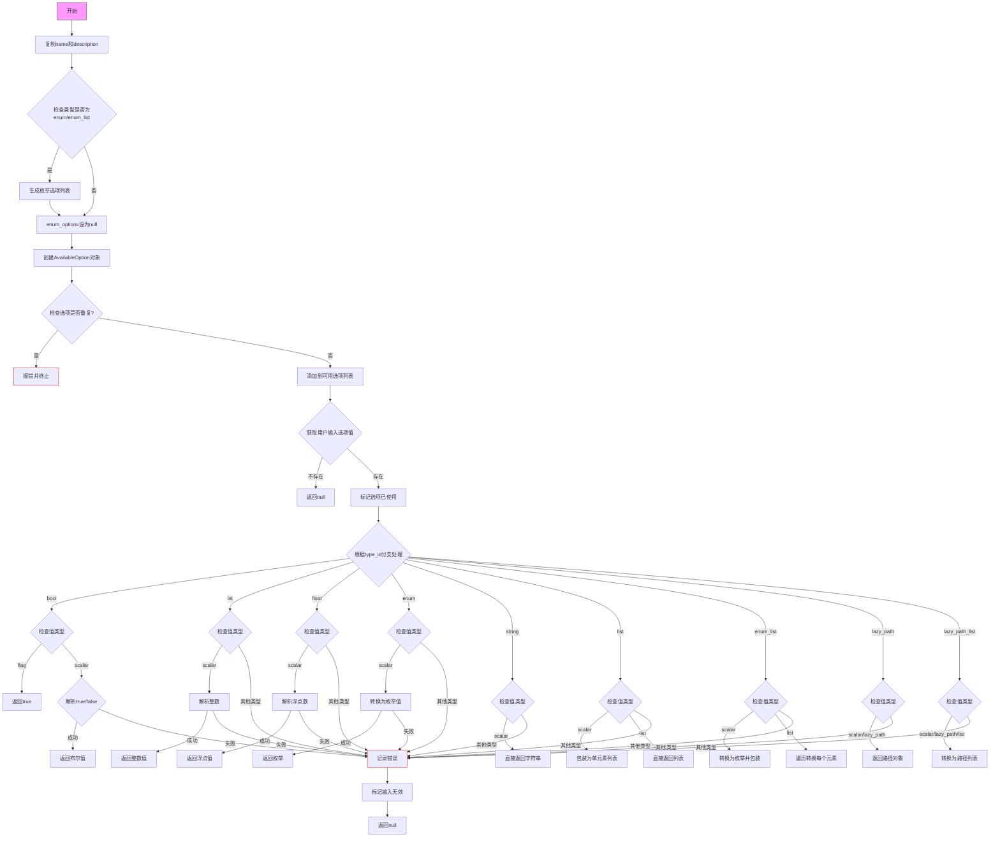

好的，我需要为给定的 Zig 函数 `option` 绘制一个流程图。首先，我要理解这个函数的结构和逻辑。

函数开始处声明了一些变量，比如 `name` 和 `description`，然后根据类型 ID 处理枚举选项。接着检查选项是否重复，并添加到可用选项列表。之后根据不同的类型 ID（如布尔、整数、浮点数、枚举等）进行各种验证和处理。每个类型都有对应的错误处理和返回值。

首先，我应该确定主要的流程分支。函数的核心是一个大的 `switch` 语句，根据 `type_id` 处理不同的数据类型。每个 `case` 处理一种类型，例如布尔、整数、字符串等，并且每个类型内部可能有不同的逻辑，比如解析值、检查有效性、记录错误等。

接下来，我需要将这些逻辑步骤转化为流程图中的节点和判断框。可能的节点包括：处理枚举选项、检查重复选项、根据类型处理值、解析标量值、处理列表、错误处理等。每个判断框对应类型检查或值验证。

需要注意的是，函数中有多个错误处理路径，例如当输入不符合预期类型时，记录错误并标记无效输入。这些都需要在流程图中体现为不同的分支。

可能的结构如下：
1. 函数入口
2. 处理枚举类型选项（如果是枚举或枚举列表）
3. 检查选项是否重复，添加到列表
4. 获取用户输入的选项值
5. 根据 `type_id` 进入不同的处理分支
6. 每个分支处理特定类型的值，进行验证和解析
7. 错误处理路径，记录错误并返回 null
8. 返回解析后的值或 null

在绘制流程图时，需要确保每个判断点（如类型检查）都有明确的是/否分支，并且错误路径集中处理。可能还需要合并一些重复的步骤，比如多个类型都需要解析标量值，但具体的解析方式不同。

最后，确保流程图的逻辑清晰，层次分明，能够反映函数的实际执行流程。
================================================
