好的，我需要帮用户分析这个用 Zig 编写的 `next` 函数，并用 Mermaid 画出它的流程图。首先，我需要理解这个函数的结构和逻辑。

函数 `next` 是一个 Tokenizer 的方法，返回一个可选的 Token。它通过不同的状态（如 `.lhs`, `.target`, `.target_reverse_solidus` 等）来处理输入字节，生成相应的 Token，或者在遇到错误时返回错误。

首先，我应该梳理每个状态之间的转换关系。例如，初始状态可能是 `.lhs`，当遇到非空白字符时转换到 `.target`。在 `.target` 状态下，不同的字符（如 `$`, `\`, `:`）会触发不同的状态转换，如 `.target_dollar_sign` 或 `.target_reverse_solidus`。

接下来，每个状态下的处理逻辑需要被映射为流程图的节点。例如，在 `.target` 状态下，处理 `$` 会进入 `.target_dollar_sign`，处理 `\` 进入 `.target_reverse_solidus`，处理 `:` 进入 `.target_colon`，其他字符则继续增加索引。

同时，错误处理部分也需要考虑。例如，在 `.target` 状态下遇到空白字符会返回错误，或者在 `.target_reverse_solidus` 遇到无效字符也会返回错误。

在处理每个状态时，还需要注意循环结构，因为函数使用 `while (self.index < self.bytes.len)` 循环遍历字节。当循环结束时（即处理完所有字节），根据当前状态进行不同的处理，可能返回 Token、错误或 null。

需要注意的是，每个状态转换可能伴随条件判断（如字符匹配），这些条件需要作为流程图的决策节点。此外，返回 Token 或错误的位置也需要作为终止节点。

最后，将所有这些状态和转换用 Mermaid 的语法表示出来，确保结构清晰，逻辑正确。可能需要将大函数分解为多个子流程，但由于用户希望一个流程图，需要合理组织层级，避免过于复杂。

可能遇到的问题包括状态过多导致流程图庞大，需要适当合并或分组；确保所有转换条件都被覆盖；正确处理循环结束后的状态处理。需要多次检查代码，确认每个状态转换的条件和结果，保证流程图的准确性。
================================================

```mermaid
graph TD
    start([Start]) --> checkIndex{self.index < bytes.len?}
    
    checkIndex -->|Yes| switchState[Switch self.state]
    checkIndex -->|No| handleEOF[Handle EOF cases]
    
    switchState --> lhs[State: lhs]
    switchState --> target[State: target]
    switchState --> targetReverse[State: target_reverse_solidus]
    switchState --> targetDollar[State: target_dollar_sign]
    switchState --> targetColon[State: target_colon]
    switchState --> targetColonRS[State: target_colon_reverse_solidus]
    switchState --> rhs[State: rhs]
    switchState --> rhsCont[State: rhs_continuation]
    switchState --> rhsContLF[State: rhs_continuation_linefeed]
    switchState --> prereqQuote[State: prereq_quote]
    switchState --> prereq[State: prereq]
    switchState --> prereqCont[State: prereq_continuation]
    switchState --> prereqContLF[State: prereq_continuation_linefeed]
    
    %% LHS State
    lhs -->|Whitespace| lhsIgnore[Ignore whitespace\nindex++]
    lhs -->|Non-whitespace| setTarget[Set state=target\nstart=index]
    
    %% Target State
    target -->|Whitespace| errorIllegalChar1[Return error]
    target -->|$| setTargetDollar[Set state=target_dollar_sign\nindex++]
    target -->|\\| setTargetReverse[Set state=target_reverse_solidus\nindex++]
    target -->|:| setTargetColon[Set state=target_colon\nindex++]
    target -->|Other| incIndex[Continue\nindex++]
    
    %% Target Reverse Solidus
    targetReverse -->|Invalid char| errorIllegalChar2[Return error]
    targetReverse -->|Special char| resolveTarget[Set must_resolve\ntarget state\nindex++]
    targetReverse -->|$| setTargetDollar2[Set state=target_dollar_sign\nindex++]
    targetReverse -->|Other| backToTarget[Return to target state\nindex++]
    
    %% Target Dollar Sign
    targetDollar -->|$| resolveDollar[Set must_resolve\ntarget state\nindex++]
    targetDollar -->|Other| errorIllegalChar3[Return error]
    
    %% Target Colon
    targetColon -->|Line end| checkTargetNull1[Check target null\nReturn token?]
    targetColon -->|/ or \\| setTargetColonRS[Set state=target_colon_reverse_solidus\nindex++]
    targetColon -->|Other| transitionRHS[Set state=rhs\nReturn token?]
    
    %% Target Colon Reverse Solidus
    targetColonRS -->|Line end| checkTargetNull2[Check target null\nReturn token?]
    targetColonRS -->|Other| backToTarget2[Return to target state]
    
    %% RHS State
    rhs -->|Whitespace| ignoreRHSWhitespace[Ignore\nindex++]
    rhs -->|Line end| resetToLHS[Set state=lhs]
    rhs -->|\\| setRHSCont[Set state=rhs_continuation\nindex++]
    rhs -->|"| startPrereqQuote[Set state=prereq_quote\nstart=index++]
    rhs -->|Other| startPrereq[Set state=prereq\nstart=index]
    
    %% RHS Continuation
    rhsCont -->|\\n| continueRHS[Set state=rhs\nindex++]
    rhsCont -->|\\r| setRHSContLF[Set state=rhs_continuation_linefeed\nindex++]
    rhsCont -->|Other| errorContinuation[Return error]
    
    %% RHS Continuation Linefeed
    rhsContLF -->|\\n| continueRHS2[Set state=rhs\nindex++]
    rhsContLF -->|Other| errorContinuation2[Return error]
    
    %% Prereq Quote
    prereqQuote -->|"| finishQuote[Return prereq token\nindex++]
    prereqQuote -->|Other| continueQuote[index++]
    
    %% Prereq
    prereq -->|Whitespace/Line end| finishPrereq[Return prereq token]
    prereq -->|\\| setPrereqCont[Set state=prereq_continuation\nindex++]
    prereq -->|Other| continuePrereq[index++]
    
    %% Prereq Continuation
    prereqCont -->|\\n| finishPrereqCont[Return token\nindex++]
    prereqCont -->|\\r| setPrereqContLF[Set state=prereq_continuation_linefeed\nindex++]
    prereqCont -->|Other| handleSpecialCont[Handle continuation logic]
    
    %% Prereq Continuation Linefeed
    prereqContLF -->|\\n| finishPrereqCont2[Return token\nindex++]
    prereqContLF -->|Other| errorContinuation3[Return error]
    
    %% EOF Handling
    handleEOF -->|States: lhs/rhs...| returnNull[Return null]
    handleEOF -->|Target states| errorIncomplete[Return incomplete error]
    handleEOF -->|Special cases| handleEdgeCases[Process remaining bytes\nReturn tokens/errors]
    
    %% Terminal Nodes
    errorIllegalChar1 --> terminate
    errorIllegalChar2 --> terminate
    errorIllegalChar3 --> terminate
    errorContinuation --> terminate
    errorContinuation2 --> terminate
    errorContinuation3 --> terminate
    errorIncomplete --> terminate
    finishTarget --> terminate
    finishPrereq --> terminate
    returnNull --> terminate([End])
    
    classDef logic fill:#f9f,stroke:#333;
    classDef state fill:#9f9,stroke:#333;
    classDef terminal fill:#f99,stroke:#333;
    
    class checkIndex,switchState,handleEOF logic
    class lhs,target,targetReverse,targetDollar,targetColon,targetColonRS,rhs,rhsCont,rhsContLF,prereqQuote,prereq,prereqCont,prereqContLF state
    class terminate,errorIllegalChar1,errorIllegalChar2,errorIllegalChar3,errorContinuation,errorContinuation2,errorContinuation3,errorIncomplete,finishTarget,finishPrereq,returnNull terminal
```
