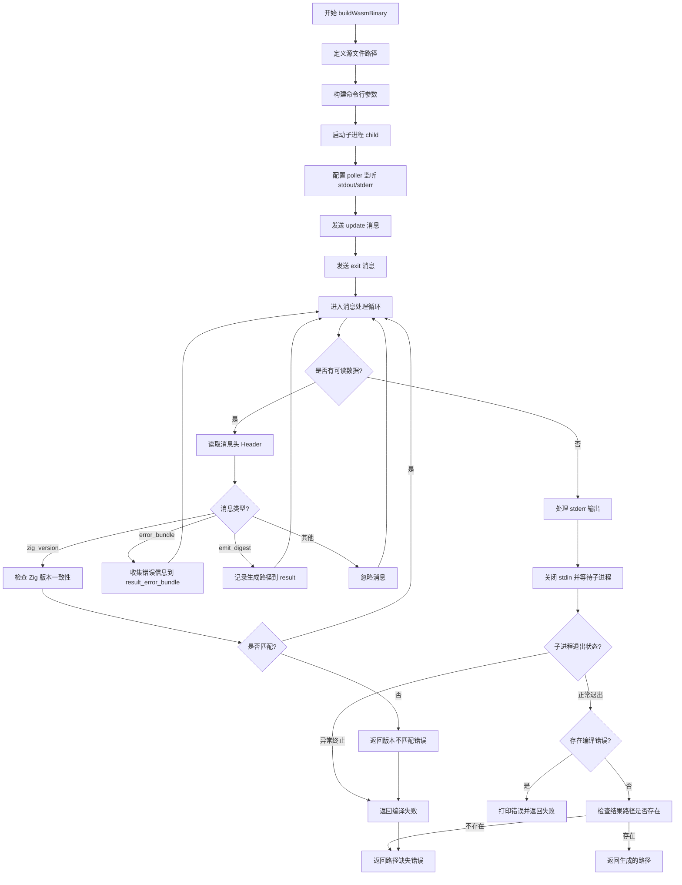

嗯，我需要为这个Zig函数画一个流程图。首先，我得仔细阅读代码，理解每个步骤的作用。这个函数叫做buildWasmBinary，看起来是用来构建WebAssembly二进制文件的。

首先，函数接收三个参数：ws（WebServer指针）、arena（内存分配器）和optimize_mode（优化模式）。返回值是Path类型，可能表示生成的二进制文件路径。

接下来，函数内部定义了一些路径变量，比如main_src_path、walk_src_path和html_render_src_path。这些路径指向不同的Zig源文件，可能是构建过程中需要的依赖项。

然后，创建了一个argv数组，用于构建命令行参数。这里使用zig build-exe命令来编译WebAssembly。注意到有很多选项，比如-fno-entry、-O指定优化模式、-target设置目标架构等。还添加了依赖项，比如Walk和html_render，并通过-Mroot、-MWalk等选项指定模块路径。

之后，启动了子进程child，配置了标准输入、输出和错误的行为为管道。然后通过poller来监听子进程的输出和错误流。发送了两个消息：update和exit，可能是通知子进程进行更新并退出。

在处理子进程的输出时，使用了一个循环来读取消息头（Header），根据不同的消息类型进行处理。比如处理.zig_version检查版本是否匹配，.error_bundle收集错误信息，.emit_digest处理生成的二进制摘要等。如果出现错误，会记录并返回错误。

最后，等待子进程结束，检查退出状态码。如果有错误信息，会打印出来并返回编译失败。如果一切正常，返回生成的路径result。

现在需要考虑如何将这一流程转化为流程图。流程图应该包括开始、参数处理、命令行构建、子进程启动、消息发送、输出处理、错误处理、子进程等待、结果返回等步骤。每个判断点（比如是否有错误、子进程是否正常退出）需要分支。

可能需要注意的节点包括：

1. 函数开始。
2. 定义源文件路径。
3. 构建命令行参数。
4. 启动子进程。
5. 配置poller监听输出。
6. 发送update和exit消息。
7. 循环读取消息头。
8. 处理不同消息类型（版本检查、错误收集、生成摘要）。
9. 处理标准错误输出。
10. 关闭标准输入，等待子进程结束。
11. 检查子进程退出状态。
12. 处理编译错误。
13. 返回结果或错误。

在流程图中，每个步骤用矩形框表示，判断用菱形框，箭头表示流程方向。需要处理可能的错误路径，比如版本不匹配、子进程非正常退出、编译错误等。

可能遇到的挑战是处理消息循环部分，尤其是当有多个消息类型需要处理时。需要确保每个消息类型的分支正确，并且错误情况能够正确跳转到错误处理流程。

另外，在发送消息后，需要等待子进程的输出，这可能涉及到异步处理，但流程图需要简化这些步骤，使其清晰易懂。

最后，确保所有可能的出口都被覆盖，比如正常返回路径和多个错误返回路径。
================================================
