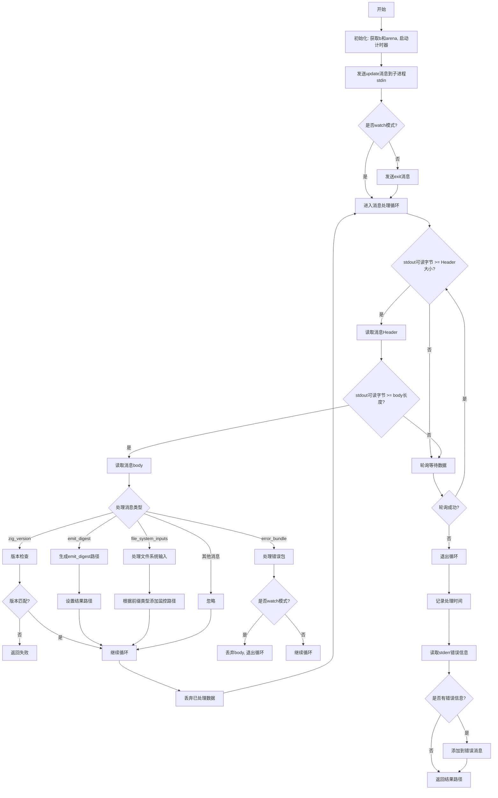

嗯，我需要为这个Zig函数`zigProcessUpdate`画一个流程图。首先，我得先理解这个函数的结构和逻辑流程。让我仔细看看代码。

函数开始于获取`b`和`arena`，然后启动计时器。接着向子进程发送消息，如果是非watch模式，还发送exit消息。然后处理消息头，进入循环轮询stdout。根据不同的消息类型（比如zig_version、error_bundle等），执行不同的操作，比如版本检查、错误处理、生成digest等。处理完消息后，记录时间，处理stderr的错误信息，最后返回结果。

接下来，我需要把这些步骤转化为流程图。流程图应该包括开始、各个判断和操作步骤，以及结束。注意条件判断，比如watch是否为true，不同的消息类型处理。循环处理stdout的部分可能需要一个循环结构。错误处理和返回结果的部分也需要标出。

可能遇到的难点是如何正确表示循环和条件分支的结构，尤其是处理不同消息类型的switch部分。另外，函数中有多个可能的返回点，需要明确每个分支的走向。还要注意处理错误的情况，比如`try`语句可能引发错误，需要捕获吗？但根据代码，错误似乎通过try向上传递，所以流程图可能不需要详细展示错误处理，除非有特定的错误处理步骤。

现在，按照步骤分解：

1. 函数开始：初始化变量，启动计时器。
2. 发送消息到子进程的stdin。
3. 非watch模式下发送exit消息。
4. 进入循环轮询stdout：
   a. 检查是否有足够的字节读取Header。
   b. 读取Header。
   c. 检查是否有足够的字节读取body。
   d. 根据Header的tag处理不同类型的消息。
   e. 处理完每个消息后丢弃已读数据。
5. 处理完成后记录时间。
6. 读取stderr的错误信息。
7. 返回结果。

消息处理部分有多个case，每个case有不同的操作，比如版本检查、错误处理、emit_digest生成路径等。这些需要不同的分支。

在流程图中，循环结构可以用一个循环框表示，内部包含处理不同消息的条件分支。每个消息类型对应不同的处理步骤，可能需要分开表示。

需要注意，循环可能因为poll失败而退出，所以在流程图中需要处理循环退出的条件。

最后，整合所有步骤，确保流程正确连贯，没有遗漏重要的判断或操作。
================================================
