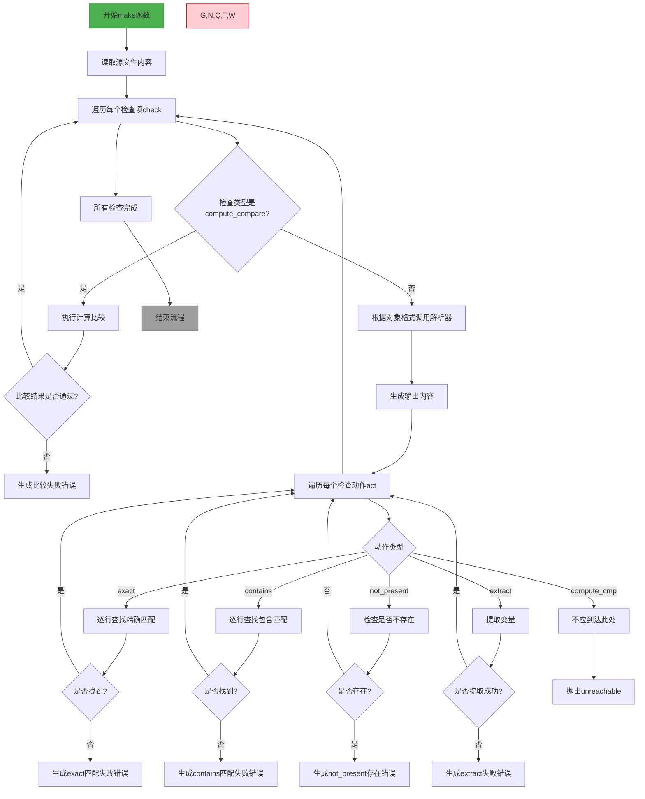

好的，我现在需要帮助用户将给定的Zig函数转换成Mermaid流程图。首先，我需要仔细阅读并理解这个函数的功能和结构。

这个函数名为`make`，接受一个`*Step`和`MakeOptions`作为参数，返回一个错误联合类型`!void`。看起来这是构建系统的一部分，用于检查某个对象文件是否符合预期。函数内部主要处理不同的检查类型，比如计算比较、精确匹配、包含、不包含和提取等。

首先，函数开始部分处理`CheckObject`，获取源文件路径，并读取文件内容。接下来，根据不同的检查类型（`compute_compare`和其他格式如macho、elf等）进行处理。对于`compute_compare`，它执行计算比较，如果失败则返回错误。对于其他格式，可能调用不同的解析器（如MachODumper、ElfDumper等）来解析文件内容并生成输出。

然后，根据不同的检查动作（如exact、contains、not_present、extract），对解析后的输出进行逐行检查。每个动作有不同的处理逻辑，如果检查失败，则返回相应的错误信息。

接下来，我需要将这些步骤转化为流程图。流程图应该包括开始、结束、主要步骤、条件判断和错误处理。需要注意的是循环、条件分支以及不同检查类型的处理路径。

可能的步骤分解：

1. 开始函数。
2. 读取源文件内容。
3. 遍历每个检查项（check）。
4. 判断检查类型是否为compute_compare：
   - 是：执行计算比较，检查结果，失败则报错。
   - 否：根据对象格式调用相应的解析器，生成输出。
5. 对于每个检查动作，按类型处理：
   - exact：逐行查找匹配项，找不到则报错。
   - contains：类似exact，但可能需要部分匹配。
   - not_present：确保不存在匹配项，存在则报错。
   - extract：提取变量，失败则报错。
6. 所有检查通过后结束。

在绘制流程图时，需要处理循环遍历检查项和动作，以及每个条件分支下的不同处理逻辑。同时，错误处理部分需要连接到相应的失败节点。

需要注意的细节包括：
- 函数开始时的初始步骤（读取文件，初始化变量）。
- 处理不同对象格式的分支（macho、elf等）。
- 每个检查动作的不同处理逻辑。
- 错误信息的格式化与返回。

现在，我需要将这些步骤用Mermaid语法结构化，确保逻辑清晰，分支正确。可能需要使用子流程或分组来简化复杂的部分，比如遍历检查项和动作的循环结构。
================================================
