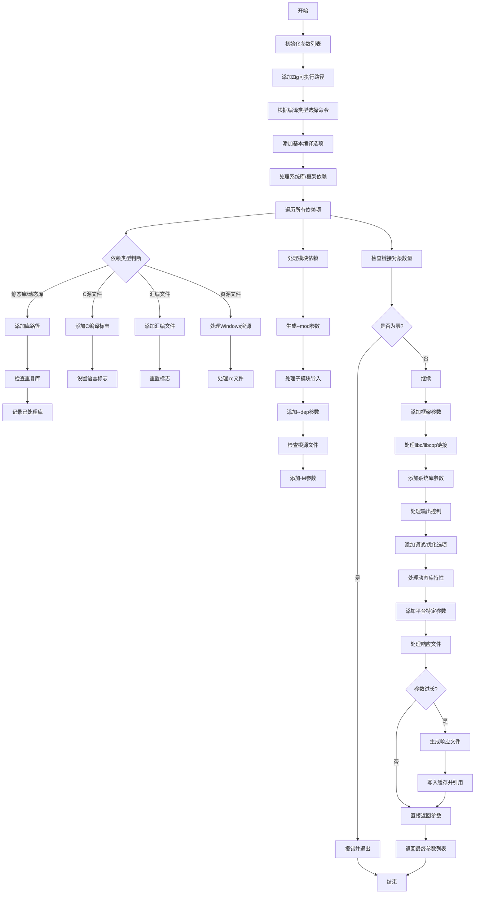

嗯，用户让我用Mermaid画一个函数的流程图，这个函数是用Zig写的，看起来是构建系统的一部分，负责生成Zig编译器的参数。首先，我需要理解这个函数的结构和逻辑流程。

首先，函数名是`getZigArgs`，接受一个`Compile`结构体的指针和一个布尔值`fuzz`，返回一个二维的`u8`数组。看起来这个函数主要是构建调用Zig编译器时需要的命令行参数列表。

让我先浏览一下代码的大致结构。函数开始初始化一个`ArrayList`来存储参数，然后添加Zig可执行文件路径和根据编译类型（如lib、exe等）选择对应的命令。接下来有很多条件判断，添加各种编译选项，比如引用跟踪、LLVM/LLD的使用、目标格式、入口点设置等等。

中间部分处理系统库、框架、链接对象，包括静态库、动态库、C源文件、汇编文件等。然后处理模块依赖，包括CLI模块的参数，确保链接器有足够的对象文件。之后还有一些特定的链接选项，如栈大小、模糊测试标志、调试信息、优化选项等。

代码后半部分处理manifest文件、镜像基址、测试过滤器、日志选项、输出文件控制（如生成ASM、二进制文件等），以及各种链接器标志，如压缩调试节、GC节、动态库选项等。还包括处理系统根目录、搜索路径、构建ID、子系统设置、错误限制等。

最后，处理参数长度过长的情况，使用响应文件来避免命令行长度限制，并返回生成的参数列表。

现在，要画流程图，需要将整个函数的逻辑分解成步骤，并用流程图的节点和箭头表示控制流。可能需要将主要步骤分组，比如初始化参数、处理编译类型、添加各种标志、处理依赖库和模块、处理链接选项、处理输出和调试、处理参数长度等。

需要注意的是，代码中有很多条件判断和循环，比如遍历依赖项、处理不同的链接对象类型等。这些需要在流程图中用判断节点和循环结构表示。同时，错误处理部分（如`step.fail`）也需要在流程图中体现。

可能遇到的挑战是如何在不过于复杂的情况下清晰地表达整个函数的逻辑，尤其是处理大量的条件分支和循环。可能需要将某些复杂部分简化为子流程，或者用注释节点说明关键步骤。

另外，用户提供的代码中有很多Zig特定的语法和构建系统的内部结构，需要确保流程图中的节点使用通用的术语，或者适当注释，以便理解。

总结一下，流程图的步骤可能包括：

1. 初始化参数列表，添加Zig可执行路径和编译命令。
2. 根据编译类型添加对应的命令（build-lib、build-exe等）。
3. 添加各种编译选项和标志，如引用跟踪、LLVM/LLD、目标格式、入口点设置。
4. 处理系统库和框架，遍历依赖项，添加链接对象。
5. 处理模块依赖，生成CLI参数，确保足够的链接对象。
6. 添加链接器选项，如栈大小、模糊测试、调试信息等。
7. 处理输出文件控制（生成ASM、二进制等）。
8. 添加系统根目录、搜索路径、构建ID等。
9. 处理参数长度，必要时生成响应文件。
10. 返回最终的参数列表。

在每个步骤中，需要处理条件判断和循环，比如根据不同的编译类型选择命令，根据是否存在某些选项添加对应的参数，遍历依赖项添加链接对象等。

最后，需要将这些步骤用Mermaid的流程图语法表示出来，合理使用判断节点、循环节点和子流程，保持图表的结构清晰，避免过于拥挤。
================================================

流程图说明：
1. 从初始化参数开始，逐步构建命令行参数
2. 核心逻辑分为依赖项处理（系统库/C文件/资源文件等）、模块依赖关系处理、链接参数配置三大部分
3. 包含关键检查点：链接对象数量检查、参数长度检查
4. 使用条件分支处理不同文件类型和平台特性
5. 最终通过直接返回或响应文件两种方式输出参数列表
6. 错误处理流程直接终止构建过程

注：由于函数逻辑复杂，此图进行了适当简化，重点表现核心流程和关键判断点。实际实现中包含更多条件分支和平台特定处理，但整体控制流保持一致。