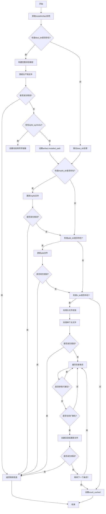

好的，我现在需要为提供的Zig函数`make`绘制一个流程图。首先，我得仔细阅读并理解这个函数的逻辑。

函数`make`接受一个`Step`指针和`MakeOptions`，返回错误联合类型。函数的主要作用似乎是安装构建产物，比如二进制文件、动态库符号链接、导入库、PDB文件和头文件等。

首先，函数通过`@fieldParentPtr`获取`InstallArtifact`实例。然后检查`dest_dir`是否存在，如果存在，处理主产物安装，包括可能的动态库符号链接。接着处理`implib_dir`（导入库）、`pdb_dir`（调试信息文件）和`h_dir`（头文件）的安装。

对于头文件目录`h_dir`，处理单个文件安装和整个目录的安装，包括排除和包含特定扩展名的文件。遍历目录时，处理每个条目，如果是目录则创建路径，如果是文件则更新文件，并跟踪是否所有步骤都是缓存的（即文件未变化，无需更新）。

最后，设置`step.result_cached`为`all_cached`，表示所有操作是否都是缓存命中。

接下来，我需要将这些步骤转化为流程图。流程图应涵盖主要的条件判断和循环结构。可能的节点包括开始、结束、条件判断（如各个目录是否存在）、文件处理步骤、错误处理以及循环遍历目录条目等。

需要注意，Zig中的错误处理是通过返回错误或调用`step.fail`，这在流程图中需要表示为错误路径。此外，循环结构如`for`和`while`循环需要正确表示。

可能的结构如下：

1. 开始
2. 获取InstallArtifact实例
3. 处理dest_dir
   a. 更新文件到目标路径
   b. 处理dylib_symlinks
4. 处理implib_dir
   a. 更新implib文件
5. 处理pdb_dir
   a. 更新pdb文件
6. 处理h_dir
   a. 处理单个头文件
   b. 遍历目录，处理每个条目
      i. 排除特定扩展名
      ii. 包含特定扩展名
      iii. 创建目录或更新文件
7. 设置result_cached
8. 结束

错误处理在每个文件操作处都可能出现，导致提前返回错误。

现在需要考虑如何用Mermaid语法表示这些步骤，包括条件判断、循环和错误处理。例如，使用菱形表示条件判断，矩形表示操作，箭头表示流程方向，虚线或不同颜色表示错误路径。

可能遇到的挑战是如何简洁地表示目录遍历和条件排除/包含扩展名的逻辑。可能需要将循环展开为多个步骤，或者使用子流程来表示。

另外，由于代码中有多个条件分支（如各个目录是否存在），流程图需要清晰地展示每个条件的分支路径。

最终，流程图应准确反映函数的执行流程，包括所有可能的路径和错误情况。
================================================

该流程图展示了以下关键流程：
1. 主产物安装路径处理
2. 动态库符号链接创建
3. 导入库(implib)、PDB文件和头文件的安装处理
4. 头文件目录的递归遍历和过滤逻辑
5. 错误处理贯穿所有文件操作步骤
6. 最终缓存状态的设置
7. 所有可能的执行路径（包括条件分支和循环）

菱形节点表示条件判断，矩形节点表示操作步骤，红色箭头表示错误路径，黑色箭头表示正常流程。目录遍历通过循环结构表示，使用条件判断实现文件过滤逻辑。