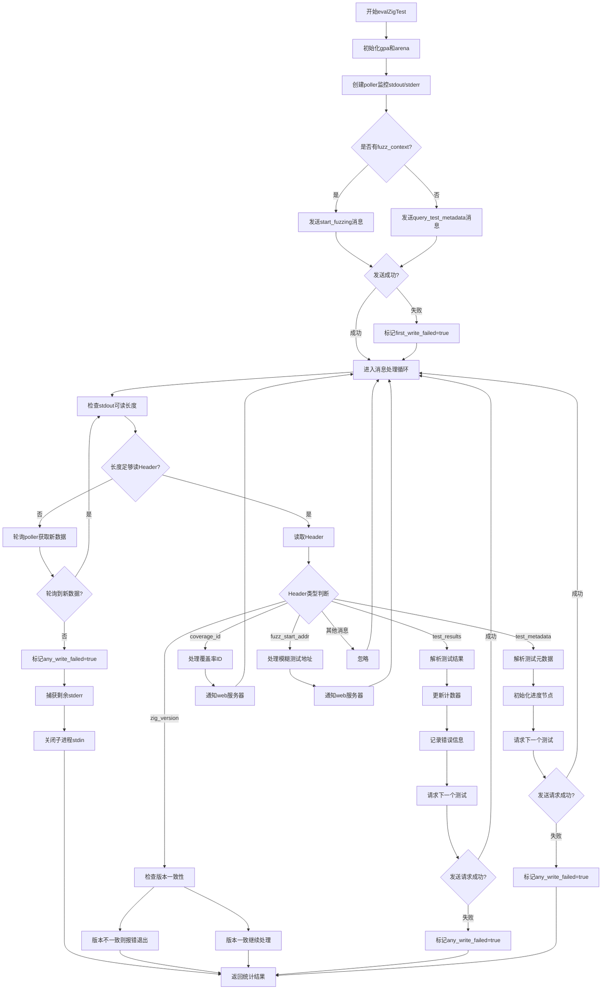

嗯，用户让我用Mermaid画一个Zig函数的流程图。首先，我需要理解这个函数的结构和逻辑。这个函数叫做evalZigTest，看起来是处理子进程的输出，比如标准输出和标准错误，然后根据不同的消息类型进行相应的处理。

首先，函数开始的时候，会初始化一些变量，比如gpa和arena，这两个都是分配器。然后创建了一个poller，用来监控子进程的stdout和stderr。接下来，根据是否有fuzz_context，会尝试向子进程的stdin发送不同的消息。如果发送失败，会记录错误并设置first_write_failed标志。

然后进入主循环，不断从stdout读取消息头（Header），根据不同的消息类型进行处理。比如处理版本信息、测试元数据、测试结果、覆盖率ID等。在处理测试结果时，会统计失败、跳过、泄漏和错误日志的数量，并记录相应的错误信息。

如果在处理过程中出现写入失败，比如子进程关闭了stdin，函数会进入错误处理流程，继续轮询以捕获所有可能的stderr输出。最后，关闭子进程的stdin，并返回结果，包括各种统计数据和错误信息。

接下来，我需要将这个过程转化为流程图。流程图应该从函数入口开始，依次展示各个步骤，包括初始化、发送初始消息、轮询处理消息、错误处理、结果汇总等。每个判断分支（如是否有fuzz_context，消息类型判断）都需要相应的条件框，不同的处理路径用箭头连接。

需要注意的是，Mermaid的流程图语法需要正确使用节点、条件判断和箭头。比如，使用菱形表示条件判断，矩形表示处理步骤。同时，循环结构（如while循环）需要用条件判断和返回箭头来表示。

可能会有一些复杂的部分，比如多个消息类型的处理，需要分别列出每个case的处理步骤。另外，错误处理的流程也需要清晰地展示出来，比如当发送消息失败时如何跳转到错误处理部分。

最后，确保流程图的逻辑与代码一致，没有遗漏重要的步骤或判断条件。可能需要多次检查，确保每个分支都被正确表示，流程的走向符合代码的执行顺序。
================================================
