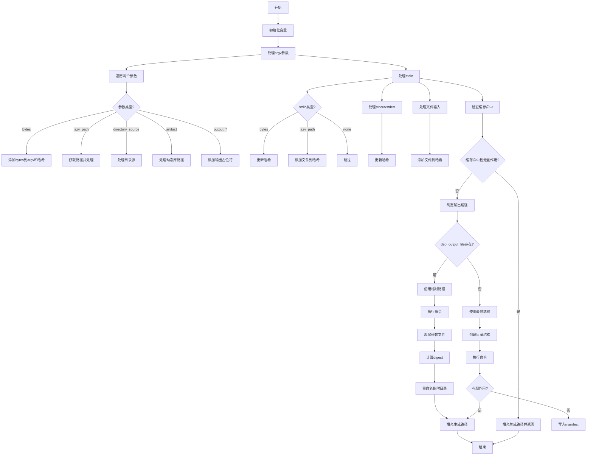

嗯，我现在需要画这个Zig函数的流程图。首先，我得仔细读一遍代码，理解每个部分的功能。这个函数叫做make，属于Build/Step/Run.zig模块。看起来是处理构建步骤中的运行命令的部分。

首先，函数接受一个Step指针和MakeOptions参数，返回一个错误联合类型。函数里有很多步骤，比如初始化参数列表、处理不同类型的参数、处理输入输出、缓存检查、执行命令等。

我需要分解这个函数的流程。首先是初始化一些变量，比如prog_node、b、arena、run等。然后处理argv_list和output_placeholders，遍历run.argv中的每个参数，根据不同的类型（如bytes、lazy_path、artifact等）添加到argv_list，并更新哈希。

接下来处理标准输入（stdin）的情况，可能包括字节、文件路径或无输入。然后是处理捕获的标准输出和标准错误，更新哈希。接着处理文件输入，添加到哈希中。

之后检查是否有缓存命中，如果有的话就直接使用缓存结果，设置result_cached并返回。如果没有缓存命中，继续处理输出路径，可能是临时目录，然后执行命令runCommand。之后处理依赖文件和输出路径的重命名，最后更新生成的路径。

需要理清每个条件分支，比如是否有side_effects，是否知道最终的输出路径（dep_output_file是否存在）。还有处理临时目录和最终目录的移动，以及错误处理的情况。

可能用到的判断条件包括：has_side_effects、cacheHitAndWatch的结果、dep_output_file是否存在、any_output等。每个条件分支会导致不同的处理流程，比如是否写入manifest，是否重命名目录等。

流程图的大致结构可能是：

1. 初始化和变量声明
2. 处理每个参数，添加到argv_list和哈希
3. 处理输入（stdin、文件输入等）
4. 检查缓存是否命中，命中则跳过执行
5. 否则，确定输出路径（临时或最终）
6. 执行命令
7. 处理依赖文件和输出路径的移动
8. 更新生成的路径

每个步骤中会有条件判断，比如参数类型、缓存命中、是否有side_effects等。需要把这些条件用菱形判断框表示出来，不同的路径分支开来。

需要注意错误处理的部分，比如makePath失败时的错误返回，rename时的错误处理，这些可能在流程图中用异常处理分支表示。

可能还需要考虑循环结构，比如遍历run.argv.items的每个arg，这在流程图中是一个循环过程。

总结来说，流程图需要覆盖主要的处理步骤，条件分支，循环，以及错误处理。现在需要把这些结构用mermaid语法表达出来，确保每个步骤和判断都正确对应代码逻辑。
================================================

该流程图按以下逻辑展开：
1. 初始化变量和参数处理阶段，遍历所有参数并分类处理
2. 输入处理阶段包含标准输入、输出捕获和文件输入
3. 缓存检查阶段决定是否跳过命令执行
4. 路径处理阶段根据是否预知输出路径分为临时目录和最终目录两种情况
5. 命令执行后处理依赖关系和输出路径
6. 最终统一处理生成的路径并结束流程
各菱形节点表示关键条件判断，矩形节点表示具体操作步骤，箭头方向表示执行流程的走向。