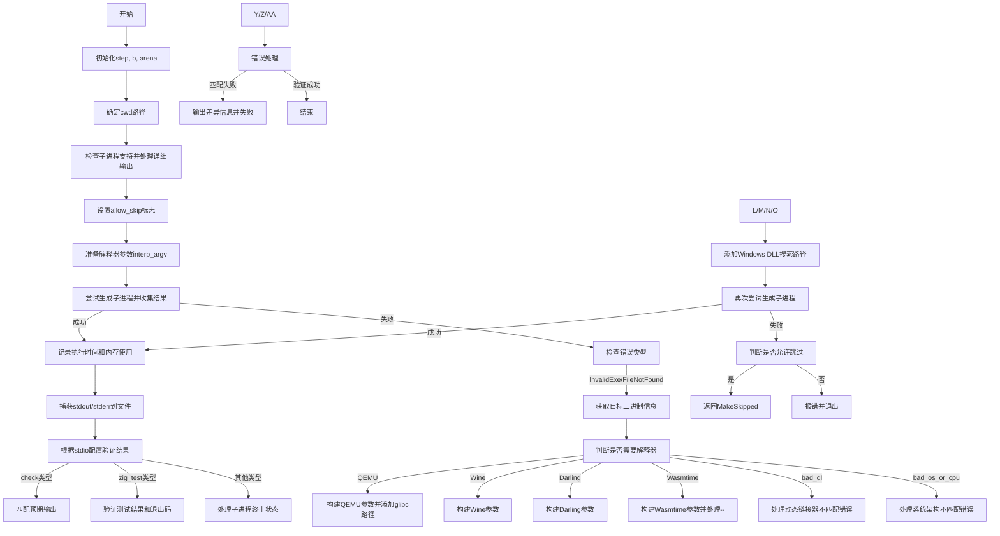

好的，我需要为给定的Zig函数`runCommand`绘制一个流程图。首先，我需要理解这个函数的结构和逻辑。

首先，函数`runCommand`接受多个参数，包括`Run`结构指针、命令行参数`argv`、布尔值`has_side_effects`等。函数的主要目的是执行一个命令，并处理其输出和结果。

接下来，我会逐步分析函数的执行流程：

1. **初始化步骤**：获取`step`和`b`（构建器），以及分配内存`arena`。
2. **处理当前工作目录（cwd）**：根据`run.cwd`是否存在，确定cwd路径。
3. **检查子进程支持**：调用`handleChildProcUnsupported`和`handleVerbose2`进行前置检查。
4. **确定是否允许跳过检查**：根据`run.stdio`的类型设置`allow_skip`。
5. **准备解释器参数**：初始化`interp_argv`数组，用于存储可能的解释器命令（如qemu、wine等）。
6. **尝试生成子进程并收集结果**：调用`spawnChildAndCollect`，如果失败则进入错误处理。
7. **处理生成子进程失败的情况**：如果是由于二进制文件不兼容或未找到，尝试使用解释器（如QEMU、Wine等）来执行命令。
   - 根据不同的解释器类型（如QEMU、Wine、Darling、Wasmtime），构建相应的命令行参数。
   - 处理动态链接器路径问题，特别是在Windows上添加DLL搜索路径。
   - 再次尝试生成子进程，如果仍然失败，根据配置决定是否跳过或报错。
8. **处理成功生成的子进程结果**：记录执行时间、内存使用等。
9. **捕获标准输出和错误输出**：将输出写入指定文件。
10. **根据`run.stdio`的配置验证输出结果**：
    - 对于`check`类型，检查标准输出和错误是否符合预期（完全匹配或包含特定字符串）。
    - 对于`zig_test`类型，验证测试结果是否成功，包括退出码和测试元数据。
    - 其他情况直接处理子进程的终止状态。
11. **错误处理与反馈**：在任何步骤中出现错误，通过`step.fail`返回相应的错误信息。

在绘制流程图时，需要注意条件分支，例如是否启用QEMU、Wine等解释器，处理不同的错误类型，以及根据`run.stdio`的不同配置进行不同的结果验证。同时，需要体现函数的异常处理流程，特别是`spawnChildAndCollect`失败后的重试逻辑。

可能的遗漏点包括对`fuzz_context`的处理，但由于代码中`fuzz_context`仅在特定条件下影响流程，可以简化为一个条件判断。另外，`termMatches`函数的逻辑可能需要进一步了解，但根据上下文可以推断其用于比较进程终止状态。

最终，流程图应涵盖主要步骤和分支，确保逻辑清晰，便于理解函数的执行路径。
================================================
