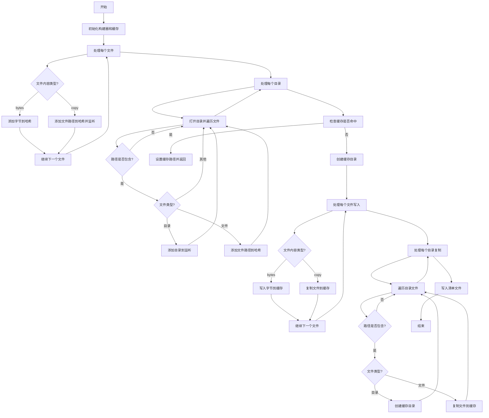

嗯，用户让我用Mermaid画出这个Zig函数的流程图。首先，我需要理解这个函数的功能。看起来这是一个用于构建步骤的函数，负责将文件或目录内容写入到缓存目录中，可能作为构建过程的一部分。函数名是make，属于WriteFile步骤的一部分。

首先，我需要通读代码，理清逻辑。函数开始获取一些上下文，比如分配器、缓存管理。然后处理文件，将内容哈希到缓存中。接着处理目录，遍历目录中的文件，同样进行哈希处理。之后检查缓存是否命中，如果命中则跳过，否则创建缓存目录，并将文件内容写入到缓存目录中。最后处理目录的复制，更新文件到缓存目录，并写入清单。

接下来，我需要将这个过程分解成步骤，每个步骤对应流程图中的一个节点。可能的分步包括：

1. 初始化步骤，获取构建器和缓存。
2. 处理每个文件，添加到哈希。
3. 处理每个目录，遍历文件，添加路径到哈希。
4. 检查缓存是否命中，如果是则设置路径并返回。
5. 如果未命中，创建缓存目录。
6. 将文件内容写入缓存目录（字节或复制）。
7. 处理目录中的每个文件，复制到缓存目录。
8. 写入清单文件。

需要注意条件判断，比如缓存命中与否的分支，以及循环处理文件和目录的情况。在流程图中，需要表示循环结构，可能使用循环节点或者子流程。此外，错误处理的部分可能需要作为终止节点，但用户可能只需要主流程。

可能的问题点：如何表示循环处理多个文件和目录？在Mermaid中可以使用循环结构，比如用loop表示。此外，处理不同类型的文件内容（字节或复制）会有不同的路径，这需要条件判断。

现在，将这些步骤转化为Mermaid流程图。使用开始和结束节点，条件判断用菱形，操作用矩形，循环用循环块。需要注意代码中的错误处理步骤可能不会体现在流程图中，除非用户特别要求。

最后，验证流程是否符合代码逻辑，确保每个步骤的顺序和分支正确。
================================================

该流程图展示了以下关键路径：
1. 初始化构建器和缓存系统
2. 递归处理文件和目录结构
3. 哈希计算和缓存检查机制
4. 缓存未命中时的文件写入操作
5. 目录结构的深度复制过程
6. 最后的清单写入操作

循环结构用重复箭头表示，条件判断用菱形节点，主要操作步骤用矩形节点。流程图既包含了缓存命中的快速路径，也详细展示了缓存未命中时的完整写入流程。