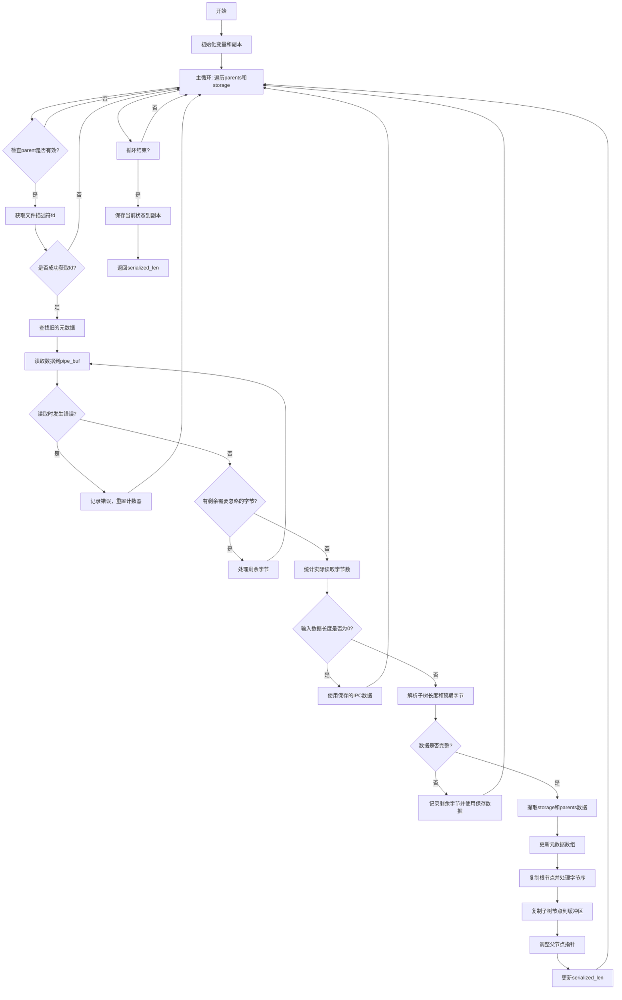

好的，我需要帮助用户将Zig语言中的serializeIpc函数转换为Mermaid流程图。首先，我需要仔细阅读并理解这个函数的代码结构和逻辑流程。

首先，函数serializeIpc接受两个参数：start_serialized_len和serialized_buffer，返回一个usize。看起来这个函数的主要作用是将IPC（进程间通信）的数据序列化到缓冲区中。

接下来，我注意到函数内部定义了几个变量，如ipc_metadata_fds_copy、ipc_metadata_copy等，这些可能是用于存储IPC元数据的副本。然后初始化serialized_len为start_serialized_len，并定义了一个缓冲区pipe_buf用于读取数据。

进入主循环main_loop，遍历serialized_buffer的parents和storage数组。对于每一个父节点，检查是否未被使用，如果是则跳过。然后尝试获取IPC的文件描述符（fd），如果失败则继续下一个循环。接着调用findOld函数查找旧的元数据。

在读取数据部分，使用posix.read尝试从文件描述符读取数据到pipe_buf。这里处理了可能出现的错误，如WouldBlock，以及其他错误情况，记录错误并重置计数器。如果有旧的元数据，处理剩余需要忽略的字节，然后复制有效数据到缓冲区。

之后，处理读取到的数据。如果输入数据长度为0，则使用保存的IPC数据。否则，解析数据中的子树长度，检查数据是否完整。如果数据不完整，记录剩余需要忽略的字节，并使用保存的数据。如果数据完整，则提取存储和父节点信息。

接下来，将元数据保存到ipc_metadata_fds和ipc_metadata中，复制根节点到主存储，并根据字节序进行交换。然后复制子树的其他节点到序列化缓冲区的末尾，调整父指针以确保正确引用。

最后，保存当前的状态到副本数组中，以便下次更新时使用，返回更新后的serialized_len。

在绘制流程图时，需要将这些步骤分解为不同的节点，并用箭头表示流程的走向。需要注意循环、条件判断以及错误处理的分支。

可能的步骤分解如下：
1. 初始化变量和副本。
2. 进入主循环，遍历每个父节点和存储。
3. 检查父节点是否有效，获取文件描述符。
4. 查找旧的元数据。
5. 读取数据，处理错误和剩余字节。
6. 处理读取的数据，解析子树信息。
7. 更新元数据，复制节点数据，调整父指针。
8. 循环结束后保存副本数据，返回长度。

需要注意条件分支，如continue :main_loop和错误处理路径，以及循环内的不同情况处理。需要将这些逻辑清晰地用流程图表示出来，确保每个判断和操作都有对应的节点和连接线。
================================================
