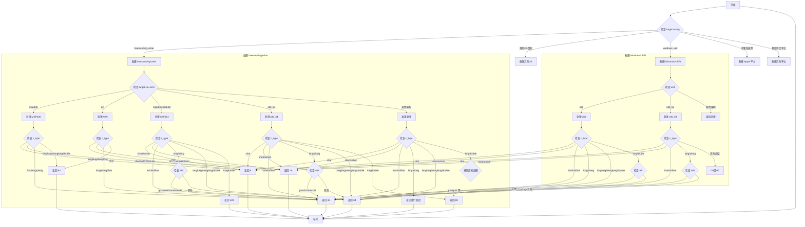

嗯，我现在要帮用户画一个Zig函数的流程图，用Mermaid语法。函数名是cTypeBitSize，看起来是根据不同的目标平台和C类型返回对应的位大小。首先，我需要理解这个函数的结构，然后转化为流程图。

首先，函数的大结构是一个大的switch语句，根据target.os.tag的不同值进入不同的分支。比如第一个分支是.freestanding和.other，然后是其他操作系统比如.windows、.uefi，接着是苹果的系统如.ios、.macos，还有一些特定的平台如.nvcl、.cuda等等。每个分支里可能再根据target.cpu.arch或c_type进行更细分的判断。

那流程图应该从函数入口开始，然后根据target.os.tag的不同分支出不同的处理块。每个块里可能还有更多的判断，比如对于.freestanding的情况，要看cpu架构是msp430、avr、mips64等，每个架构又有不同的c_type处理。之后可能还有ABI的判断，比如在x86_64下，根据不同的ABI决定long的大小是32还是64位。

我需要理清每个可能的路径，确保每个条件分支都被正确表示。比如在第一个大的switch里，处理的是.freestanding和.other，然后是其他OS标签的分支。每个分支内部可能又有多个层级的switch，可能需要嵌套的流程图节点。

另外，注意到有些情况会直接返回数值，比如.case .char => return 8，这些可以作为终止节点。而有些情况需要进一步的判断，比如在x86_64下，检查ABI来决定返回值。这时候需要分支节点，然后根据不同的条件进入不同的子流程。

可能的挑战是如何组织复杂的嵌套条件，避免流程图过于混乱。可能需要将大的分支拆分成子图，或者用不同的颜色或形状来表示不同层级的判断。不过Mermaid的语法支持子图，所以可以考虑用子图来分组不同的操作系统情况。

另外，有些条件可能重复出现，比如对于某些架构，处理方式类似，这时候可以合并相同的路径，或者用注释说明。例如，在多个地方，.char都返回8，这可以统一表示为一个节点，而不必在每个分支重复画。

还需要注意，有些条件可能涉及多个层级的判断，比如在x86_64下，先判断c_type，再在long的情况下判断ABI，再根据ABI返回不同的值。这种情况下，流程图需要逐层展开。

总之，我需要将整个函数的逻辑分解成多个层级的判断，每个判断对应一个菱形节点，每个返回对应一个矩形节点，并用箭头连接各个节点。对于复杂的嵌套结构，可能需要使用子图来保持清晰。

现在，我需要根据代码结构逐步构建流程图。首先，顶层是switch (target.os.tag)，分出主要的操作系统类别，每个类别作为子图。在每个子图中，再根据target.cpu.arch或c_type进行细分。每个细分后的条件再进一步处理，直到到达返回语句。

例如，处理.freestanding和.other的情况时，进入一个子图，里面根据arch进行判断，每个arch下再处理c_type的不同情况。每个c_type的处理可能又涉及更具体的条件，如ABI的判断，这时候需要再嵌套条件节点。

同样，对于.windows和.uefi的情况，处理方式又不同，需要单独的子图。每个子图内部的结构可能与主结构类似，但具体的条件分支不同。

为了保持流程图的可读性，可能需要将每个主要的OS标签作为子图，然后在子图中处理各自的逻辑。这样，整个流程图的结构会比较清晰，每个子图对应一个代码中的大分支。

最后，要确保所有的返回路径都被覆盖，没有遗漏任何条件。可能需要多次检查代码，确保每个case都被正确转换到流程图中。
================================================

该流程图通过嵌套的子图结构展示了：
1. 顶层根据操作系统标签分流
2. 每个子图处理特定平台的条件判断
3. 使用菱形节点表示条件分支
4. 矩形节点表示具体返回值
5. 箭头清晰地展示了所有可能路径
6. 特殊处理（如ABI检查）用独立分支表示
7. 重复模式（如.char返回8）被统一简化为共享节点