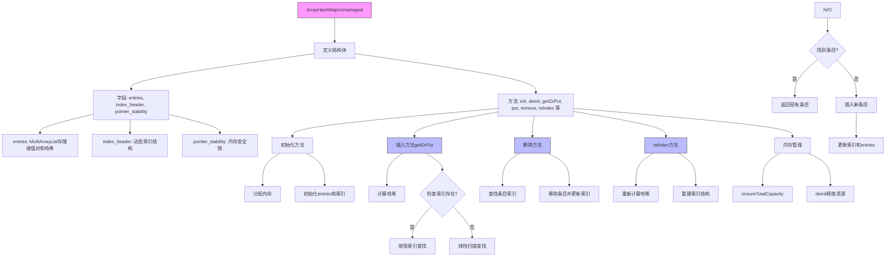

嗯，我现在需要为一个用Zig编写的函数ArrayHashMapUnmanaged画一个流程图。首先，我需要理解这个函数的结构和功能。这个函数看起来是一个泛型结构，用于创建一个非托管的数组哈希表。它接受键类型K、值类型V、上下文类型Context和一个布尔标志store_hash。返回的类型是一个包含各种方法和字段的结构体。

首先，我应该理清这个函数的主要部分。结构体包含entries、index_header、pointer_stability等字段。接下来有很多方法，比如初始化、释放内存、插入、获取、删除元素等。每个方法都有不同的逻辑，比如getOrPut、put、remove等。

画流程图的话，可能需要从主函数开始，即ArrayHashMapUnmanaged，然后展示如何构建返回的结构体类型。结构体中包含各种方法，每个方法可能有自己的流程。但用户可能希望的是整个函数的总体流程图，而不是每个方法的细节。

考虑到函数返回一个结构体类型，流程图可能需要展示结构体的创建过程，以及关键方法的逻辑流程。例如，初始化时的步骤：分配entries，处理index_header，处理pointer_stability等。或者插入元素时的流程：检查是否存在，处理哈希冲突，更新索引等。

可能还需要考虑不同情况，比如store_hash为true或false时的不同处理。比如当store_hash为true时，哈希值会被存储，否则每次需要重新计算。

此外，函数中有很多错误处理和内存管理的部分，比如ensureTotalCapacity、deinit等。这些步骤也需要在流程图中体现。

不过，用户可能希望的是整个结构体的创建流程，以及主要方法如getOrPut或put的流程。或者，他们可能需要整个结构体的数据流图，显示各个部分如何相互关联。

可能需要先确定流程图的重点。因为这是一个结构体生成函数，流程图应该展示如何根据输入的参数构建对应的结构体类型，以及该结构体内部的主要组件和它们的关系。例如，entries是一个MultiArrayList，index_header是可选指针，pointer_stability用于安全检查等。

然后，可以针对主要方法如getOrPut绘制子流程图，展示如何查找或插入键值对，处理哈希冲突，更新索引等步骤。这可能需要分支判断，比如线性扫描或使用索引头的情况，以及处理不同存储哈希的情况。

不过，用户要求的是整个函数的流程图，可能需要更高级别的抽象，而不是深入到每个方法。或者，可能只需要主函数的结构，即如何根据参数生成对应的结构体类型，包含哪些字段和方法。

或者，用户可能希望的是这个结构体的实例化过程，比如调用init时的步骤：分配内存，初始化entries，构建索引等。

总之，我需要确定流程图的重点。由于代码量较大，可能需要分模块处理，但用户可能希望一个总体的高层次流程图，展示结构体的主要组成部分和核心方法的流程。

最终，可能的流程图结构如下：

1. 开始于ArrayHashMapUnmanaged函数，接受参数K, V, Context, store_hash。
2. 返回的结构体包含entries（数据列表）、index_header（索引头）、pointer_stability（安全锁）。
3. 结构体的方法分为初始化、销毁、插入、查找、删除等。
4. 对于插入操作（如getOrPut），流程可能包括：
   a. 计算哈希值。
   b. 检查索引头是否存在，决定使用线性扫描还是索引查找。
   c. 查找现有条目。
   d. 如果存在，返回现有条目；否则，插入新条目。
   e. 更新索引和entries。
5. 对于索引处理，当条目数量超过线性扫描最大值时，分配索引头，构建哈希索引。

这可能需要用多个子流程来表示不同的方法，但整体结构需要展示模块之间的关系和主要流程步骤。

可能还需要考虑错误处理分支，例如内存分配失败时的处理。

不过，由于时间限制，可能需要简化，只展示主结构和关键方法的流程，而不是每个细节。
================================================

该流程图展示了以下关键部分：
1. 结构体定义和核心字段
2. 主要方法分类（初始化/插入/删除/索引重建/内存管理）
3. 插入方法getOrPut的详细流程
4. 动态索引和线性扫描的决策分支
5. 内存管理和安全机制
6. 索引重建的核心操作

重点突出了哈希计算、索引结构决策、内存安全检查和核心操作流程之间的交互关系。