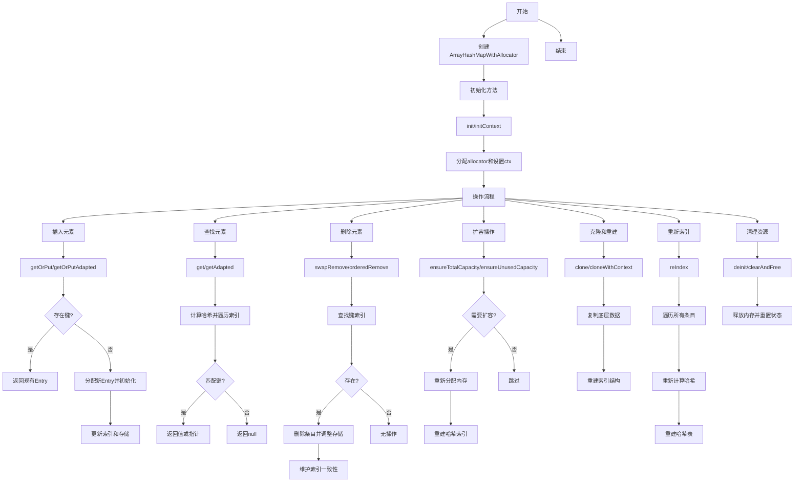

嗯，我需要为这个Zig的ArrayHashMapWithAllocator函数画一个流程图。首先，我得仔细看看这个函数的结构。这个函数返回一个结构体，里面有很多方法，比如init、deinit、getOrPut等等。流程图应该涵盖主要的函数调用流程，比如初始化、添加元素、删除元素、查找元素等。

首先，函数入口是ArrayHashMapWithAllocator，它接收K、V、Context和store_hash参数，然后返回一个结构体。结构体包含Unmanaged实例、allocator和ctx。接下来，结构体有很多方法，比如init会初始化一个实例，deinit释放资源，getOrPut用于插入或获取元素，还有put、remove等方法。

我应该从初始化开始，然后展示如何添加元素，处理可能的冲突，比如扩容或者重新哈希。然后考虑查找元素的过程，以及删除元素的不同方式（swapRemove、orderedRemove等）。另外，像clone、reIndex这些方法也需要考虑进去。

可能需要注意的是，有些方法依赖于Unmanaged的方法，比如unmanaged.getOrPutContext，所以在流程图中需要体现这些调用关系。同时，错误处理也是一个部分，比如ensureTotalCapacity可能会失败，需要处理错误。

可能需要将流程分成几个主要部分：初始化、插入元素、查找元素、删除元素、扩容、克隆、重新索引等。每个部分用不同的流程块表示，并用箭头连接它们之间的调用关系。

不过，用户提供的代码是结构体的定义，而不是具体的函数实现，所以流程图可能需要更抽象地表示结构体的方法调用流程，而不是具体的内部实现细节。比如，当调用getOrPut时，流程可能涉及检查是否存在键，存在则返回现有条目，不存在则分配新空间，然后插入新条目。

另外，考虑到store_hash参数的影响，当store_hash为true时，eql函数的调用次数可能减少，这在流程图中可能需要不同的分支。

可能需要使用不同的子流程来表示这些不同的情况，比如是否存储哈希值。但可能用户希望的是一个概括性的流程图，而不是深入到每个条件分支。

总之，我需要根据结构体的方法，绘制出主要的函数调用流程，展示从初始化到各种操作（增删改查）的步骤，以及它们之间的关系。
================================================
