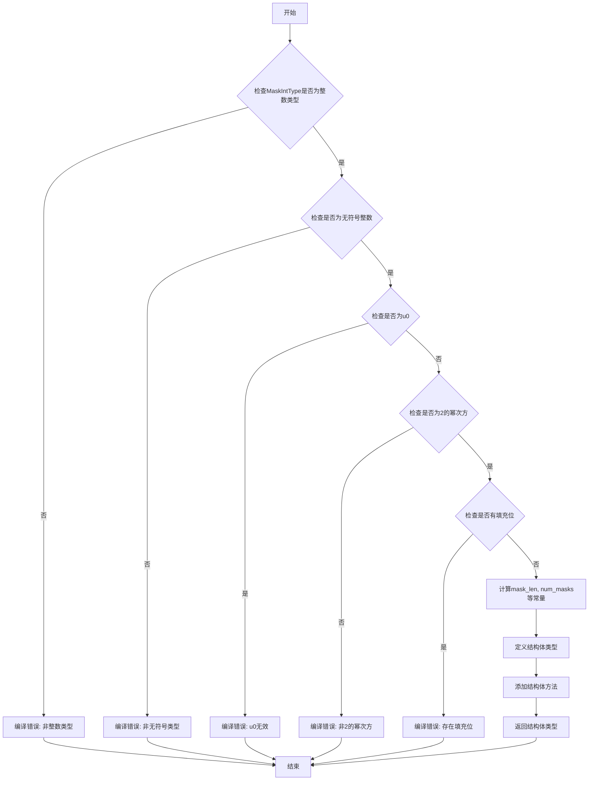

嗯，用户给了我一个Zig语言写的函数，叫做`ArrayBitSet`，他们希望我用Mermaid画出这个函数的流程图。首先，我需要理解这个函数的结构和逻辑，然后才能转化为流程图。

首先，这个函数是一个泛型函数，接受两个参数：`MaskIntType`和`size`，然后返回一个结构体类型。看起来这是一个用于创建位集合（bitset）的工厂函数。函数内部有很多编译时的检查，比如确保传入的`MaskIntType`是无符号整数类型，且是2的幂次方，没有填充位等等。然后定义了一些方法，比如初始化空集合、全集合、设置位、清除位、交集、并集等操作。

接下来，我需要确定流程图的起点和各个分支。函数开始部分有一系列的编译时检查，这些检查可能会导致编译错误，如果条件不满足的话。例如，检查类型是否是整数、是否是无符号、是否是u0等等。这些检查需要作为判断节点在流程图中体现。

然后，函数定义了一些常量，比如`mask_len`、`num_masks`、`last_pad_bits`和`last_item_mask`。这些计算步骤可能需要作为处理步骤出现在流程图中。

接下来是结构体的定义，包含多个方法，如`initEmpty`、`initFull`、`isSet`、`count`、`setValue`等等。每个方法都有其自己的逻辑，比如循环、位操作等。这些方法是否需要单独的子流程，还是作为主流程的一部分？可能需要根据用户的需求来决定。但用户可能希望的是整个`ArrayBitSet`函数的流程图，而不是每个方法的详细流程。

不过，用户可能希望的是这个工厂函数的流程，即当调用`ArrayBitSet`时，内部的各个步骤如何执行，包括参数检查和结构体的生成。因此，流程图应该从函数入口开始，依次展示参数验证、计算常量，最后返回结构体类型。而结构体内部的方法可能不需要详细展开，除非用户特别要求。

可能的流程步骤：
1. 开始
2. 检查`MaskIntType`是否为整数类型 → 不是则编译错误
3. 检查是否无符号 → 不是则编译错误
4. 检查是否不是u0 → 是u0则编译错误
5. 检查是否是2的幂次方 → 不是则建议使用更大的类型并报错
6. 检查是否有填充位 → 有则报错
7. 计算`mask_len`、`num_masks`、`last_pad_bits`等
8. 定义并返回结构体类型，包含各种方法

对于每个错误检查，流程图中需要有判断节点，根据条件分支到不同的处理（报错或继续）。然后，计算各个常量的步骤作为处理步骤，最后生成结构体。

需要注意的是，Zig的编译时函数执行是在编译阶段，所以这些检查都是在编译时进行的，流程图中可能需要体现这些编译时检查的顺序。

可能的问题：用户是否希望包括结构体方法的内部流程？比如，`initEmpty`如何初始化，或者`setValue`如何操作位。但根据问题描述，用户要求的是“函数的流程图”，而该函数`ArrayBitSet`是一个返回类型的函数，所以主流程图应集中在参数验证和结构体定义的生成过程，而不是结构体方法的具体实现。结构体方法的流程可能需要单独的流程图，但用户没有特别说明。

因此，主流程图应涵盖从函数入口开始，参数检查，条件判断，错误处理，到最终生成结构体类型的整个过程。
================================================
