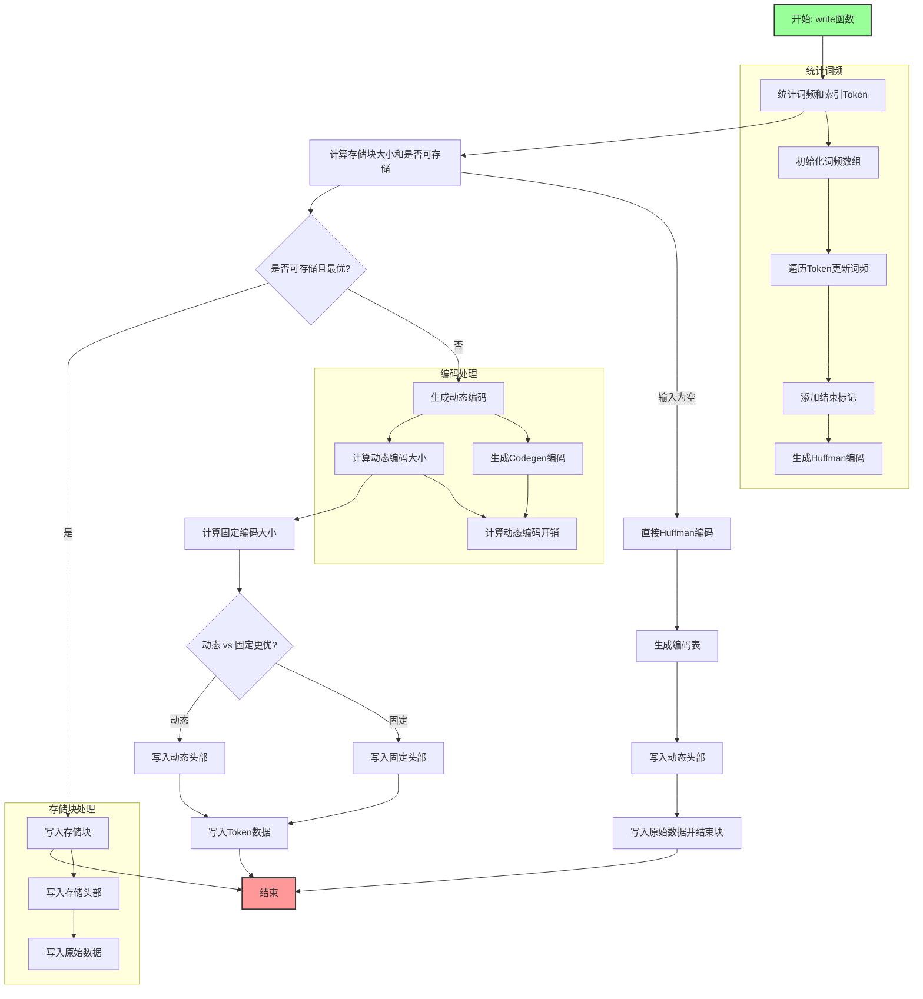

好的，我需要帮助用户根据提供的Zig代码绘制一个流程图。首先，我需要理解这个代码的结构和功能。代码定义了一个名为BlockWriter的结构体，它用于压缩数据的块写入。这个结构体包含了许多方法，比如初始化、刷新缓冲区、设置写入器、生成编码、计算动态和固定大小、写入头部信息、处理令牌（tokens）等。

首先，我需要确定流程图的范围。用户可能希望看到BlockWriter的主要流程，特别是write函数，因为它似乎是处理数据写入的核心方法。此外，其他重要的函数如dynamicBlock、indexTokens、writeTokens等也需要考虑。

接下来，我需要分析每个函数的作用和它们之间的调用关系。例如，write函数调用了indexTokens来统计词频，然后根据不同的压缩策略（动态Huffman、固定Huffman或存储块）选择最优的压缩方式。dynamicBlock函数处理动态Huffman编码，而storedBlock处理直接存储未压缩的数据。

在绘制流程图时，应该从主入口点开始，通常是write函数。然后根据条件判断（如是否可存储、动态还是固定编码更优）分支到不同的处理流程。每个分支需要展示关键步骤，例如生成编码、计算大小、写入头部信息、处理令牌等。

需要注意代码中的错误处理，比如flush和setWriter可能涉及资源管理，但在流程图中可能不需要详细展示，除非用户特别强调。

另外，代码中的注释提到了一些RFC规范，比如RFC 1951，这些可能影响编码方式，但流程图应主要关注代码结构而非具体算法细节，除非用户有特别要求。

可能存在一些复杂的逻辑，例如generateCodegen函数中的运行长度编码，这部分在流程图中可能需要简化，避免过于详细导致图表难以理解。

最后，确保流程图的连贯性和可读性，使用适当的符号和箭头表示流程走向，条件判断使用菱形框，处理步骤使用矩形框，开始和结束使用圆角矩形或圆形。

总结步骤：
1. 确定主流程从write函数开始。
2. 分析write函数内的主要步骤：计算存储大小、动态和固定编码的大小比较，选择最优方式。
3. 根据选择的分支（存储、动态、固定）绘制相应的处理流程。
4. 包含关键子函数如indexTokens、generateCodegen、dynamicHeader等的调用。
5. 简化复杂逻辑，突出主要决策点和处理步骤。
6. 使用Mermaid语法构建流程图，确保结构清晰。
================================================
