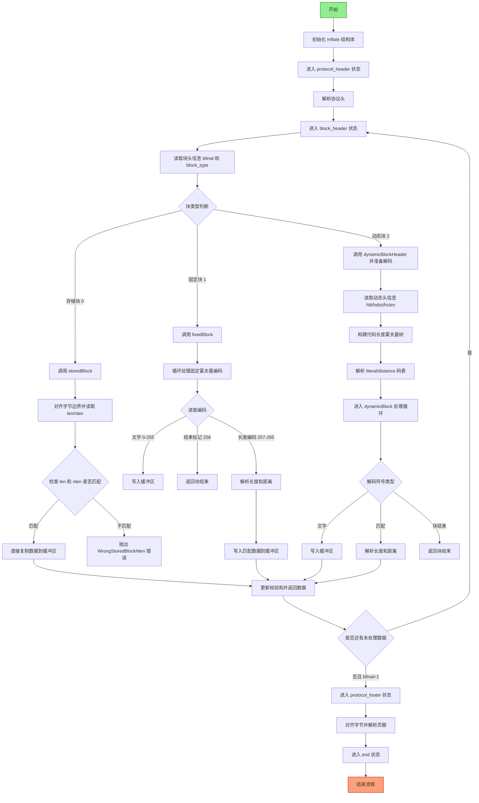

好的，我需要帮用户用Mermaid画出他们提供的Zig函数`Inflate`的流程图。首先，我需要理解这个函数的结构和逻辑。看起来这是一个用于解压缩数据的函数，可能实现了DEFLATE算法，因为它提到了动态块、固定块和存储块，这些都是DEFLATE中的概念。

首先，我会浏览整个函数，识别主要的组成部分。函数`Inflate`返回一个结构体，包含多个方法和状态变量。主要的状态变量包括`bits`（位读取器）、`hist`（循环缓冲区）、`hasher`（用于校验和）、`lit_dec`和`dst_dec`（霍夫曼解码器），以及`state`（当前读取状态）。

接下来，分析`step`函数，它似乎控制着解压的不同阶段。状态包括`protocol_header`、`block_header`、`block`、`protocol_footer`和`end`。每个状态对应不同的处理步骤。例如，在`block_header`状态，会读取块的类型（存储块、固定块或动态块），然后进入相应的块处理阶段。

然后，考虑各个块的处理方法：`storedBlock`、`fixedBlock`和`dynamicBlock`。这些方法分别处理不同类型的压缩块。例如，存储块是未经压缩的数据，直接复制到输出；固定块使用预定义的霍夫曼编码；动态块需要从数据中读取霍夫曼树的信息。

还需要注意错误处理和各个辅助函数，如`decodeLength`和`decodeDistance`，它们用于解析匹配的长度和距离。此外，`decodeSymbol`用于从霍夫曼编码中解码符号。

在绘制流程图时，应该从`init`开始，然后进入主循环，根据当前状态处理不同的步骤。每个状态转换需要明确条件，例如处理完一个块后，根据`bfinal`判断是否继续下一个块或进入协议页脚处理。

需要注意的是，由于代码中有多个可能的状态转换和条件分支，流程图可能会比较复杂。可能需要将主流程分解为几个子流程，例如处理块头、处理不同类型的数据块，以及处理协议页脚。

另外，错误处理部分也需要在流程图中体现，例如当读取到无效的块类型或数据时，抛出相应的错误。

最后，结合Mermaid的语法，将各个状态和转换用节点和箭头表示出来，确保逻辑清晰，层次分明。可能需要使用子图来组织不同的处理阶段，以提高可读性。
================================================
