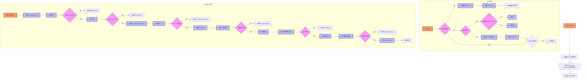

嗯，我需要用Mermaid来画出这个Zig函数的流程图。首先，我得仔细看一下这个代码的结构。这个函数是Decoder，返回一个结构体类型。结构体里面有初始化、释放、读取等方法。主要的逻辑在read和readBlock这两个函数里。

首先，流程图应该从Decoder的初始化开始，然后进入read方法。在read方法中，会检查是否有未读的数据，如果有就直接复制到输出。如果没有，就检查是否有错误，如果有错误就处理错误。否则，重置读取位置，然后调用readBlock来读取新的数据块。

readBlock函数负责解析块头，处理压缩数据，验证校验和等。这里可能需要分解成几个子步骤：读取块头、处理过滤器和属性、解压数据、验证大小、处理填充和校验和检查。

我需要确保每个判断和循环都正确地在流程图中表示出来。比如，在read方法里的while循环，以及在readBlock中处理不同校验方式的逻辑。可能还需要处理错误情况，比如校验和不匹配、不支持的过滤器等。

可能还需要考虑各个函数之间的调用关系，比如read调用readBlock，而readBlock又调用lzma2.decompress等。不过Mermaid的流程图可能更适合控制流程而不是函数调用关系，所以应该集中在主流程上。

另外，注意一些条件判断，比如是否有未读数据，是否有错误，是否到达流末尾等。这些都需要在流程图中用菱形判断框来表示。

最后，要确保流程图的正确性和完整性，覆盖所有主要路径，包括正常流程和错误处理。可能需要多次检查代码，确认每个步骤的顺序和条件。
================================================
