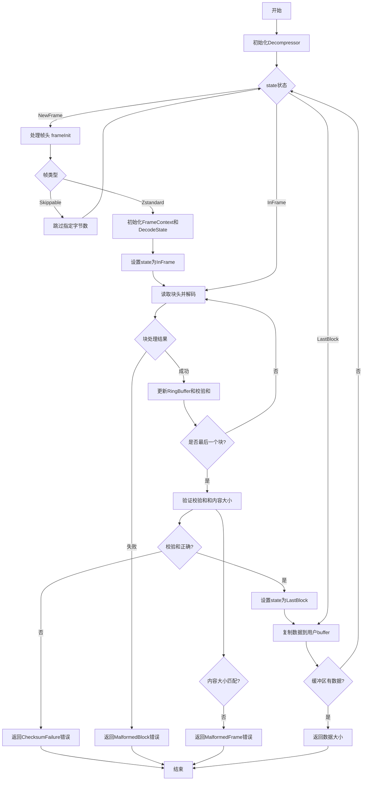

嗯，我现在需要为这个用Zig编写的Decompressor函数画一个流程图。首先，我得仔细阅读代码，理解它的结构和执行流程。这个函数看起来是用于Zstandard解压缩的，它有一个Decompressor结构体，里面包含了很多状态和缓冲区。

首先，初始化部分，当调用init函数时，会设置source、state、decode_state、frame_context等。初始状态是NewFrame，然后进入读取循环。当调用read方法时，会检查buffer长度，如果是0就直接返回。否则，进入循环，处理不同的状态。

接下来是frameInit函数，它会解码帧头。如果是skippable帧，就跳过相应的字节，并保持NewFrame状态。如果是zstandard帧，就初始化frame_context和decode_state，并进入InFrame状态。

在readInner函数中，主要处理InFrame状态下的数据块解码。这里使用了RingBuffer来管理数据，处理每个块的数据，解码后写入缓冲区。如果遇到最后一个块，则进入LastBlock状态，并验证校验和。如果校验和失败，返回错误。最后，从RingBuffer中读取数据到用户提供的buffer中，并更新状态。

整个流程大致是：初始化→读取帧头→处理帧→解码块→处理校验和→返回解压后的数据。可能需要考虑各种错误处理，比如校验和不匹配、格式错误等。

现在，我需要把这些步骤转化为流程图。流程图应该包括开始、初始化状态、处理帧头、处理不同帧类型、解码块、处理校验和、读取数据到缓冲区、错误处理等步骤。使用mermaid语法的话，需要用不同的节点和箭头连接这些步骤，并标注条件和操作。

可能的结构：

开始 -> 初始化Decompressor
初始化Decompressor -> 检查state是否为NewFrame
如果是NewFrame -> 处理帧头（frameInit）
处理帧头时，如果是skippable帧，跳过字节，回到NewFrame状态
如果是zstandard帧，初始化frame_context和decode_state，进入InFrame状态
InFrame状态下，读取块头，解码块数据，处理校验和，直到LastBlock
LastBlock处理完成后，回到NewFrame状态，继续处理下一帧
读取数据到用户buffer，直到buffer填满或数据读完

可能还需要考虑循环结构，比如在read方法中循环处理直到有数据可返回，或者在readInner中循环处理块直到缓冲区有数据。

错误处理分支也需要标注，比如遇到错误时跳转到相应的错误节点，并结束流程。
================================================
