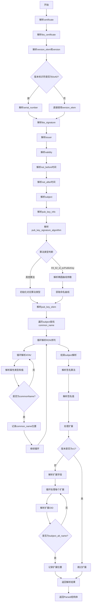

嗯，我现在需要为这个用Zig写的证书解析函数画一个流程图。首先，我得仔细看看这个函数的代码结构，了解它的各个部分是怎么工作的。这个函数的名字是parse，它接收一个Certificate参数，返回一个ParseError或者Parsed类型的结果。

首先，函数开始处理cert.buffer，然后通过der.Element.parse解析证书字节，得到certificate。接着解析tbs_certificate，然后是version_elem和version。这里有个条件判断，根据version_elem的标识符决定如何处理serial_number。这部分可能需要条件分支。

接下来是解析签名算法、颁发者（issuer）、有效期（validity）、生效时间和失效时间。然后是subject、公钥信息等。公钥算法部分有一个switch语句，处理不同的算法类型，特别是对于椭圆曲线的情况，需要解析参数和命名曲线。这里可能需要一个子流程或分支。

然后，代码遍历subject来查找common name，这里用了三个嵌套的while循环，可能对应流程中的循环结构。接着处理签名算法和签名值。之后是处理扩展部分，比如主题备用名称（subject_alt_name）。这里有一个ext块，根据版本和其他条件决定是否处理扩展，内部还有循环处理每个扩展。

最后，函数返回一个结构体，包含所有解析后的信息。整个流程应该是顺序执行，但有很多条件判断和循环，需要正确地在流程图中表示这些分支和循环结构。

需要注意的是，mermaid的流程图语法中的节点和箭头，以及如何处理条件判断（菱形框）、循环（循环框）和子流程。比如，解析version_elem后的条件判断会影响serial_number的解析路径；处理公钥算法时的switch语句可能需要不同的分支；遍历subject和扩展时的循环结构需要正确表示。

可能还需要考虑错误处理，比如try语句可能会导致提前返回错误，但在流程图中可能不需要特别表示错误路径，除非特别要求。根据用户的需求，重点放在主流程上，可能不需要详细画出每个错误情况。

总结一下，流程图的大致步骤是：

1. 解析certificate和tbs_certificate。
2. 解析version和serial_number（有条件判断）。
3. 解析签名算法、issuer、validity的时间。
4. 解析subject，并在其中循环查找common name。
5. 解析公钥信息和算法（可能有分支处理不同算法类型）。
6. 解析签名部分。
7. 处理扩展（有条件判断和循环）。
8. 返回解析后的结果结构体。

在画图时，每个解析步骤用矩形框，条件判断用菱形框，循环用循环结构或括号表示循环体。需要注意各个步骤之间的顺序和可能的条件分支。
================================================
