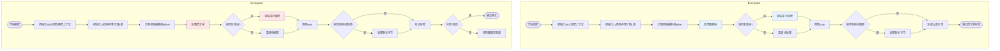

好的，我现在需要帮用户用Mermaid画出Zig语言中这个AES-OCB实现的流程图。首先，我需要理解这个代码的结构和各个函数的作用。

首先，这个文件定义了一个名为AesOcb的结构体，它包含了加密和解密的功能。结构体内部有Lx子结构体，用于处理一些预计算和块操作。然后有hash函数、getOffset函数，以及encrypt和decrypt两个主要的公开方法。

我需要先理清每个主要函数的流程。例如，encrypt函数处理加密过程，包括初始化上下文、预处理L表、处理数据块、处理剩余数据、生成认证标签等步骤。同样，decrypt函数处理解密和验证标签。

接下来，我需要将每个步骤转化为流程图中的节点，并按照执行顺序连接起来。可能需要分开加密和解密两个流程，或者将它们合并成一个图，但可能会复杂。考虑到用户可能希望分开，我可以分别画加密和解密的流程图。

对于encrypt函数：
1. 初始化AES加密上下文。
2. 初始化Lx结构，预计算L表。
3. 获取初始偏移量offset。
4. 处理数据块（分宽块处理和其他块处理）。
5. 处理剩余字节。
6. 计算sum，生成认证标签。
7. 输出密文和标签。

同样，decrypt函数：
1. 初始化加密和解密上下文。
2. 类似加密的预处理步骤。
3. 处理密文块，解密成明文。
4. 处理剩余字节。
5. 计算sum，生成预期标签。
6. 验证标签，失败则清除数据并报错。

需要注意条件判断，例如宽块处理（wb>0的情况）、剩余数据（leftover>0）等分支。此外，错误处理部分在解密流程中的标签验证失败时需要处理。

在Mermaid中，可以使用不同的形状表示步骤（矩形）、条件判断（菱形）、输入输出（平行四边形）等。需要确保流程图的逻辑正确，步骤之间的箭头正确连接，条件分支清晰。

可能遇到的挑战是如何简洁地表示循环和条件分支，特别是处理块时的循环。可能需要用注释或子流程来简化。例如，处理块的部分可以用一个循环节点表示，内部可能分宽块和普通块处理。

最后，确保流程图的可读性，避免过于复杂，合理分组步骤。可能需要将加密和解密作为两个独立的流程图，或者用子图来区分。
================================================

注：流程图包含加密和解密两个独立子流程，主要步骤包括：
1. 上下文初始化与预计算
2. 块数据的分支处理（宽块优化/普通块）
3. 剩余数据特殊处理
4. 认证标签生成/验证
5. 错误处理机制（解密时）
颜色差异用于区分加密（浅蓝）和解密（浅红）流程中的相似操作。