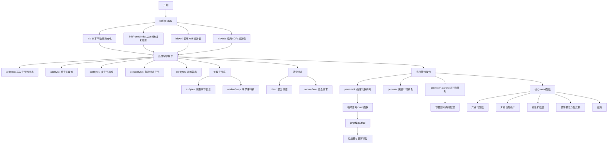

嗯，我需要为这个Zig语言编写的Ascon加密算法的State函数画一个流程图。首先，我得仔细看一下代码的结构和各个函数的作用。

首先，这个State函数是一个泛型函数，接受一个endian参数，返回一个结构体类型。结构体内部包含多个方法和常量。比如，block_bytes是40，表示状态块的字节数。Block是5个u64组成的数组，代表状态。

接下来，初始化方法有init、initFromWords、initXof和initXofA。这些方法用于不同的初始化场景，比如从字节切片、u64数组或者特定的XOF初始值初始化状态。然后是一些操作状态的方法，比如asBytes、endianSwap、setBytes、addByte、addBytes等，用于处理字节的读写、异或操作等。

还有permuteR和permute方法，用于执行轮函数，permuteR是减少轮数的排列，permute则是完整的12轮。round函数是核心的排列逻辑，涉及到位运算和循环移位。

现在，我需要把这些方法按照调用顺序和逻辑关系组织成流程图。可能需要从初始化开始，然后展示各个方法如何修改状态，最后到排列函数的处理。需要注意条件判断、循环以及各个方法之间的调用关系。

可能的结构是：

1. 初始化状态（init/initFromWords/initXof/initXofA）
2. 处理字节（setBytes, addByte, addBytes）
3. 字节转换（asBytes, endianSwap）
4. 提取和异或字节（extractBytes, xorBytes）
5. 清空状态（clear, secureZero）
6. 执行排列（permuteR, permute, permuteRatchet）
7. 轮函数（round）

每个步骤需要分解成具体的操作，比如在permuteR中循环应用round函数，而round内部有一系列的位操作和移位。可能需要用子流程来表示复杂的轮函数步骤。

还需要注意条件分支，比如在addByte中根据endian的不同处理不同的移位方式，或者在xorBytes中处理不足8字节的部分。

流程图应该用不同的形状表示开始/结束、过程、判断、循环等。例如，初始化是开始，各个方法是过程，循环和条件判断用菱形框，轮函数内部操作用子流程。

可能需要将整个结构分成几个部分：初始化、字节操作、排列处理、清理。每个部分内部详细展开步骤。

最后，要确保流程图的逻辑清晰，符合代码的执行顺序和数据流动。
================================================

流程图说明：
1. **初始化**：支持四种初始化方式（字节数组/u64数组/XOF/XOFa）
2. **字节操作**：包含读写、异或、提取等基础操作
3. **字节序处理**：处理不同字节序的转换和内存表示
4. **状态清空**：提供普通清零和安全清零两种方式
5. **排列操作**：
   - permuteR：通过循环调用round函数实现可配置轮数
   - permute：固定12轮完整排列
   - permuteRatchet：带容量保护的防回溯排列
6. **核心round函数**：
   - 轮常数异或
   - 非线性层（S-box）
   - 线性扩散层（位旋转）
   - 最终位反转操作

各模块通过箭头表示执行顺序和数据流动关系，深色模块表示关键加密操作，浅色模块表示辅助功能。