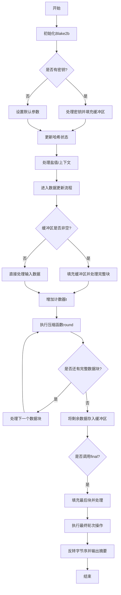

好的，我需要帮用户用Mermaid画出他们提供的Zig语言编写的Blake2b函数的流程图。首先，我需要理解这段代码的结构和功能。看起来这是一个Blake2b哈希函数的实现，包含初始化、更新数据、最终处理等步骤。

首先，我应该从`init`函数开始，它是初始化哈希状态的。然后看`update`函数，负责处理输入数据的分块，可能涉及缓冲区的管理和多次调用`round`函数进行哈希计算。最后是`final`函数，处理剩余的数据并生成最终的摘要。

接下来，`round`函数是核心的压缩函数，里面有很多循环和位操作。需要理清每个步骤的顺序和条件判断，比如如何处理最后一轮（last参数）以及如何更新状态变量h。

我需要将这些步骤分解成流程图中的各个节点，并用箭头连接它们，表示执行顺序。可能的结构包括开始、初始化、处理数据块、处理缓冲区、执行轮次、更新状态、处理剩余数据、生成最终输出等。

需要注意的是条件分支，比如是否有密钥、盐值或上下文的处理，以及在`update`中如何处理部分块。此外，循环结构（如while循环）也需要在流程图中正确表示。

可能还需要考虑错误处理或断言，比如在初始化时的`comptime debug.assert`，但用户可能只需要主流程。最后，确保流程图的每个部分都对应代码中的关键步骤，保持逻辑清晰和正确。
================================================
