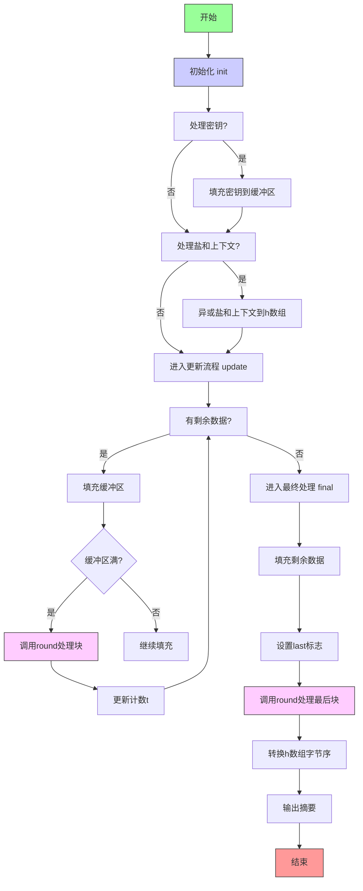

好的，我现在需要帮用户用Mermaid画出他们提供的Zig代码中Blake2s函数的流程图。首先，我需要理解这段代码的结构和逻辑。

首先，这个代码定义了一个Blake2s函数，它接受一个编译时的参数out_bits，返回一个结构体类型。这个结构体包含了Blake2s哈希算法的实现。主要的方法有init、update、final和round，以及一些辅助函数和常量。

我需要确定流程图的起点和各个步骤。通常，哈希函数的流程包括初始化、更新数据（处理数据块）和最终处理（生成摘要）。所以流程图应该包括这些主要步骤。

首先，用户调用init函数进行初始化，设置初始向量（iv），处理密钥、盐和上下文参数。然后，通过update函数处理输入数据，可能分多次处理数据块。每次处理一个64字节的块，调用round函数进行压缩。最后，调用final函数处理剩余的数据，进行最后的压缩，并输出摘要。

接下来，我需要考虑各个函数之间的调用关系。例如，hash函数会先调用init，然后update，再final。update函数在处理数据时，如果缓冲区已满，会调用round函数处理一个块。final函数也会调用round进行最后的处理。

另外，round函数是核心的压缩函数，执行多轮的混合操作，涉及sigma排列和一系列的位运算。这部分可能需要详细展开，但根据用户的要求，流程图可能不需要深入到每个轮次的细节，而是展示主要的处理流程。

需要注意的是，Blake2s的结构可能涉及到循环处理多个数据块，以及处理填充和长度等信息。在final函数中，会处理填充，并可能设置标志位（如last参数为true），这会影响压缩函数的行为。

在绘制流程图时，应该从init开始，然后到update处理数据，可能循环处理多个块，直到所有数据被处理完毕，最后进入final步骤，处理最后的块并生成摘要。

可能的结构：

1. 开始
2. 初始化（init）
   - 设置初始向量
   - 处理密钥、盐、上下文
3. 更新数据（update）
   - 处理缓冲区中的数据
   - 分块处理，调用round函数
4. 最终处理（final）
   - 填充数据
   - 调用最后一次round
   - 生成摘要输出
5. 结束

此外，round函数内部有多个轮次，每个轮次使用不同的sigma排列。在流程图中，可以简化为一个处理块，表示执行压缩函数。

现在需要将这些步骤用Mermaid的流程图语法表示出来，确保逻辑正确，步骤清晰。需要注意条件判断，例如是否有剩余数据需要处理，是否最后一块等。

可能的节点包括：

- 初始化
- 处理密钥
- 处理盐和上下文
- 处理数据块（循环）
- 填充数据
- 执行压缩（round）
- 生成摘要

条件判断如“是否有剩余数据？”、“是否是最后一块？”需要用菱形判断框。

可能还需要处理缓冲区的逻辑，例如当缓冲区填满时触发压缩。

现在将这些思路转化为Mermaid代码。需要注意正确的语法，如节点定义、箭头连接、条件分支等。
================================================

流程图说明：
1. 初始化阶段处理密钥、盐和上下文参数
2. 更新阶段循环处理输入数据，分块调用压缩函数
3. 最终阶段处理尾部数据并生成摘要
4. round函数为核心压缩操作，涉及多轮混合计算
5. 虚线框表示条件判断，菱形为决策点
6. 紫色节点表示关键加密操作步骤