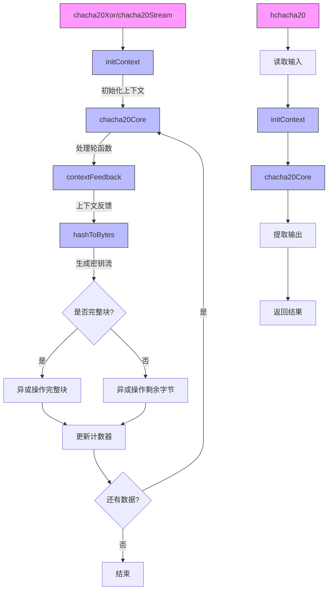

嗯，我现在需要帮用户用Mermaid画出一个Zig函数的流程图。首先，我需要仔细看一下用户提供的代码。这个代码是关于ChaCha20的非向量化实现，看起来是加密相关的。代码里有一个结构体ChaChaNonVecImpl，里面包含了一些函数，比如initContext、QuarterRound结构、chacha20Core、hashToBytes、contextFeedback、chacha20Xor、chacha20Stream和hchacha20。

首先，我需要理解每个函数的作用和它们之间的调用关系。比如，initContext用来初始化上下文，chacha20Core是核心处理函数，可能负责轮运算。然后，chacha20Xor和chacha20Stream可能是生成密钥流并进行异或操作。hchacha20可能是一个简化版的ChaCha20，用于生成哈希或密钥。

接下来，流程图需要展示这些函数的主要步骤和流程。可能需要从入口函数开始，比如chacha20Xor或chacha20Stream，然后展示它们如何调用其他函数。例如，chacha20Xor可能首先调用initContext初始化上下文，然后在循环中调用chacha20Core处理每个块，接着使用hashToBytes将结果转换为字节，最后进行异或操作。

另外，需要注意条件判断和循环结构。例如，在chacha20Xor中有一个处理完整块的主循环，以及处理剩余字节的部分。还有count64参数影响计数器如何递增，这需要在流程图中体现。

可能遇到的挑战是确保所有函数调用和逻辑分支都被正确表示，同时保持流程图的简洁性。需要确定哪些步骤是关键节点，哪些可以合并或简化。例如，QuarterRound结构可能在chacha20Core中被多次使用，但在流程图中可能不需要详细展开每一轮的具体操作，而是概括为轮处理步骤。

最后，确保流程图的连贯性和可读性，使用合适的节点和箭头表示函数调用、循环、条件判断等结构。可能需要将主要函数作为不同的子流程或模块，并展示它们之间的关系。
================================================

流程图说明：
1. 主函数（chacha20Xor/chacha20Stream）从初始化上下文开始
2. 核心处理通过chacha20Core进行轮运算
3. 通过hashToBytes生成密钥流字节
4. 根据数据块是否完整分别处理
5. 计数器更新逻辑根据count64参数不同实现
6. hchacha20独立流程处理简化版运算
7. 所有路径最终收敛到结束节点

蓝色节点表示内部辅助函数，紫色节点表示入口函数，菱形表示条件判断，圆角矩形表示操作步骤。