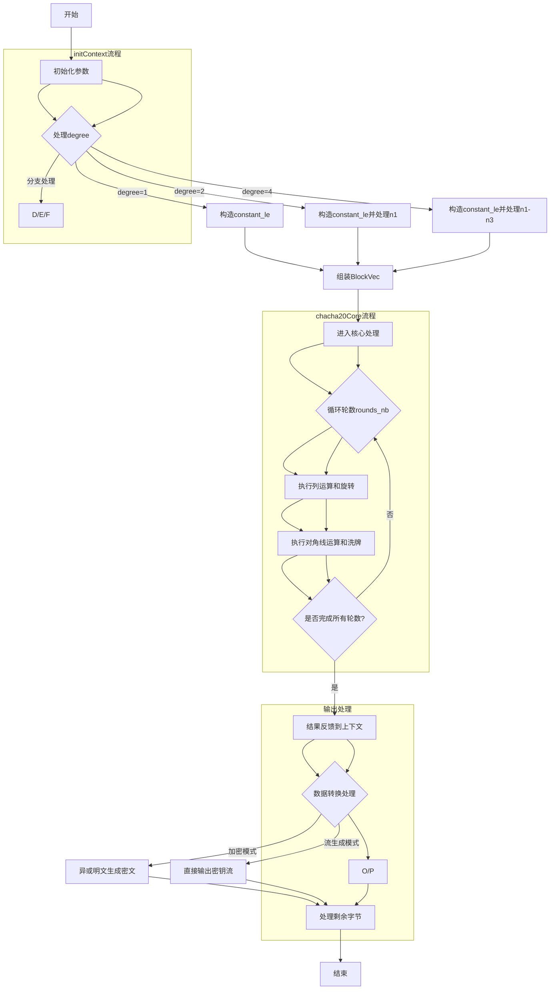

嗯，我需要用Mermaid画这个Zig函数的流程图。首先，我得仔细看一下代码的结构。这个文件定义了一个名为ChaChaVecImpl的函数，返回一个结构体类型。结构体里包含了一些方法，比如initContext、chacha20Core、hashToBytes、contextFeedback、chacha20Xor、chacha20Stream和hchacha20。

首先，我应该理解每个函数的作用。比如，initContext用来初始化上下文，chacha20Core是核心处理函数，进行轮数的运算。hashToBytes将结果转换为字节，contextFeedback可能用于反馈到上下文。chacha20Xor和chacha20Stream是加密的主流程，而hchacha20可能用于生成密钥。

接下来，我需要确定各个函数之间的调用关系。例如，chacha20Xor会调用initContext、chacha20Core、contextFeedback、hashToBytes等。可能需要分步骤画出每个函数的流程，再连接它们之间的调用关系。

然后，要注意循环和条件判断。例如，在chacha20Core中有循环处理轮数，而initContext根据不同的degree有不同的处理逻辑。这些控制结构需要在流程图中体现出来。

可能遇到的问题是如何处理向量化和并行处理的部分，比如degree参数可能代表SIMD的宽度，这在流程图中可能需要简化表示。此外，一些内联函数和编译时参数（comptime）的处理也需要考虑进去。

最后，按照Mermaid的语法，将各个步骤用流程图符号表示，确保逻辑正确，步骤清晰。可能需要先画出主函数（如chacha20Xor）的流程，再细化每个子函数的流程，或者将它们作为子流程嵌入主流程中。
================================================

该流程图包含以下关键节点：
1. 初始化阶段根据degree参数构建不同的上下文结构
2. 核心处理阶段通过循环执行轮运算（列操作+对角线操作）
3. 结果反馈阶段将中间状态与初始上下文混合
4. 最终输出阶段根据模式选择加密处理或直接生成密钥流
5. 处理边界条件（剩余字节）并完成整个流程

特殊处理逻辑：
- 使用@shuffle进行SIMD向量洗牌
- 通过@rotl实现循环左移
- 支持1/2/4三种并行度（degree参数）
- 64位计数器模式和非64位计数器模式的分支处理