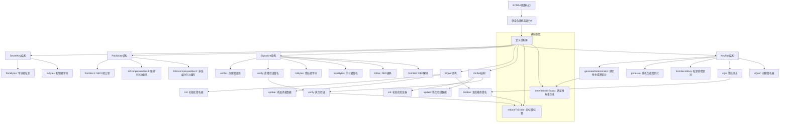

嗯，我需要为这个Zig编写的ECDSA函数画一个流程图。首先，我需要理解这个代码的结构和各个部分的功能。看起来这个代码定义了一个名为Ecdsa的泛型函数，接受Curve和Hash两个类型参数。然后返回一个包含多个结构体的结构体，比如SecretKey、PublicKey、Signature、Signer、Verifier和KeyPair。

首先，我应该确定主要的流程，比如生成密钥对、签名和验证这三个主要过程。每个过程可能涉及不同的结构体和函数调用。例如，生成密钥对可能包括生成私钥、公钥，以及可能的确定性生成和随机生成两种方式。签名过程可能包括初始化签名器、更新消息、最终生成签名。验证过程则可能包括初始化验证器、更新消息、验证签名。

接下来，我需要考虑各个结构体之间的关系。比如，Signer需要SecretKey和可能的noise来生成签名，而Verifier需要PublicKey和Signature来进行验证。KeyPair结构体包含公钥和私钥，并提供生成和签名的方法。

另外，代码中有一些辅助函数，比如reduceToScalar和deterministicScalar，这些可能在签名和验证过程中被调用。需要确定这些函数在流程中的位置。

可能遇到的挑战是如何将所有这些部分整合到一个连贯的流程图中，尤其是处理条件判断和循环结构，比如在deterministicScalar函数中的while循环。不过，流程图通常不需要详细展示所有循环和条件，而是关注主要步骤和模块之间的关系。

最后，我需要使用Mermaid语法来绘制流程图，确保每个步骤和模块之间的连接正确，并且流程清晰易懂。可能需要分块处理，比如密钥生成、签名、验证三个主要块，每个块内部展示详细的步骤。
================================================
