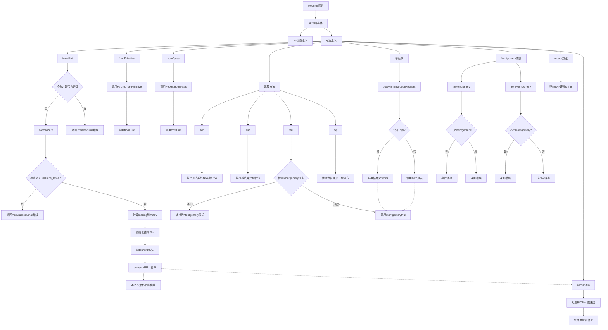

嗯，我现在需要为这个Zig语言的Modulus函数画一个流程图。首先，我得理解这个函数的结构和功能。看起来这个函数是用来处理模数运算的，特别是有限域中的元素操作。函数返回一个结构体类型，包含了一些字段和方法，比如Fe类型、模数值v、Montgomery表示的R²等等。

首先，我应该从Modulus函数的入口开始，也就是pub fn Modulus(comptime max_bits: comptime_int) type。它返回一个结构体，里面有很多方法，比如fromUint、fromPrimitive、add、sub、mul、pow等等。每个方法可能对应流程图中的一个节点。

接下来，我需要确定各个方法之间的调用关系。例如，fromUint方法调用了normalize、computeRR等。而computeRR又调用了shiftIn和shrink。同样，pow相关的方法可能调用montgomeryMul或montgomerySq。

流程图的起点应该是Modulus函数的定义，然后分支到各个方法，如创建模数实例（fromUint、fromPrimitive、fromBytes），接着是各种运算操作（add、sub、mul、sq、pow）。每个方法内部可能有条件判断或循环，比如在fromUint中检查模数是否为奇数，或者在pow中使用循环处理指数。

需要注意的是，Montgomery乘法是一个关键部分，它涉及到montgomeryLoop函数，处理进位和借位，还有条件减法。这些步骤应该在流程图中详细展示。

另外，错误处理部分也很重要，比如InvalidModulusError、OverflowError等，这些应该在流程图中作为不同的分支出现。

可能的结构是，主流程从Modulus开始，分为初始化模数（fromUint等）、运算操作（加减乘除）、幂运算、转换到/从Montgomery形式等。每个部分内部有详细的步骤，比如fromUint中的参数检查、计算m0inv、计算R²等。

在画流程图时，需要确保每个函数调用和条件判断都有对应的节点和判断框。例如，在fromUint中，首先检查v_是否为奇数，如果不是，返回错误；然后计算leading、m0inv，接着调用computeRR，最后返回初始化后的模数结构体。

对于montgomeryMul，流程可能包括初始化d为零，执行montgomeryLoop，处理溢出，进行条件减法，最后返回结果。而montgomeryLoop内部有一个循环处理每个limb，涉及乘法和进位处理。

幂运算部分可能比较复杂，分为处理公开指数和秘密指数，使用预计算表或直接循环处理每个bit。这里需要根据public参数决定不同的处理路径。

总之，流程图需要覆盖所有主要的方法和它们之间的调用关系，同时包括错误处理和条件分支。可能需要将大的函数拆分成子流程，比如将fromUint、computeRR、montgomeryMul等作为子流程图，以保持主流程图的清晰。
================================================

该流程图展示了：
1. 模数结构的核心创建流程（fromUint/fromPrimitive/fromBytes）
2. 基础运算方法（加/减/乘/平方）
3. Montgomery形式转换机制
4. 幂运算的分支逻辑（公开/秘密指数处理）
5. 核心Montgomery乘法循环的实现关系
6. 错误处理路径和参数校验逻辑

箭头表示调用关系，菱形表示条件判断，矩形表示处理步骤，虚线表示间接调用关系。