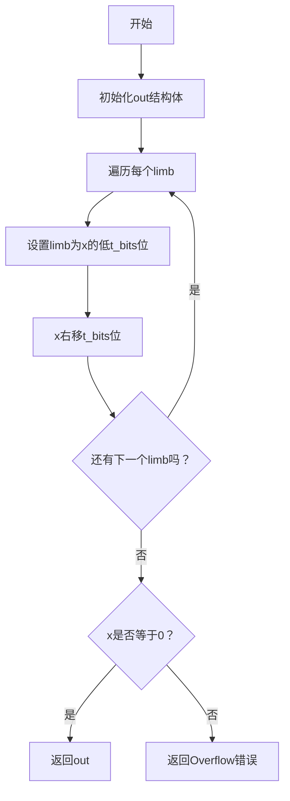
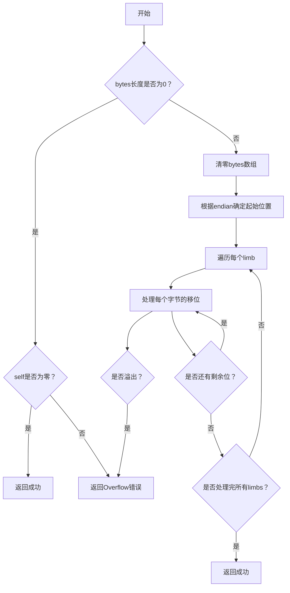
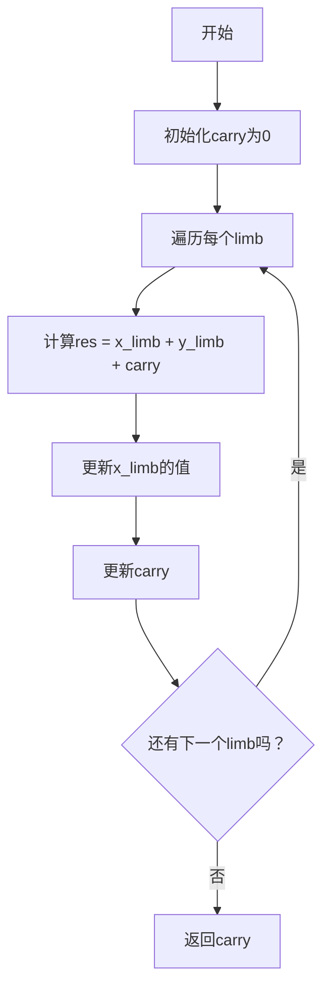
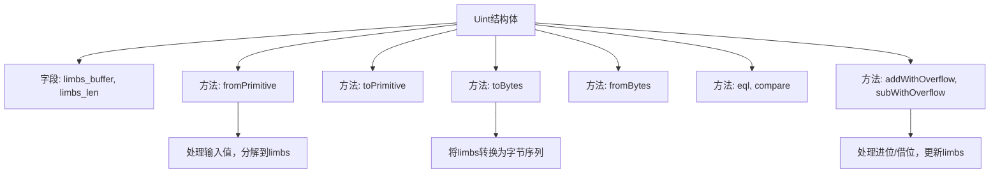
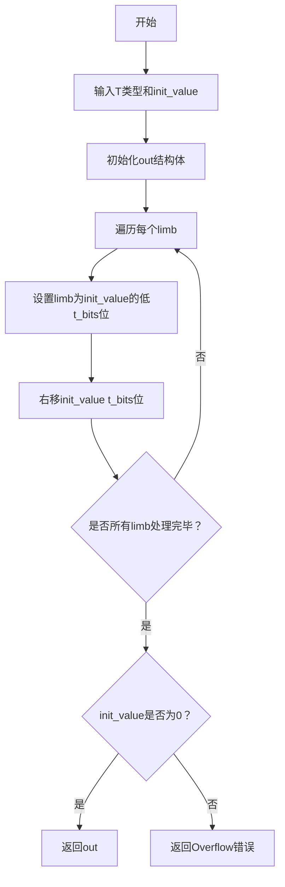
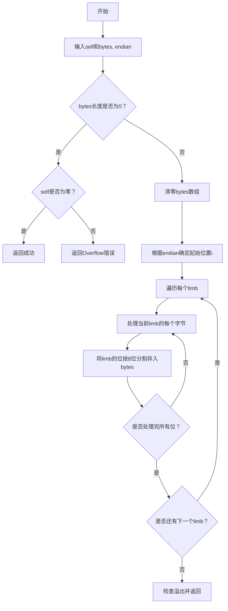

嗯，我现在需要帮用户用Mermaid画出他们提供的Zig代码的流程图。首先，我得仔细看看这段代码的结构和功能。这段代码定义了一个名为Uint的函数，返回一个结构体，结构体里有很多方法，比如fromPrimitive、toPrimitive、toBytes、fromBytes等等。看起来这是一个大整数的实现，支持各种操作，比如加减、比较、序列化和反序列化。

首先，我需要确定流程图的范围。用户提到要画出这个函数的流程图，但函数Uint实际上返回一个结构体类型。所以，可能需要画出整个结构体的方法调用流程，或者主要函数的流程。不过，由于结构体有很多方法，可能需要分别绘制每个方法的流程图，或者综合整个结构体的逻辑。

不过，用户可能希望的是整个Uint函数的流程，也就是这个结构体的创建过程，以及主要方法的流程。或者，可能是指整个结构体各个方法之间的关系。我需要进一步分析。

接下来，我需要确定每个主要方法的流程。例如，fromPrimitive将原始类型转换为大整数，toPrimitive反之，toBytes和fromBytes处理字节序列，还有加减操作、比较、归一化（normalize）等。

可能用户希望的是整个结构体的主要流程，或者每个方法的流程图。但用户只提到“函数的流程图”，可能指的是Uint这个函数本身，但Uint是一个返回类型的函数，可能结构体内部的方法才是重点。

或者，用户可能希望将整个结构体的各个方法之间的关系用流程图表示，比如初始化、转换、运算等步骤的流程。

考虑到Mermaid的流程图适合步骤和判断，可能需要为每个主要方法绘制流程图。比如，fromPrimitive的流程：检查输入类型，初始化limbs_buffer，处理每个limb，检查溢出，返回结果或错误。

同样，toPrimitive的流程：初始化变量，遍历limbs，检查溢出，返回结果或错误。

toBytes和fromBytes的流程可能更复杂，涉及到字节操作和移位，需要处理大端和小端，以及溢出检查。

此外，addWithOverflow和subWithOverflow涉及进位和借位的处理，循环处理每个limb，更新值，并返回溢出标志。

normalize方法则是去除高位的零，调整limbs_len。

可能用户希望将这些主要方法的流程分别绘制，或者综合成一个整体的结构图，展示各个方法之间的调用关系。

不过，用户可能希望一个总体的流程图，展示整个Uint结构体的创建和使用流程。例如，从初始化开始，到各种操作的可能路径。

或者，可能需要将每个方法的内部步骤用流程图表示。例如，fromPrimitive的步骤：

1. 输入T类型和init_value
2. 初始化out结构体
3. 遍历limbs_buffer的每个元素
   a. 将x的低t_bits位存入limb
   b. 右移x t_bits位
4. 检查x是否为0，否则返回溢出错误
5. 返回out

这样的步骤可以用流程图表示。

同样，toBytes的步骤：

1. 检查bytes长度是否为0，如果是且非零则溢出
2. 清零bytes数组
3. 根据endian确定起始位置
4. 遍历每个limb，处理每个字节
   a. 将limb的位按8位分割，存入bytes对应位置
   b. 处理移位和剩余位数
   c. 检查是否溢出
5. 返回结果或错误

这些步骤可以用条件判断和循环的流程图元素表示。

不过，用户可能希望一个综合的流程图，涵盖所有方法，但这可能过于复杂。因此，可能需要选择几个主要方法进行绘制，或者提供一个高层次的流程，展示结构体的创建和主要操作。

或者，可能用户希望的是整个Uint结构体的初始化流程，包括各个常量和方法的定义顺序，但这可能不太适合流程图。

综合来看，用户可能需要一个高层次的流程图，展示如何创建Uint实例，以及调用其各种方法时的流程，比如初始化、转换、运算等步骤。

另外，考虑到代码中有normalize方法，可能在加减操作后会被调用，所以流程图中可能需要展示这些调用关系。

不过，我需要明确用户的需求，但根据问题描述，用户只是希望将提供的Zig代码用Mermaid画出函数的流程图。由于代码较长且复杂，可能需要分部分处理。

可能的解决步骤：

1. 确定需要绘制流程图的范围：是整个结构体的所有方法，还是某个特定方法？

根据代码中的注释，结构体有多个方法，如fromPrimitive、toPrimitive、toBytes、fromBytes、eql、compare、isZero、isOdd、addWithOverflow、subWithOverflow、cmov、conditionalAddWithOverflow、conditionalSubWithOverflow等。

但用户可能希望的是整个Uint函数的流程图，即结构体的创建过程，或者结构体中各个方法的调用流程。

可能更合理的是，为每个主要方法绘制单独的流程图，例如fromPrimitive、toBytes、addWithOverflow等。

不过，由于用户的问题中没有明确说明，可能需要选择一个代表性的方法，或者综合整个结构体的使用流程。

例如，用户可能希望展示如何创建一个Uint实例，然后进行各种操作，如加减、转换等。

或者，可能用户希望将整个结构体的方法调用流程综合成一个总图，但这可能过于复杂。

考虑到时间和复杂性，可能需要选择一个主要方法，比如fromPrimitive或toBytes，绘制其流程图，或者将整个结构体的创建和使用流程简化。

例如，Uint函数创建结构体类型，结构体包含各种方法，每个方法有各自的流程。

可能，用户希望看到整个结构体的初始化流程，以及主要方法的调用流程。

或者，可能用户希望的是结构体内部方法的调用关系，比如normalize在何时被调用，addWithOverflow如何调用conditionalAddWithOverflow等。

例如，当调用addWithOverflow时，会调用conditionalAddWithOverflow，并传递参数。

此外，cmov方法被conditionalAdd和Sub调用，用于条件性地更新limbs。

但这样的调用关系可能更适合用序列图或类图，而不是流程图。

综上所述，可能需要将每个主要方法的内部处理步骤用流程图表示，例如fromPrimitive、toBytes、addWithOverflow等。

例如，以fromPrimitive为例：

开始 -> 检查T类型 -> 初始化out结构体 -> 遍历每个limb，设置值 -> 检查x是否为0 -> 返回结果或错误。

而每个步骤中的循环和条件判断需要详细表示。

同样，toBytes方法：

开始 -> 检查bytes长度 -> 清零bytes -> 确定endian方向 -> 遍历每个limb -> 处理每个字节 -> 检查溢出 -> 返回结果或错误。

对于这样的流程，可以用Mermaid的流程图语法表示。

由于用户可能希望多个方法的流程图，但问题中只提到“函数的流程图”，可能指的是整个Uint函数的流程，但Uint函数本身只是返回结构体类型，所以可能更合理的是绘制结构体中某个关键方法的流程图，如fromPrimitive或toBytes。

或者，将结构体的创建和主要方法调用流程综合起来。

现在，我需要根据这些分析，决定如何绘制Mermaid流程图。可能，选择几个关键方法，如fromPrimitive、toBytes、addWithOverflow，分别为它们绘制流程图。

例如，fromPrimitive的流程图：

toBytes的流程图：

addWithOverflow的流程图：

但用户可能希望将这些整合成一个总图，或者分别绘制。由于用户的问题没有明确说明，可能需要选择主要函数，如fromPrimitive和toBytes，绘制它们的流程图。

不过，可能用户希望的是整个结构体的创建流程，即Uint函数如何生成结构体类型，但这个过程在编译时确定，可能不太适合流程图。

综上所述，我认为用户需要的是几个主要方法的流程图，如fromPrimitive、toBytes、addWithOverflow等，每个方法一个流程图。但由于问题要求一个答案，可能需要选择一个代表性的方法，或者综合主要步骤。

不过，考虑到用户提供的代码较多，可能需要提供一个高层次的流程图，展示结构体的主要组成部分和方法之间的关系。

例如：

这样的高层次图可能更简洁，但可能不够详细。用户可能需要更详细的步骤流程。

综上所述，可能需要为fromPrimitive和toBytes方法绘制详细的流程图，因为它们涉及较多的步骤和条件判断。

例如，fromPrimitive的详细流程图：

toBytes的详细流程图：

这样的流程图能够展示每个方法的关键步骤和条件判断。

综上，我认为用户需要的是主要方法的详细流程图，因此我会选择fromPrimitive和toBytes作为示例，用Mermaid绘制它们的流程图。
================================================

