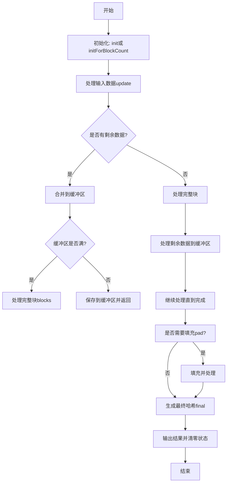
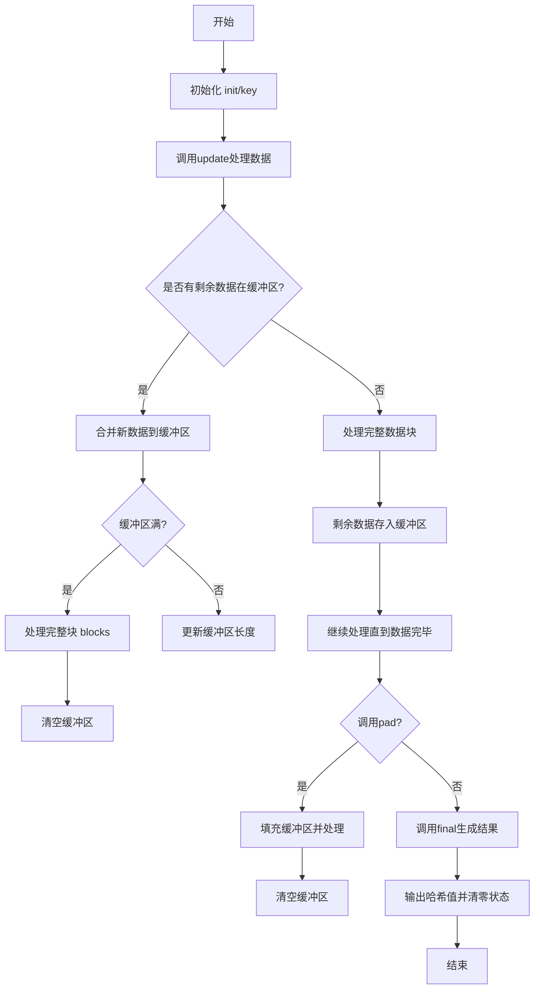

好的，我现在需要帮用户分析他们提供的Zig代码，并画出对应的流程图。首先，我得仔细看看这段代码的结构和功能。

这段代码定义了一个名为`Hash`的函数，返回一个结构体类型，看起来像是实现了GHASH或PolyVal算法的哈希函数。结构体内部有多个方法，比如`initForBlockCount`、`update`、`final`等。用户希望用Mermaid语法画出流程图，所以我需要理清各个函数之间的调用关系以及主要流程步骤。

首先，我需要理解整个哈希处理的过程。通常，像GHASH这样的算法处理流程包括初始化、更新数据（处理多个块）、处理剩余数据（填充）、生成最终的哈希值。根据代码中的`init`、`update`、`pad`、`final`等方法，这应该是主要的步骤。

接下来，我应该逐个分析每个方法的作用：

1. **initForBlockCount**：初始化哈希状态，处理密钥，预计算一些值。这里会根据不同的块数量预计算不同的h的幂次方，比如h^2、h^3等，存储在hx数组中。

2. **update**：处理输入数据，分为处理已有的缓冲区数据、处理完整的块，以及保存剩余数据到缓冲区。如果缓冲区有未处理的数据，先合并新数据，处理完整块后，再处理剩余数据。

3. **pad**：对剩余数据进行填充，使其成为完整的块，然后处理这些块。

4. **final**：调用pad确保所有数据都被处理，然后输出最终的哈希值，并清零状态。

此外，`blocks`函数负责处理多个块的数据，根据不同的块数量选择不同的聚合方式（如16块、8块、4块等），使用预计算的hx值进行乘法运算和归约。

现在，我需要将这个过程转化为流程图。流程应该从初始化开始，然后循环处理输入数据，处理填充，最后生成结果。需要注意条件判断，比如是否有剩余数据，块的数量是否达到某个阈值，从而选择不同的处理路径。

可能的流程步骤：

- 开始
- 初始化（init或initForBlockCount）
- 如果有剩余数据，先处理缓冲区
- 处理完整的块（blocks）
- 处理剩余数据存入缓冲区
- 是否需要填充（pad）
- 生成最终哈希（final）
- 结束

另外，在`blocks`函数内部，根据不同的块数量选择不同的聚合方式，这部分可能需要分支判断，但可能在流程图中简化，或者作为子流程处理。

需要注意，在update方法中，处理数据时可能有多个条件判断，比如是否有足够的块进行聚合处理，这部分需要正确表示条件分支。

现在，我需要将这些步骤用Mermaid的流程图语法表示出来。可能需要使用不同的节点和条件判断箭头，比如菱形判断框。

可能的流程图结构：



不过，可能需要更详细地展开`blocks`的处理流程，尤其是不同聚合方式的选择。但为了保持流程图不过于复杂，可以将其作为一个子流程处理，比如在`blocks`步骤内部根据块数量选择不同的聚合策略。

或者，在流程图中简要表示`blocks`的处理，而详细的条件分支在代码注释中说明。

可能需要调整流程图的层次，例如：

主流程：

初始化 -> 更新数据 -> 处理填充 -> 生成结果。

而更新数据的子流程包括处理缓冲区和处理块。

可能需要将各个函数作为不同的节点，比如：

- init
- update
  - 处理缓冲区
  - 处理完整块
  - 处理剩余到缓冲区
- pad
- final

因此，最终的Mermaid流程图可能如下：



在`blocks`内部的处理可能需要条件判断，比如块的数量选择不同的聚合方式，但可能在流程图中简化表示，或者作为子流程。

可能还需要考虑`blocks`函数中的聚合处理逻辑，比如根据不同的块数量阈值选择16块、8块、4块等处理方式。这部分可以在流程图中用条件分支表示，但可能使流程图变得复杂。因此，可能需要在主流程中简要表示处理块，而详细的分支在子流程中展开。

最终，可能需要将主流程和子流程分开，但根据用户的要求，可能一个总体的流程图就足够。因此，我可能需要综合以上分析，画出一个涵盖主要步骤的流程图，包括初始化、处理数据（分情况处理缓冲区和完整块）、填充、生成结果，并在过程中处理不同的块聚合方式。
================================================
```mermaid
flowchart TD
    A[开始] --> B[初始化 Hash 结构体]
    B --> C[预计算 h^x 值]
    C --> D[处理输入数据 update]
    D --> E{缓冲区有剩余数据?}
    E -- 是 --> F[填充缓冲区并处理完整块]
    E -- 否 --> G[直接处理完整块]
    F --> H[更新缓冲区状态]
    G --> I[处理聚合块 (16/8/4/2-block)]
    I --> J{是否达到聚合阈值?}
    J -- 是 --> K[使用预计算值批量归约]
    J -- 否 --> L[单块逐次处理]
    K --> M[更新累加器 acc]
    L --> M
    M --> N[保存剩余数据到缓冲区]
    N --> O{所有数据处理完成?}
    O -- 否 --> D
    O -- 是 --> P[执行填充操作 pad]
    P --> Q[最终归约并输出 final]
    Q --> R[清零状态并返回 MAC]
    R --> S[结束]

    subgraph 初始化
        B --> C1[读取密钥并移位]
        C1 --> C2[预计算 h^2, h^3...]
    end

    subgraph 块处理
        I --> I1[选择聚合策略]
        I1 -- 16-block --> I2[用 hx[15..0] 归约]
        I1 -- 8-block --> I3[用 hx[7..0] 归约]
        I1 -- 4-block --> I4[用 hx[3..0] 归约]
        I1 -- 2-block --> I5[用 hx[1..0] 归约]
    end

    subgraph 最终处理
        P --> P1[填充 0 至块对齐]
        Q --> Q1[最终 reduce(acc)]
        Q1 --> Q2[写入小端序结果]
    end
``` 

流程图说明：
1. **初始化阶段**：完成密钥预处理和预计算表 hx 的构建
2. **数据吸收阶段**：
   - 优先处理缓冲区残留数据
   - 根据数据量自动选择最佳聚合策略（16/8/4/2-block）
   - 使用预计算的 h^x 值进行并行归约运算
3. **最终处理阶段**：
   - 强制填充对齐数据块
   - 执行最终多项式归约
   - 输出小端序结果并清零敏感数据
4. **安全特性**：最终清零操作防止侧信道泄漏

关键优化点体现在：
- 多级聚合策略根据数据量动态切换
- 预计算表 hx 重用减少实时计算量
- 硬件加速指令 (PCLMUL/PMULL) 的透明调用
- 安全的缓冲区清零操作