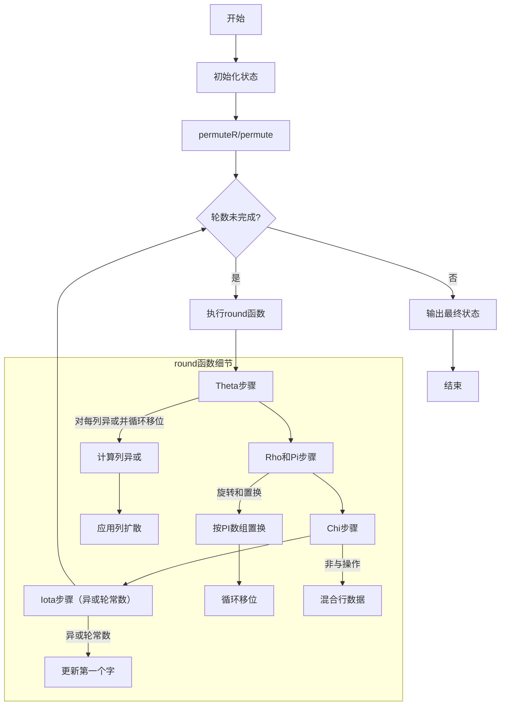

好的，我需要为这个用Zig编写的KeccakF函数画一个流程图。首先，我要理解这个函数的结构和各个部分的功能。

首先，函数KeccakF是一个泛型函数，接受一个f参数，这个参数决定了状态的大小。代码中有一些常量和结构体的定义，比如Block是25个元素的数组，PI数组用于rho和pi步骤的置换。然后返回一个结构体，里面包含了各种方法，比如初始化、字节操作、置换等。

主要的置换过程在round方法中，分为theta、rho+pi、chi和iota四个步骤。permuteR和permute方法用来应用这些轮次。

接下来，我需要确定流程图的起点和各个步骤。流程图应该从初始化状态开始，然后是各个处理步骤：theta、rho和pi、chi、iota，循环进行多轮，最后结束。

需要注意的是，permuteR方法会根据指定的轮数多次调用round，而permute则调用完整的轮数。此外，round中的各个子步骤需要详细分解。

可能的结构是：

1. 初始化状态（init）
2. 处理每个轮次：
   a. Theta步骤
   b. Rho和Pi步骤
   c. Chi步骤
   d. Iota步骤（应用轮常数）
3. 重复指定轮数
4. 输出最终状态

此外，其他方法如setBytes、addByte等可能也需要在流程图中体现，但用户可能更关注permute的过程。因此，流程图应重点放在permute和round的步骤上。

在绘制时，需要将每个步骤用不同的节点表示，并用箭头连接它们的执行顺序。例如，theta之后是rho+pi，然后是chi，最后是iota，每个轮次结束后循环直到所有轮次完成。

确认各个步骤的代码对应关系，确保流程图准确反映代码逻辑。例如，theta步骤中的异或和循环移位操作，rho和pi中的旋转和置换，chi的非与操作，以及最后的异或轮常数。

最后，整理这些步骤，形成清晰的流程图结构，使用mermaid语法正确表示各个节点和流程。
================================================
