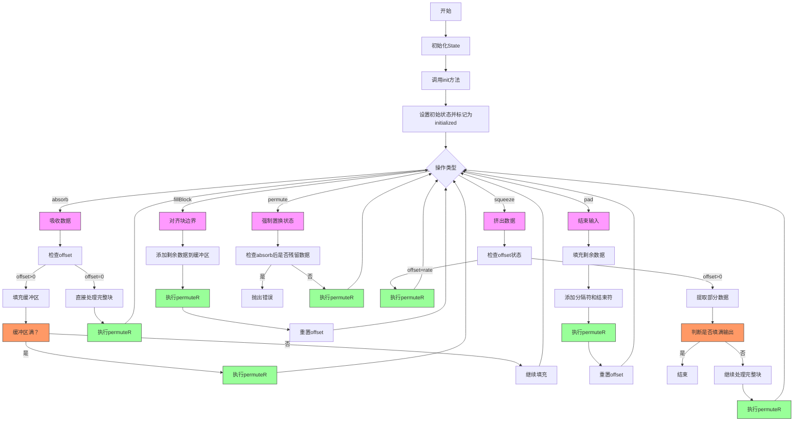

嗯，我需要为这个用Zig语言编写的Keccak状态处理函数画一个流程图。首先，我应该理解这个函数的结构和各个部分的功能。

首先，这个函数定义了一个`State`类型，它接受三个编译时常量参数：f、capacity和rounds。然后有一些编译时的断言检查，确保参数的有效性。接下来，定义了一个`Op`枚举，用于跟踪状态转换，在调试模式下会检查状态转换是否合法，否则在非调试模式下不做检查。

然后，`State`结构体包含了多个成员变量，比如`delim`、`offset`、`buf`、`st`和`transition`。结构体还有多个方法，如`absorb`、`init`、`permute`、`fillBlock`、`pad`和`squeeze`，这些方法分别处理不同的状态操作。

接下来，我需要确定每个方法的作用和它们之间的调用关系。例如，`init`用于初始化状态，`absorb`处理输入数据的吸收，`permute`进行状态的置换，`fillBlock`填充块并置换，`pad`进行填充并结束输入，`squeeze`输出数据。

在画流程图时，应该从初始化开始，然后根据不同的操作调用相应的方法，并处理可能的错误或状态转换。需要注意各个方法之间的状态转换条件，比如在`absorb`之后不能直接`squeeze`，否则会触发panic。

可能遇到的困难是如何正确表示状态之间的转换，以及各个方法内部的处理步骤。例如，`absorb`方法中有条件判断，处理缓冲区未满时的情况，以及填充后的置换操作。此外，`pad`方法中的填充逻辑和置换也需要详细表示。

需要确保在流程图中包含所有重要的步骤和条件分支，比如在`absorb`中处理剩余数据的方式，`squeeze`中处理输出缓冲区的逻辑。同时，状态跟踪器`transition`在不同模式下的行为也需要考虑，但可能在流程图中简化这部分，重点放在主要方法之间的流程。

可能需要将整个流程分为几个主要部分：初始化、吸收数据、填充数据、置换状态、挤出数据。每个部分内部的方法调用和条件判断需要详细展开。

最后，需要确保流程图的逻辑清晰，正确反映代码的执行流程和状态转换，同时避免过于复杂，保持可读性。
================================================
