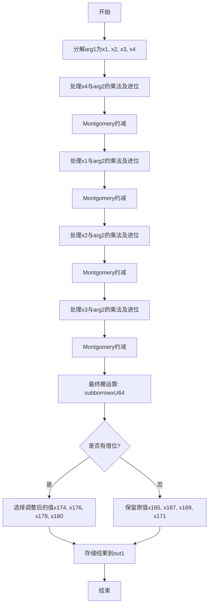

嗯，我需要画出这个Zig函数的流程图。首先，我得理解这个函数的功能。看起来这是一个椭圆曲线P-256的乘法运算，可能是在Montgomery域中的乘法。函数名为mul，接受三个参数：输出out1，输入arg1和arg2，都是MontgomeryDomainFieldElement类型。

首先，函数内部有很多变量定义和操作，比如mulxU64、addcarryxU64、subborrowxU64，这些可能是处理64位无符号整数的乘法和进位加法/借位减法。还有一些常量，比如0xffffffff00000001，这可能是P-256的模数相关参数。

接下来，我需要逐行分析代码的结构。代码分为多个部分，每个部分似乎对应不同的乘法步骤和模约减。例如，第一个部分处理arg1[0]与arg2的各个元素相乘，然后进行进位处理。接着是类似的步骤，处理arg1[1]、arg1[2]、arg1[3]与arg2的乘法，每次都会进行类似的进位和模约减操作。

然后，注意到每个大的乘法部分后面都有使用mulxU64进行乘法，然后一系列的addcarryxU64来处理进位，之后可能进行模约减。比如在第一个块之后，使用0xffffffff00000001等常数进行乘法，可能是在进行Montgomery约减。

之后，代码末尾有subborrowxU64和cmovznzU64操作，这可能是最后的模运算，确保结果在正确的范围内。最后的out1赋值则是将结果存储到输出数组中。

为了画流程图，我需要将整个函数的步骤分解成几个主要阶段：

1. 初始化参数分解：将arg1分解为x1, x2, x3, x4。
2. 处理第一个输入元素（x4）与arg2的乘法，并累加进位。
3. 进行Montgomery约减。
4. 处理第二个输入元素（x1）与arg2的乘法，累加进位，再次约减。
5. 处理第三个输入元素（x2）与arg2的乘法，累加进位，约减。
6. 处理第四个输入元素（x3）与arg2的乘法，累加进位，约减。
7. 最后的模运算处理，使用subborrowxU64和条件移动指令cmovznzU64来确定最终结果。
8. 将结果存储到out1中。

每个阶段可以表示为一个流程节点，箭头表示执行顺序。此外，每个处理乘法部分可能包含循环结构，但由于代码是展开的，所以流程图可能没有循环，而是顺序结构。

需要注意的是，每次处理一个输入元素（如x4, x1, x2, x3）时，都会进行类似的乘法、进位处理、约减步骤，因此这些步骤可能在流程图中重复出现，但针对不同的元素。

最后，确定条件跳转的位置，比如最后的subborrowxU64后的cmovznzU64，根据是否有借位来决定结果的选择，这需要分支判断。

综上，流程图的大致结构如下：

开始 -> 分解arg1 -> 处理x4的乘法 -> Montgomery约减 -> 处理x1的乘法 -> 约减 -> 处理x2的乘法 -> 约减 -> 处理x3的乘法 -> 约减 -> 最终模运算 -> 结果选择 -> 存储结果 -> 结束。
================================================
