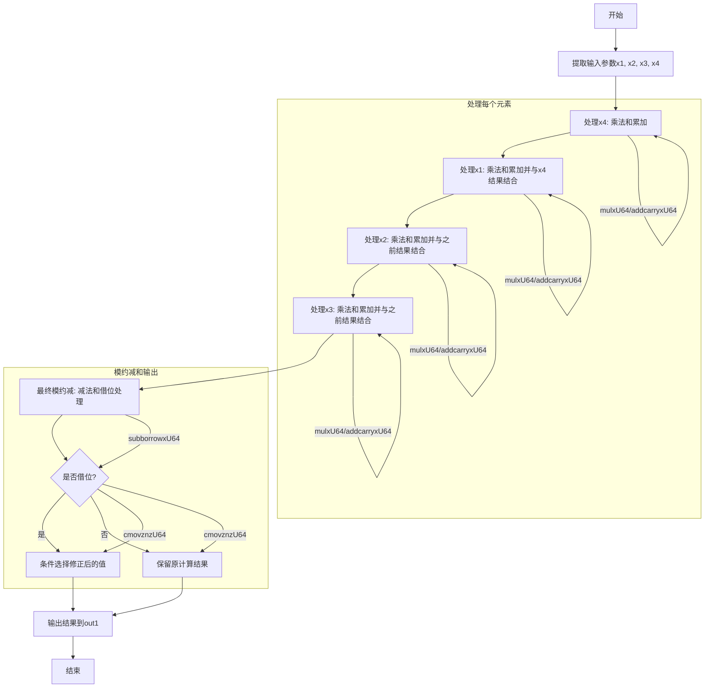

好的，我需要帮助用户将一个用Zig编写的函数转换为Mermaid流程图。首先，我需要理解这个函数的功能。看起来这个函数是将一个非蒙哥马利域的元素转换为蒙哥马利域的元素，具体是针对P256椭圆曲线参数进行的64位优化实现。

首先，我需要通读代码，了解每个步骤的作用。函数名为toMontgomery，输入是一个NonMontgomeryDomainFieldElement，输出是MontgomeryDomainFieldElement。函数内部进行了大量的乘法、加法和进位处理操作，可能涉及到模约减和蒙哥马利乘法转换的步骤。

接下来，我需要识别代码中的主要部分。函数开始处提取输入参数的各个元素x1到x4，然后进行一系列的乘法（mulxU64）和带进位的加法（addcarryxU64）。这些操作可能是在执行蒙哥马利转换中的乘法和累加步骤。之后，代码多次重复类似的模式，可能是在处理不同的输入部分（x1, x2, x3）。最后，有一些减法操作（subborrowxU64）和条件移动（cmovznzU64），可能是进行最终的模约减，以确保结果在正确的范围内。

接下来，我需要将这些步骤转化为流程图的结构。流程图通常包括开始、处理步骤、判断和结束。由于代码中有许多重复的乘法、加法和进位处理，可能需要将这些步骤合并为循环或重复块，但根据代码结构，看起来是针对每个输入元素（x1, x2, x3）进行类似的处理，因此每个元素可能有独立的处理流程。此外，最后的减法部分和条件移动用于处理可能的溢出，需要进行条件判断。

需要注意的是，代码中的变量名如x5到x170可能对应于中间计算结果，但流程图不需要详细到每个变量，而是展示主要操作流程，如乘法、加法、进位处理、模约减和条件判断。

可能的流程图结构如下：
1. 开始
2. 提取输入参数x1, x2, x3, x4
3. 对x4进行乘法操作和累加处理
4. 对x1进行类似的处理并与之前的结果结合
5. 对x2重复类似步骤
6. 对x3重复类似步骤
7. 进行最终的模约减（减法操作）
8. 根据条件选择结果
9. 输出结果
10. 结束

在绘制Mermaid流程图时，需要将每个主要步骤作为节点，处理流程中的循环或重复结构可能需要用子流程或分组表示。不过，由于代码中每个输入元素（x1, x2, x3）的处理步骤相似但独立，可能需要分别表示每个元素的处理过程。

此外，最后的减法操作和条件移动涉及条件判断，需要使用菱形判断节点，根据条件结果选择不同的路径。

总结步骤：
- 提取输入
- 处理每个输入元素（x4, x1, x2, x3）进行乘法和累加
- 每次处理元素后可能进行模约减
- 最终的整体模约减和条件选择
- 输出结果

现在需要将这些步骤转化为Mermaid的语法，使用合适的节点和连接线，确保逻辑清晰。
================================================
