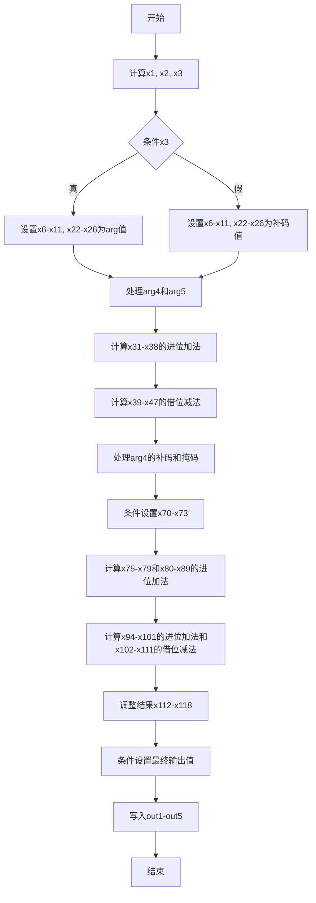

好的，我需要帮用户画出这个Zig函数的流程图。首先，我得仔细阅读代码，理解它的结构和逻辑。这个函数名为divstep，有多个输出参数和输入参数，看起来像是某种数学运算，可能与椭圆曲线加密相关，尤其是P256曲线。

首先，函数参数包括多个数组和变量，out1到out5是输出，arg1到arg5是输入。代码中有很多位操作、条件移动（cmovznzU64）、进位加法（addcarryxU64）和借位减法（subborrowxU64），这可能涉及到大数运算，比如模运算或除法步骤。

接下来，我需要理清函数的执行流程。代码开始处计算x1和x2，然后通过addcarryxU64得到x4和x5。接着根据x3的条件选择不同的值，这里x3是arg3[0]的最低位和arg1的补码加1后的最高位的与操作结果。这说明可能有条件分支，但Zig中使用条件移动而不是跳转，所以流程图里需要体现条件选择。

然后，代码中多次使用cmovznzU64来根据条件选择不同的值，这类似于if-else的逻辑，但用位操作实现。例如，根据x3的值选择arg1或x4赋值给x6。之后处理arg2和arg3数组的元素，同样根据x3条件选择。

接下来是多个加法、减法和进位处理，可能涉及到大数的加减运算。例如，计算x31到x38的一系列加法，然后进行减法得到x39到x47，这可能是模减操作，因为后面出现了特定的常数0xf3b9cac2fc632551等，这些是P256曲线的参数。

中间部分处理arg4和arg5数组，同样使用条件移动和加减运算，可能是在调整中间变量或进行模运算。代码后半部分有更多的条件移动和加减，最后将结果赋值给输出参数out1到out5。

为了画流程图，我需要将代码分解成几个主要步骤：

1. 初始化变量和计算初始条件（x1到x3）。
2. 根据x3条件选择不同的值（x6到x26）。
3. 处理arg4和arg5的条件选择（x27到x30）。
4. 进行一系列的加法和减法运算，可能涉及模运算。
5. 更多的条件移动和调整中间变量。
6. 最后的赋值给输出参数。

每个步骤中，条件移动和算术运算是主要操作，需要将这些操作用流程图节点表示，并用箭头连接，条件判断用分支表示。但由于Zig中的cmovznz是条件移动，不是分支，所以流程图中可能用条件节点来选择不同的路径，但实际代码是顺序执行的，没有跳转。

需要注意，流程图中应正确反映各个变量的依赖关系和执行顺序。可能存在的循环结构需要检查，但在这个函数中似乎没有循环，都是线性操作。因此，流程图可能是一个线性的过程，中间穿插条件选择。

可能需要将每个大的计算块作为流程图中的一个节点，特别是条件移动的部分。同时，加减运算中的进位和借位处理也需要体现，但可能简化为操作步骤，而不是详细画出每个位操作。

最后，输出部分将结果写入out1到out5，这也是流程图的结束部分。

总结，流程图的大致结构是：

开始 -> 初始化变量 -> 条件选择1 -> 处理arg2/arg3 -> 处理arg4/arg5 -> 加减运算 -> 条件选择2 -> 结果调整 -> 输出结果 -> 结束。

在mermaid图中，使用矩形框表示步骤，菱形表示条件判断，箭头表示流程方向。但需要注意，由于条件移动是直接赋值，没有分支，所以可能不需要菱形，而是用条件说明在矩形框中。
================================================
