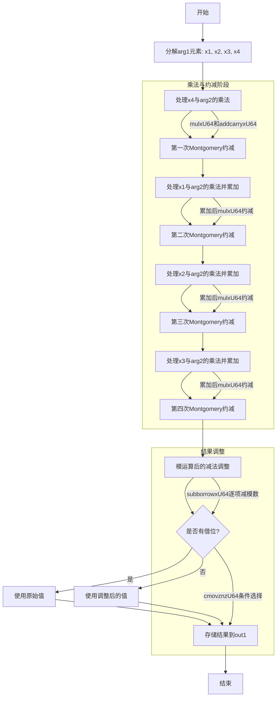

嗯，用户让我画这个Zig函数的流程图。首先，我需要理解这个函数的功能。看起来这是一个在Montgomery域中进行乘法运算的函数，可能用于椭圆曲线加密，特别是P256曲线。函数名是mul，参数是两个MontgomeryDomainFieldElement类型的参数arg1和arg2，结果存储在out1中。

首先，我需要理清函数的结构。代码中有很多变量x1到x219，看起来是中间计算步骤。每一步可能涉及乘法、加法、进位处理等。函数开始部分提取arg1的元素x1到x4，然后进行一系列的mulxU64和addcarryxU64操作。mulxU64可能是执行无符号64位乘法并返回高位和低位结果，addcarryxU64处理带进位的加法。

接下来，注意到有多次类似的模式：先进行乘法，然后处理进位，接着进行模约减。例如，每次处理完一部分乘法后，会乘以一个常数0xccd1c8aaee00bc4f，然后进行一些模运算，这可能与Montgomery约减有关。每个大步骤可能对应处理arg1的一个元素（比如x4, x1, x2, x3）与arg2的各个元素相乘，并进行累加和模约减。

流程大致分为几个阶段：
1. 初始化，分解arg1的元素。
2. 对arg1[0]（x4）与arg2的各个元素相乘，累加结果，并进行Montgomery约减。
3. 类似地处理arg1[1]（x1）、arg2[2]（x2）、arg3[3]（x3），每次处理都进行乘法、累加、进位处理，然后Montgomery约减。
4. 最后的减法操作（subborrowxU64）可能是在进行模运算后的调整，确保结果在正确的范围内。
5. 使用条件移动指令（cmovznzU64）选择最终结果，避免分支。

现在，我需要将这些步骤转化为流程图。每个主要步骤可以作为一个流程节点，比如乘法阶段、进位处理、模约减、结果调整等。需要注意循环或重复的结构，可能每个输入元素（x4, x1, x2, x3）的处理流程是相似的，可以表示为循环结构，但由于代码是展开的，可能需要分别表示。

可能的流程图结构：
- 开始
- 分解arg1的元素x1, x2, x3, x4
- 处理x4与arg2的乘法，得到初始累加结果
- 进行第一次Montgomery约减
- 处理x1与arg2的乘法，累加到之前的结果，再次约减
- 类似处理x2和x3
- 最后的模调整（减法）
- 条件移动选择正确结果
- 输出out1

需要确认每个步骤之间的数据流向，比如每次乘法后的结果如何传递到下一步，进位如何处理。另外，最后的减法部分可能是一个关键点，用于确保结果不超过模数，如果减法产生借位，则需要选择原始值，否则选择减去后的值，这由cmovznzU64处理。

可能需要将每个乘法阶段视为一个子流程，尤其是每个arg1的元素处理都遵循类似的模式：乘法、累加进位、约减。因此，流程图可能会有四个类似的子流程块，每个处理一个元素，然后是最终的调整步骤。

需要确保流程图的每个节点明确表示操作，如“Multiply x4 with arg2 elements”，“Add with carry”，“Montgomery reduction”等。最后的条件移动部分需要表示根据借位标志选择结果。

可能需要用Mermaid的分支和子流程来表示这些步骤，但由于代码是线性的且展开的，可能不需要循环结构，而是顺序的步骤。每个乘法阶段可以视为一个处理块，然后是约减块，重复四次，接着是减法调整和条件移动。
================================================

流程说明：
1. **初始化**：分解输入参数arg1的四个64位元素
2. **四级乘加-约减流水**：
   - 每级处理一个arg1元素与arg2的全乘法
   - 使用mulxU64进行64×64→128位乘法
   - 通过addcarryxU64处理256位累加
   - 用Montgomery常数0xccd1c8aaee00bc4f进行快速约简
3. **最终模调整**：
   - 通过带借位的减法(subborrowxU64)处理可能超出模数的情况
   - 根据借位标志，用cmovznzU64选择最终结果
4. **输出**：将调整后的结果写入out1数组