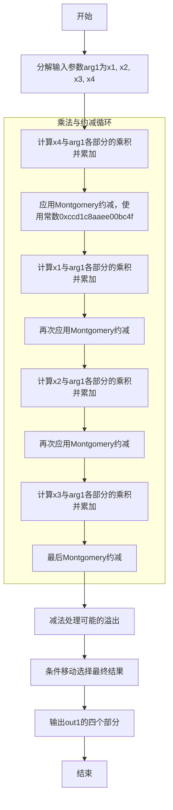

嗯，我现在需要分析这个Zig语言编写的函数，并画出它的流程图。首先，我得理解这个函数的功能。看起来这是一个关于椭圆曲线加密的函数，特别是P-256曲线的标量乘法或平方运算。函数名为square，接收两个参数，一个是输出的Montgomery域场元素指针，另一个是输入的Montgomery域场元素。

首先，我需要理清代码的结构。代码里有很多变量声明和一系列的操作，比如mulxU64（可能是64位无符号整数乘法并返回高位和低位结果）、addcarryxU64（带进位的加法）以及subborrowxU64（带借位的减法）。还有最后的cmovznzU64（条件移动指令，根据条件选择值）。这些操作通常用于大数运算，特别是模运算，这在椭圆曲线密码学中很常见。

接下来，我注意到代码中有四个输入元素arg1[0]到arg1[3]，可能代表的是256位的数，分成四个64位的部分。函数的主体部分似乎在进行一系列的乘法和累加操作，然后进行模约减（可能使用Montgomery约减）。每一步乘法后，可能会有中间结果的处理，以及通过进位链来管理溢出。

为了画出流程图，我需要分解每个步骤：

1. **初始化阶段**：提取输入参数arg1的各个部分x1, x2, x3, x4（即arg1的各个64位块）。
2. **乘法与累加**：进行多次mulxU64和addcarryxU64操作，生成中间结果。例如，第一次乘法是x4与arg1[3]相乘，得到x5和x6，然后继续处理其他位的乘法。
3. **Montgomery约减**：在每次乘法后，似乎有一个固定的模式，使用0xccd1c8aaee00bc4f作为乘数，然后进行一系列乘法和加法，可能是为了将结果转换到Montgomery域。
4. **处理进位和借位**：每个加法步骤都处理进位，减法处理借位，确保中间结果正确。
5. **条件移动**：最后的cmovznzU64根据条件选择是否使用约减后的值，以避免负值或处理溢出。

流程图的大致结构可能如下：

- 开始
- 分解输入参数
- 对每个输入块进行乘法和累加（分四个部分处理，每个部分可能对应不同的位）
- 进行Montgomery约减，可能涉及多次乘法和调整
- 处理进位和借位，确保数值正确
- 最后的条件移动，确定输出值
- 结束

需要特别注意循环或重复的结构，例如每个输入块的处理可能有相似的模式，可能需要循环展开的步骤。此外，Montgomery约减的步骤可能需要特定的常数乘法，如代码中出现的0xf3b9cac2fc632551等，这些是P-256曲线的参数。

可能的错误点或需要注意的地方：进位和借位的处理是否正确，条件移动是否在正确的条件下触发，以及所有步骤是否正确地组合以实现平方运算。此外，Montgomery域的转换是否正确应用，可能需要参考P-256的具体参数。

总结流程图步骤：

1. 分解输入到各个64位块。
2. 对每个块进行乘法并累加中间结果。
3. 应用Montgomery约减，使用特定常数。
4. 处理进位和借位。
5. 条件选择最终结果。
6. 输出结果。

现在需要将这些步骤转化为mermaid流程图，注意每个步骤之间的顺序和可能的循环或分支。
================================================
