嗯，我现在要画这个Zig函数的流程图。首先，我得仔细读一下这段代码，理解它的结构和逻辑。这个函数叫做toMontgomery，看起来是将一个非Montgomery域的元素转换为Montgomery域的元素。函数内部有很多变量操作，包括乘法、加法、进位处理，最后还有条件移动指令。

首先，函数接受两个参数：out1是一个指向MontgomeryDomainFieldElement的指针，arg1是NonMontgomeryDomainFieldElement类型的输入。函数体里有很多变量定义，比如x1到x202，这些变量可能是在处理不同的中间结果。代码中多次出现mulxU64和addcarryxU64这样的函数，看起来是进行64位无符号整数的乘法和带进位的加法运算。

接下来，我需要理清代码的执行流程。首先，函数从arg1中取出各个元素，x1到x4，然后开始一系列的乘法和累加操作。例如，第一个部分是对x4进行乘法，然后处理进位，接着对x1、x2、x3进行类似的操作。每次处理完乘法后，似乎有一个模约减的过程，通过乘以某个常数（比如0xccd1c8aaee00bc4f）并进行后续的乘法和加法操作，最后进行减法调整，确保结果在正确的模数范围内。

可能的流程步骤是：
1. 分解输入参数arg1的元素。
2. 对每个元素进行乘法运算，并处理进位。
3. 进行Montgomery约减，可能涉及到乘以一个特定的常数，并调整结果。
4. 最后进行减法检查，确保结果在模数范围内，使用条件移动指令选择正确的结果。

我需要将这个过程转化为流程图。可能需要分为几个主要块：初始化处理、循环处理每个输入元素、Montgomery约减步骤、最后的调整和输出。

不过，代码中没有明显的循环结构，而是按顺序处理x4、x1、x2、x3。每个元素的处理步骤类似，都是进行乘法和进位处理，然后进行Montgomery约减。可能需要将每个元素的处理作为流程图中的一个节点，然后连接这些节点，显示数据流向。

另外，最后的减法调整部分可能涉及到条件判断，根据进位标志决定是否替换结果值。这时候在流程图中可能需要分支结构，但代码中使用的是cmovznzU64，即条件移动指令，根据标志位选择值，而不是显式的分支。

所以，整个流程图的大致结构可能是：
1. 分解输入元素。
2. 对每个输入元素（x4, x1, x2, x3）进行处理：
   a. 乘法运算，生成中间变量。
   b. 处理进位，累加中间结果。
   c. 进行Montgomery约减，调整结果。
3. 最后的减法调整，检查是否溢出，使用条件移动更新结果。
4. 输出结果到out1。

每个步骤之间是顺序执行的，每个元素的处理可能重复相同的模式。因此，流程图可能有四个主要处理块，分别对应x4、x1、x2、x3的处理，然后是最后的调整步骤。

不过，代码中的处理顺序可能更复杂，因为每个元素处理后的结果会被后续步骤使用。比如，处理x4后的结果可能影响x1的处理，依此类推。因此，流程图需要反映这种数据依赖关系。

此外，每次处理元素后，会调用mulxU64和addcarryxU64，这些操作可能涉及多个步骤，如乘法、处理高位和低位、进位传递等。在流程图中，可能需要将这些步骤分解为更细的节点，以准确表示操作顺序和数据流向。

最后的减法部分，四个subborrowxU64调用，检查结果是否超过模数，如果超过则进行调整。然后根据subborrow的结果，使用cmovznzU64来选择是否保留原始值或调整后的值。这部分在流程图中可能需要一个判断节点，根据进位标志决定结果值。

总结来说，流程图的结构可能是：
- 开始
- 初始化，分解输入元素x4, x1, x2, x3
- 处理x4：
   - 乘法，生成x5到x12
   - 处理进位，得到x13到x18
   - Montgomery约减步骤，生成x19到x43
- 处理x1：
   - 乘法，生成x45到x52
   - 处理进位，得到x53到x58
   - 结合之前的结果，进行Montgomery约减，生成x59到x91
- 处理x2：
   - 类似步骤，生成x93到x113
   - 继续Montgomery约减，得到x115到x139
- 处理x3：
   - 类似步骤，生成x141到x161
   - 最后的Montgomery约减，得到x163到x187
- 最后的减法调整：
   - 四次subborrowxU64，得到x189到x195
   - 根据进位标志x198，使用cmovznzU64选择结果x199到x202
- 输出结果到out1数组
- 结束

每个处理块内部可能有相似的子步骤，但需要详细展开。但由于代码非常冗长，变量很多，流程图可能会非常复杂。因此，可能需要将每个元素的处理简化为一个过程块，内部展开关键步骤，如乘法、进位处理、约减等。

最终的流程图应该展示数据从输入到输出的流动，每个主要步骤的顺序，以及关键的操作如乘法和条件移动的位置。
================================================

```mermaid
graph TD
    Start[开始] --> Init[初始化参数: x1, x2, x3, x4]
    Init --> ProcessX4[处理x4]
    ProcessX4 --> MulX4[乘法: x4 * 常量]
    MulX4 --> AddCarryX4[处理进位: addcarryxU64]
    AddCarryX4 --> MontgomeryReductionX4[Montgomery约减]
    
    MontgomeryReductionX4 --> ProcessX1[处理x1]
    ProcessX1 --> MulX1[乘法: x1 * 常量]
    MulX1 --> AddCarryX1[处理进位]
    AddCarryX1 --> MontgomeryReductionX1[Montgomery约减]
    
    MontgomeryReductionX1 --> ProcessX2[处理x2]
    ProcessX2 --> MulX2[乘法: x2 * 常量]
    MulX2 --> AddCarryX2[处理进位]
    AddCarryX2 --> MontgomeryReductionX2[Montgomery约减]
    
    MontgomeryReductionX2 --> ProcessX3[处理x3]
    ProcessX3 --> MulX3[乘法: x3 * 常量]
    MulX3 --> AddCarryX3[处理进位]
    AddCarryX3 --> MontgomeryReductionX3[Montgomery约减]
    
    MontgomeryReductionX3 --> FinalAdjust[最终调整]
    FinalAdjust --> SubBorrow[减法调整: subborrowxU64]
    SubBorrow --> CMOV[条件移动: cmovznzU64]
    CMOV --> Output[输出结果到out1]
    Output --> End[结束]
    
    subgraph 处理x4
        MulX4
        AddCarryX4
        MontgomeryReductionX4
    end
    
    subgraph 处理x1
        MulX1
        AddCarryX1
        MontgomeryReductionX1
    end
    
    subgraph 处理x2
        MulX2
        AddCarryX2
        MontgomeryReductionX2
    end
    
    subgraph 处理x3
        MulX3
        AddCarryX3
        MontgomeryReductionX3
    end
    
    subgraph 最终处理
        FinalAdjust
        SubBorrow
        CMOV
    end
``` 

流程图说明：
1. **初始化**：分解输入参数的四个元素（x1-x4）。
2. **处理每个元素**（x4→x1→x2→x3）：
   - **乘法**：元素与预定义常量相乘。
   - **进位处理**：通过`addcarryxU64`累加中间结果。
   - **Montgomery约减**：通过乘法和调整将结果映射到Montgomery域。
3. **最终调整**：
   - **减法调整**：检查结果是否超过模数，进行减法修正。
   - **条件移动**：根据标志位选择最终值。
4. **输出**：将结果写入`out1`数组。