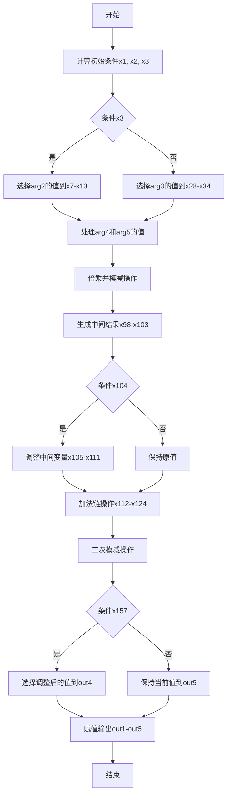

嗯，我需要画这个Zig函数的流程图。首先，我得理解这个函数在做什么。看起来像是一个divstep函数，可能用于椭圆曲线密码学中的模逆运算，比如在P384曲线上。函数有很多参数，out1到out5，以及arg1到arg5。函数内部有很多变量和操作，比如addcarryxU64、subborrowxU64、cmovznzU64这些函数，可能涉及到大数的算术运算和条件选择。

首先，我需要理清函数的整体结构。函数开始处理arg1和arg2、arg3之间的关系，可能是在进行某种条件判断或者交换。然后有一系列的cmovznzU64调用，根据条件x3来选择不同的值。这可能是在处理模运算中的条件分支，比如根据某个位是否为1来决定是否取反或者保持原值。

接下来，有很多的加法和减法运算，可能是在进行大数的加减操作，处理进位和借位。然后有一些位操作，比如移位和按位与，可能是在调整数的表示形式或者处理模数的特性。

中间部分可能涉及到模数的减法，比如subborrowxU64操作，可能是为了确保结果在模数范围内。之后又有cmovznzU64，根据之前的条件调整结果。最后，将结果赋值给out1到out5。

为了画流程图，我需要分块处理。首先，处理初始的条件判断和变量初始化，然后处理主要的算术运算，包括加减、进位处理，接着处理条件选择和结果调整，最后输出结果。

可能的分块：
1. 初始条件计算，如计算x1, x2, x3。
2. 根据x3选择arg2或arg3的值，生成x7到x13和x28到x34。
3. 处理arg4和arg5，生成x35到x40，并进行倍乘和模减。
4. 生成x98到x103，处理可能的模运算结果。
5. 根据x104调整中间变量，进行加法操作。
6. 最后的减法操作，调整结果，并使用cmovznzU64选择最终输出。
7. 将结果赋值给输出参数。

在流程图中，每个主要步骤作为一个节点，条件判断作为分支，操作用矩形框表示，条件判断用菱形框表示，箭头表示流程方向。可能需要处理多个并行的操作，比如同时处理多个数组元素，这时候可以用并行处理的分支。

需要注意的是，Zig中的函数可能涉及到低级的位操作和精确的溢出处理，这在流程图中需要适当简化，突出主要逻辑。例如，连续的addcarryxU64和subborrowxU64可能可以合并表示为一个大的加法或减法步骤，而具体的进位处理可以简化为进位标志的传递。

另外，cmovznzU64函数根据条件选择值，这相当于条件赋值，可以在流程图中用条件分支表示，选择不同的路径更新变量。

最后，函数的输出部分将处理后的变量赋值给out1到out5，这在流程图中作为终止节点，输出结果。

总结一下，流程图的大致步骤是：
- 初始化条件和变量选择
- 主要的算术运算（加减、进位处理）
- 条件调整和结果选择
- 输出结果

需要将这些步骤用合适的图形符号表示，并连接起来，确保逻辑正确。
================================================
