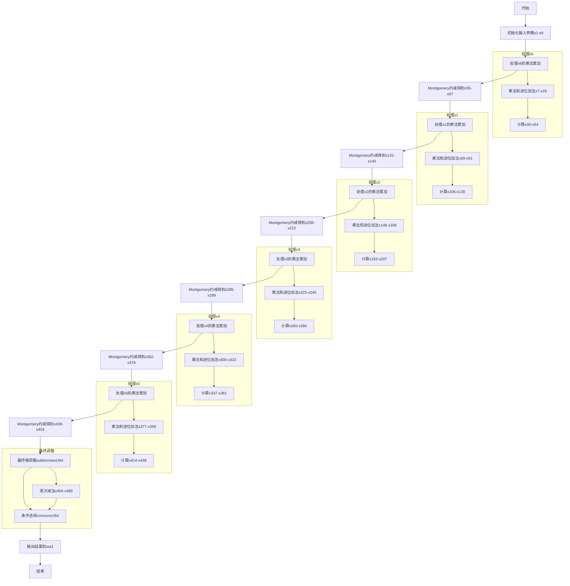

嗯，我现在要画这个Zig函数的流程图。首先，我得先理解这个函数是做什么的。看起来像是一个椭圆曲线加密相关的函数，特别是P-384曲线的平方运算，因为文件名里有p384。函数名是square，接受Montgomery域的两个参数，输出结果到out1。

首先，函数一开始定义了一些变量，比如x1到x6，都是从输入参数arg1中取出来的，可能对应不同的位或部分。然后有很多mulxU64和addcarryxU64的调用，这些应该是进行乘法和进位加法的操作。mulxU64可能是无符号64位乘法，返回高位和低位的结果。addcarryxU64则处理进位加法，记录进位标志。

接下来，函数中有多次类似的模式：先进行一系列乘法和累加，然后乘以一个常数0x100000001，接着进行更多的乘法和模约减操作，可能是在进行Montgomery约减。每次处理完一部分后，会更新一系列的变量，然后进入下一轮的处理，直到最后的部分。

然后，在函数末尾有一些subborrowxU64和cmovznzU64的调用，这可能是最后的模运算，确保结果在正确的范围内。如果减法导致借位，就选择原来的值，否则用减后的值，这样结果就不会溢出。

现在要画流程图的话，应该分步骤：

1. 初始化部分：读取输入参数到x1-x6。
2. 第一轮乘法累加：处理x6与arg1各个元素的乘法，生成x7到x29。
3. 进行Montgomery约减：使用0x100000001作为模数，计算x30到x54，并更新结果到x55到x67。
4. 接下来的每一轮处理x1到x5，每一轮都进行类似的乘法、累加、Montgomery约减步骤。每一轮的结构类似，处理不同的输入元素，比如x1对应生成x69到x91，然后约减到x92到x145，依此类推。
5. 处理完所有轮次后，最后的模运算处理：使用subborrowxU64进行减法，检查是否需要调整结果，然后用cmovznzU64选择正确的值，将结果存入out1。

流程图的结构可能是一个循环处理每个输入元素（x6, x1, x2, x3, x4, x5），每一轮的结构类似，但处理的数据不同。每个轮次内部包括乘法、累加、进位处理、约减，然后进入下一轮。最后进行最终的模调整。

需要注意每个轮次之间的数据依赖关系，比如前一轮的输出作为下一轮的输入。比如，第一轮处理x6后，得到的结果作为处理x1时的基础，依此类推。

可能的结构图：

开始 -> 读取输入 -> 处理x6 -> 约减 -> 处理x1 -> 约减 -> 处理x2 -> 约减 -> 处理x3 -> 约减 -> 处理x4 -> 约减 -> 处理x5 -> 约减 -> 最终模调整 -> 输出结果。

每个处理步骤内部有详细的乘法、累加、进位处理步骤，但流程图中可能不需要展开到每一行代码，而是概括每个主要步骤。

另外，最后的subborrowxU64和cmovznzU64部分需要处理可能的减法溢出，决定是否使用调整后的值或原值。这部分可能是一个条件判断流程，根据借位标志来选择结果。

总结起来，流程图的大致步骤是：

1. 初始化输入参数。
2. 对每个输入元素（按顺序x6, x1, x2, x3, x4, x5）进行乘法和累加操作。
3. 每次乘法累加后进行Montgomery约减。
4. 最后进行整体的模减法调整，确保结果在模数范围内。
5. 输出结果到out1数组。

在Mermaid图中，可以用多个子流程块表示每个处理阶段，并用箭头连接表示流程顺序。每个处理阶段内部可能有多个操作，比如乘法、累加、进位处理，但为了简洁，可以合并成一个步骤。
================================================
