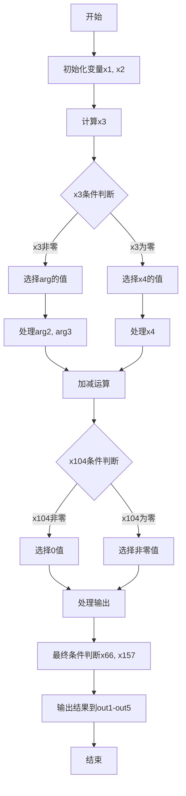

嗯，我现在需要理解这个用Zig编写的函数，并为它画一个流程图。首先，这个函数的名字是divstep，接受多个指针参数作为输出，还有一些输入参数。看起来像是处理椭圆曲线加密中的某种运算，特别是p384曲线的标量运算。函数内部有很多变量和操作，看起来有点复杂。

首先，我应该看看这个函数的大体结构。函数一开始设置运行时安全检查，然后定义了很多局部变量，接着是一系列的addcarryxU64和cmovznzU64操作。这些函数可能用于处理大整数的加减和条件移动操作。然后是大量的算术运算，包括加法、减法、条件移动，还有一些位移操作。

接下来，我需要理清函数的执行流程。可能这个函数实现了某种迭代算法，比如扩展欧几里得算法或者Montgomery梯子，用于计算模逆或者其他标量运算。divstep这个名字可能指的是一个“division step”，可能类似于计算最大公约数时的步骤。

让我尝试分解函数的各个部分：

1. 函数开始处，计算x1和x2，可能是计算某个补码或者进行某种初始化。
2. 然后根据条件x3（由x1的最高位和arg3[0]的最低位决定）来选择不同的值，这里用到了cmovznzU64，条件移动指令。
3. 接下来有很多条件移动操作，根据x3来设置x6到x13的值，可能是选择不同的寄存器值。
4. 然后计算一系列的addcarryxU64和subborrowxU64，处理大数的加减运算，可能是在进行模运算或者调整中间结果。
5. 中间还涉及到对arg4和arg5数组的操作，同样使用条件移动，可能是在处理模数的不同部分。
6. 后面有多个条件分支，根据不同的条件（如x3、x104、x66、x157等）来移动不同的值到输出变量中。
7. 最后，将结果写入out1到out5这些输出参数中。

为了画流程图，我需要将主要的步骤模块化，并确定每个步骤之间的条件分支和数据流动。可能需要分为几个阶段：

- 初始化阶段：计算初始变量，如x1到x3。
- 条件选择阶段：根据x3的值选择不同的操作路径。
- 加减运算阶段：处理大数的加减，可能涉及进位和借位。
- 条件移动阶段：根据不同的条件选择不同的值。
- 结果处理和输出阶段：将最终结果写入输出参数。

可能需要考虑循环结构，但看起来这个函数可能是一个单步操作，而不是循环，因为所有的操作都是线性的，没有明显的循环语句。但divstep通常是在一个循环中多次调用的步骤，所以这个函数可能代表一个单独的步骤。

在画流程图时，每个主要操作可以作为一个节点，条件判断作为分支点，箭头表示流程的方向。例如，条件x3决定是否选择arg1还是x4，这可能对应一个判断框，然后分为两个分支，每个分支处理不同的变量赋值。

此外，处理进位和借位的操作可能需要特别的注意，因为它们会影响后续的计算步骤。例如，addcarryxU64不仅计算和，还产生进位标志，这个进位标志会被下一个加法操作使用。同样，subborrowxU64处理借位。

由于代码中有大量的变量和操作，可能需要将流程图简化，只显示主要的步骤和关键的条件分支，而不是每个变量的操作。否则，流程图会过于复杂，难以理解。

可能的流程如下：

1. 开始
2. 初始化变量，计算x1和x3
3. 根据x3选择不同的路径（条件判断）
4. 进行一系列的加减运算，处理进位和借位
5. 根据中间条件（如x104、x66、x157等）进行更多的条件移动
6. 处理结果，组合输出数组
7. 结束

在具体实现时，可能需要将每个大的代码块转化为流程图的节点，例如：

- 计算x1和x3的块
- 根据x3的条件选择块
- 处理arg2和arg3的条件移动块
- 处理arg4和arg5的条件移动块
- 进行加法和减法运算的块
- 处理进位和借位的块
- 最后的输出赋值块

每个块之间用箭头连接，条件判断用菱形框表示分支。

可能还需要注意函数末尾的out1到out5的赋值，这些是最终的输出结果，需要明确它们的来源是哪些变量。

由于代码非常冗长，可能需要先识别出主要的逻辑部分，然后为每个部分绘制对应的流程图节点。例如，所有的cmovznzU64调用可能属于条件选择部分，而所有的addcarryxU64和subborrowxU64属于算术运算部分。

总结来说，这个函数的流程图可能包含多个条件分支和并行处理路径，因为涉及到多个数组和条件选择。需要仔细分析每个变量的依赖关系和控制流，才能准确绘制流程图。
================================================
