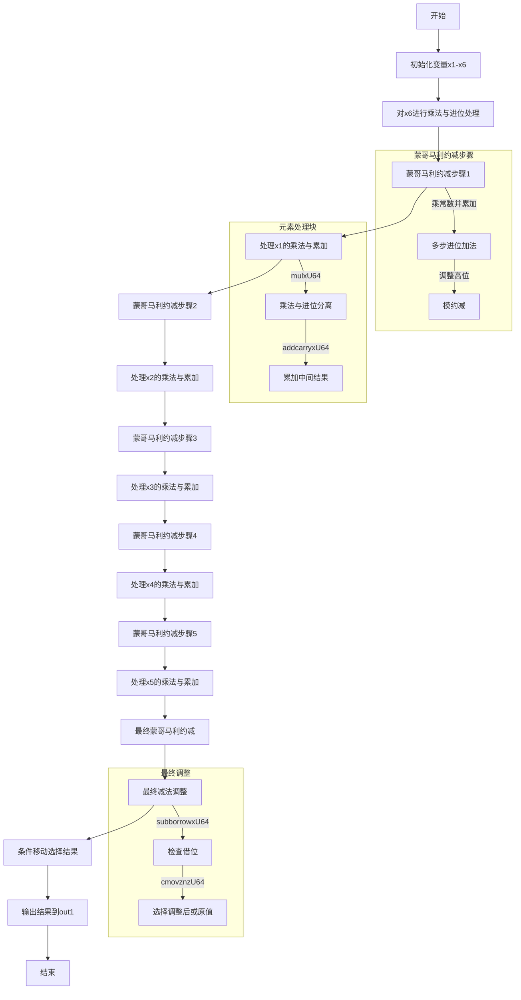

嗯，我需要为这个用Zig编写的P-384椭圆曲线标量乘法函数绘制流程图。首先，我得仔细看一下代码的结构和逻辑。这个函数名为mul，接受三个参数：out1、arg1和arg2，都是MontgomeryDomainFieldElement类型。看起来是进行蒙哥马利域下的乘法运算。

函数开头先禁用了运行时安全检查，只在Debug模式下启用。然后定义了一些变量x1到x6，分别对应arg1的不同元素。接下来使用mulxU64进行无符号64位乘法，并处理进位。每次乘法后，用addcarryxU64处理进位加法。这个过程可能是在计算中间结果的各个部分。

然后，代码中出现了一些常量，比如0x6ed46089e88fdc45，这可能是蒙哥马利约减中用到的常数。随后，重复出现了类似的模式：乘法、进位处理、加法，然后再次进行乘法，可能是在执行蒙哥马利约减步骤，以将结果保持在域内。

接下来，对于每个输入元素（x1到x5），都进行了类似的操作：乘法、累加、进位处理，然后再次应用蒙哥马利约减。最后的部分有一系列的subborrowxU64和cmovznzU64操作，这可能是最终的减法步骤，以确保结果在模数范围内，并根据是否需要借位来选择正确的结果。

现在需要将这些步骤转化为流程图。流程图应该包括开始、初始化变量、循环处理每个输入元素、乘法、进位处理、蒙哥马利约减、最后的减法调整以及输出结果。不过，代码中没有显式的循环结构，而是展开处理每个元素，所以流程图可能需要分步骤展示每个操作。

需要注意的是，代码中存在多个重复的模式，比如对每个xi的处理都是类似的乘法、进位、加法、约减。这可能意味着流程图中会有多个类似的块，每个对应不同的元素。最后的减法步骤可能是一个条件判断，决定是否使用原始值或调整后的值。

可能需要将整个过程分解为几个主要阶段：初始化、主乘法累加循环（展开的）、蒙哥马利约减、最后的模数调整，以及结果输出。每个阶段内的具体操作需要详细展开，尤其是进位处理和条件判断部分。

另外，最后的cmovznzU64函数是根据条件选择值，这对应于流程图中的条件分支，但使用条件移动指令来避免分支预测，这在流程图中可能需要用判断框来表示。

总结起来，流程图的大致步骤可能是：

1. 开始
2. 初始化变量（x1到x6）
3. 对第一个元素（x6）进行乘法和累加
4. 应用蒙哥马利约减
5. 对后续元素（x1到x5）重复步骤3-4，每个元素处理展开
6. 最后的减法调整，处理可能的溢出
7. 使用条件移动选择最终结果
8. 输出结果到out1
9. 结束

每个乘法步骤内部需要展开mulxU64和addcarryxU64的细节，但为了简化流程图，可能将这些操作用一个块表示，注明其功能。同样，蒙哥马利约减部分可能包含多个乘法和加法步骤，可以合并为一个块。

需要注意代码中的变量命名（如x7, x8等）可能对应临时结果和进位，但流程图不需要具体变量名，而是关注操作流程。此外，最后的减法部分需要判断是否需要调整结果，这对应条件判断框。

可能需要多次迭代，确保每个步骤都被正确表示，并且流程图的逻辑与代码一致。尤其是处理每个输入元素时的展开操作，可能需要分块处理每个元素的乘法、累加和约减步骤。
================================================

### 详细说明：
1. **初始化**：提取输入参数`arg1`的各个元素到x1-x6。
2. **乘法与进位处理**：对每个元素（x6, x1, x2, x3, x4, x5）依次进行：
   - 使用`mulxU64`进行64位乘法并分离高位和低位。
   - 用`addcarryxU64`累加结果并处理进位链。
3. **蒙哥马利约减**：在每轮乘法后：
   - 乘以预定义的常数（如`0x6ed46089e88fdc45`）。
   - 通过多步乘法和加法将结果映射到蒙哥马利域。
   - 处理进位并调整高位。
4. **最终调整**：在最后一次约减后：
   - 使用`subborrowxU64`进行模数减法，检查是否需要借位。
   - 通过`cmovznzU64`条件选择最终值，确保结果在模数范围内。
5. **输出**：将调整后的值写入`out1`数组。