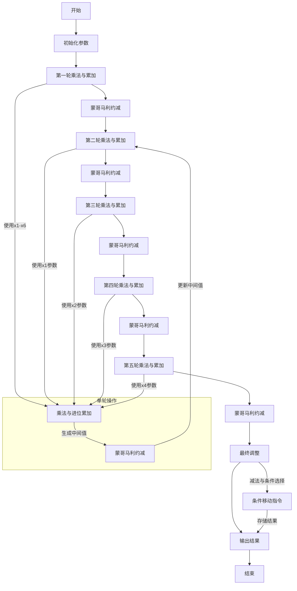

好的，我需要为提供的Zig函数绘制一个流程图。首先，我应该理解这个函数的功能。看起来这是一个用于椭圆曲线密码学的函数，具体来说可能是P-384曲线的标量平方运算。函数名为square，接受两个参数：out1和arg1，都是MontgomeryDomainFieldElement类型，可能代表蒙哥马利域中的元素。

接下来，我需要仔细阅读代码，理解每个步骤的作用。代码中大量使用了mulxU64和addcarryxU64函数，这些可能是用于64位无符号整数的乘法和带进位的加法。代码中还涉及很多中间变量（x1到x473），这可能是为了优化性能而展开的循环或手动管理的中间步骤。

首先，函数开始部分将arg1的元素分配给x1到x6。然后进行一系列的乘法和累加操作，生成x7到x29。接着使用mulxU64进行乘法，并处理进位。之后，有多个阶段（每个阶段可能对应不同的位数或不同的操作数），每个阶段重复类似的模式：乘法、处理进位、累加，然后进行模约减（可能使用蒙哥马利约减）。

在代码的后半部分，特别是从x454开始，有subborrowxU64和cmovznzU64函数，这可能是在进行最终的模减操作，以确保结果在正确的范围内。最后，结果被存储在out1数组中。

绘制流程图时，需要将整个过程分解为几个主要步骤：

1. **初始化**：将输入参数分解为x1到x6。
2. **乘法与累加**：进行多组乘法操作，处理进位，生成中间结果。
3. **蒙哥马利约减**：每个阶段后使用特定的常数（如0x6ed46089e88fdc45）进行模约减。
4. **重复步骤**：对每个输入元素（x1到x5）重复上述乘法、累加和约减步骤。
5. **最终调整**：通过减法处理可能的溢出，使用条件移动指令选择正确的结果。
6. **输出结果**：将最终结果存储在out1数组中。

需要注意每个阶段的相似性，可能需要用循环结构表示，但由于代码是手动展开的，流程图需要详细展示每一步的操作。此外，处理进位和借位的逻辑是关键部分，需要正确表示条件分支。

可能遇到的挑战是如何简化复杂的中间变量和重复的操作，使流程图清晰易懂。可能需要将重复的模式抽象为子流程，并在不同阶段重复使用。此外，正确表示进位和借位的传递是关键，需要确保逻辑正确。

最后，需要验证每个步骤是否符合预期，特别是蒙哥马利约减和最终的模调整步骤，确保流程图准确反映代码的逻辑。
================================================

### 关键步骤说明：
1. **初始化**：将输入参数分解为`x1`-`x6`，对应`arg1`的6个64位元素。
2. **乘法与累加**：
   - 使用`mulxU64`进行64位乘法，分离高位和低位。
   - 通过`addcarryxU64`处理进位链，累加中间结果。
3. **蒙哥马利约减**：
   - 用常数`0x6ed46089e88fdc45`进行模乘。
   - 展开模数`0xffffffffffffffff`和曲线特定常数。
   - 通过进位链调整中间值，确保结果在模数范围内。
4. **循环处理**：对每个输入元素（`x1`到`x5`）重复上述步骤，共5轮。
5. **最终调整**：
   - 使用`subborrowxU64`处理可能的溢出。
   - 通过`cmovznzU64`条件移动指令选择最终值，避免负结果。
6. **输出**：将调整后的值存入`out1`数组，完成平方运算。