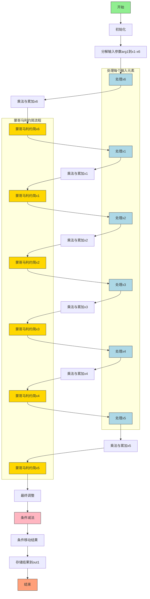

好的，我现在需要为一个用Zig编写的函数绘制流程图。这个函数名为`toMontgomery`，作用是将非Montgomery域的元素转换为Montgomery域的元素。代码看起来涉及大量的64位无符号整数运算，包括乘法、加法、进位处理，以及条件移动操作。对于不熟悉密码学或底层数学运算的人来说，这段代码可能有点难以理解。

首先，我需要理解这个函数的大致流程。根据函数名和参数，它接受一个非Montgomery域的域元素（arg1），处理后输出到Montgomery域的域元素（out1）。通常，将元素转换到Montgomery域涉及到模乘运算，可能使用某种快速算法，比如蒙哥马利约简（Montgomery reduction）。

从代码结构来看，函数内部进行了多次乘法（mulxU64）、带进位的加法（addcarryxU64）、减法（subborrowxU64）和条件移动（cmovznzU64）操作。变量名如x1到x446可能代表中间计算步骤的临时变量。看起来代码是手动优化的，可能使用了展开循环或特定的算法步骤来高效处理大数运算。

接下来，我需要识别代码中的主要步骤。首先，函数将输入参数分解为x1到x6，这可能是输入元素的各个部分。然后进行一系列的乘法和累加操作，生成中间结果。之后，可能涉及到模运算的步骤，例如使用蒙哥马利参数（如0x6ed46089e88fdc45）进行乘法，并对结果进行调整，最后进行条件减法来确保结果在正确的范围内。

为了绘制流程图，我需要将代码分解为几个主要阶段：

1. **初始化阶段**：分解输入参数，初始化变量。
2. **乘法与累加阶段**：进行多次乘法操作，处理进位，累加中间结果。
3. **蒙哥马利约简阶段**：使用特定的模数进行约简，调整中间结果。
4. **条件减法阶段**：处理可能的溢出，确保结果在模数范围内。
5. **结果输出阶段**：将最终结果存储到输出数组中。

在绘制流程图时，需要注意循环或重复的结构，例如处理每个输入元素的部分（x1到x5，x6）。由于代码中没有明显的循环结构，可能每个输入元素都有类似的处理步骤，需要手动展开。

另外，注意到代码中有多个类似的块，比如对x1到x5的处理可能遵循相同的模式，每个变量经过一系列mulxU64和addcarryxU64操作，然后进行蒙哥马利约简。最后一个输入x6可能被单独处理，或者可能在之前的步骤中已经处理过。

在条件移动部分（cmovznzU64），根据减法后的进位标志来决定是否使用减法后的结果或保持原值，这对应于蒙哥马利转换后的最终调整步骤，确保结果小于模数。

可能遇到的挑战包括：

- 理解每个乘法常数的意义，例如0xc84ee012b39bf21等，这些可能是蒙哥马利转换中使用的特定参数，需要参考相关文档或算法。
- 跟踪大量的中间变量，这些变量可能在流程图中需要简化表示，避免过于复杂。
- 确定各个步骤之间的数据流和控制流，特别是进位和借位的处理，这会影响条件分支。

为了简化流程图，可以将重复的步骤合并为一个通用块，并标注循环或迭代次数。此外，使用子流程来表示重复的操作，例如每个输入元素的乘法累加阶段。

总结来说，流程图的大致结构可能如下：

1. 开始
2. 分解输入参数到x1-x6
3. 对每个xi（i从0到5）：
   a. 进行多组乘法操作，生成中间变量
   b. 处理进位，累加结果
   c. 应用蒙哥马利约简
4. 最终调整步骤，包括条件减法
5. 将结果存储到out1数组
6. 结束

需要确保每个步骤之间的箭头正确表示执行顺序，并标注关键操作如乘法、进位处理、约简和条件移动。
================================================

该流程图的关键步骤说明：
1. **输入分解**：将输入参数的6个64位分段分别处理
2. **逐元素处理**：对每个输入分段进行：
   - 多组定点乘法（mulxU64）
   - 带进位累加（addcarryxU64）
   - 蒙哥马利模约简（与特定常数相乘并调整）
3. **最终调整**：
   - 通过条件减法（subborrowxU64）处理溢出
   - 使用条件移动（cmovznzU64）选择最终结果
4. **结果存储**：将调整后的6个分段写入输出数组

蒙哥马利约简模块（黄色背景）是核心计算单元，每个输入分段都需要经过这个标准化处理流程。粉色的条件减法模块确保结果始终在模数范围内。