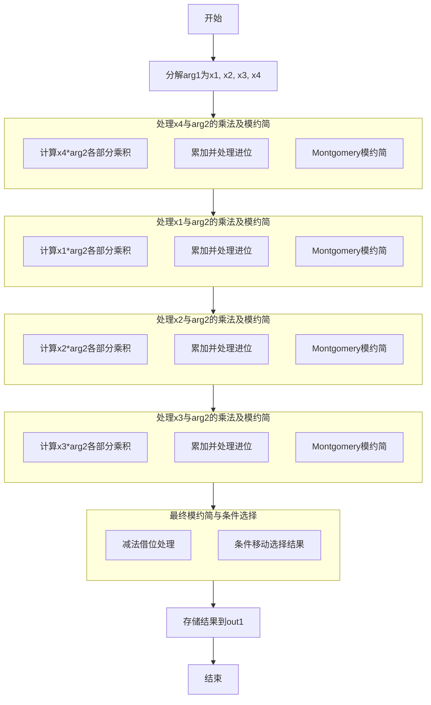

好的，我现在需要为这个Zig语言编写的函数绘制流程图。首先，我需要理解这个函数的功能。看起来这是一个在Montgomery域中进行乘法运算的函数，用于椭圆曲线secp256k1的64位实现。函数名为mul，接受三个参数：输出out1和两个输入arg1、arg2，都是MontgomeryDomainFieldElement类型。

首先，我需要理清代码的结构。代码中多次出现mulxU64和addcarryxU64，这些可能是处理无符号64位整数乘法和带进位的加法。还有cmovznzU64，可能是在条件满足时移动数据的函数。整个函数似乎在进行一系列的乘法和加法运算，然后在最后进行减法借位处理，最终将结果存储在out1中。

接下来，我应该分步骤分析代码。函数的开始部分分解了arg1的元素，然后进行了一系列的乘法和累加操作。每个大的代码块似乎处理不同的乘法步骤，并且可能是在进行Montgomery约简。每次乘法后，都会进行模约简，使用常数0xd838091dd2253531和0xfffffffefffffc2f（这是secp256k1的素数域模数）。

然后，代码中有四个主要的乘法块，分别对应arg1的不同元素（x4, x1, x2, x3）与arg2的各个元素相乘。每个块之后都会进行类似的模约简步骤，包括乘法和加法进位处理。

最后的部分是减法借位处理，使用subborrowxU64，然后根据条件选择结果，最终将四个结果存储到out1中。

为了绘制流程图，我需要将整个过程分解成几个主要步骤：

1. 初始化和参数分解：分解arg1的元素x1, x2, x3, x4。
2. 第一个乘法块：x4与arg2的各个元素相乘，并进行累加和模约简。
3. 第二个乘法块：x1与arg2的各个元素相乘，累加到之前的中间结果，并进行模约简。
4. 第三个乘法块：x2与arg2相乘，同样累加和约简。
5. 第四个乘法块：x3与arg2相乘，累加和约简。
6. 最终的减法借位处理，检查是否超过模数，并进行条件选择。
7. 结果存储到out1。

每个乘法块的结构相似，可能可以归纳为一个循环或重复的模式，但代码中是展开的。因此，流程图需要反映这四个乘法块的顺序执行，每个块后跟一个模约简步骤。

在绘制流程图时，需要注意各个步骤之间的数据依赖关系，尤其是中间变量（如x5到x219）的传递。但为了简化，可能需要抽象每个乘法块为一个过程，突出主要操作而不是每个变量。

最后，减法借位和条件选择部分需要处理可能的溢出，并确定最终结果是否在模数范围内，从而决定是否使用减法后的值或原始值。

可能遇到的挑战是处理大量的中间变量和进位标志，但流程图应尽可能简洁，突出主要步骤而不是每个操作。需要确认每个乘法块的结构是否一致，以便在流程图中用重复的结构表示。

总结流程图的大致步骤：

开始
分解arg1为x1, x2, x3, x4
处理x4的乘法与约简
处理x1的乘法与约简
处理x2的乘法与约简
处理x3的乘法与约简
最终的模约简和条件选择
存储结果到out1
结束

每个处理步骤内部包括乘法、累加、进位处理、模乘和调整。最后的减法借位用于确保结果在模数范围内，若结果大于等于模数，则减去模数。
================================================
