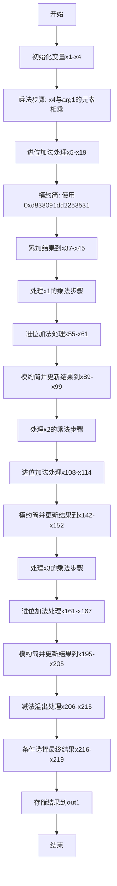

嗯，我现在需要理解这段Zig代码，并画出它的流程图。首先，这个函数叫做square，属于Montgomery域中的元素平方运算。函数参数是out1和arg1，都是MontgomeryDomainFieldElement类型的。看起来是进行某种大数运算，可能与椭圆曲线secp256k1相关，因为文件名提到了这个曲线。

首先，代码里有很多变量定义，比如x1到x219，这可能是中间计算步骤的结果。很多地方使用了mulxU64和addcarryxU64这样的函数，应该分别是无符号64位乘法和带进位的加法。还有cmovznzU64，可能是有条件移动指令，根据条件选择不同的值。

函数的结构可能分为几个步骤：首先进行一系列的乘法和加法运算，然后进行模约简，最后处理进位或者溢出，将结果存储到out1中。因为Montgomery乘法通常包括将结果转换回原域，所以可能会有乘法和模约简的操作。

接下来，我需要理清代码的流程。首先，函数开始提取arg1的元素x1到x4。然后进行四次mulxU64，分别对应不同的元素相乘，比如x4和arg1[3]、arg1[2]等。每次乘法后，使用addcarryxU64进行累加，处理进位。这部分可能是在计算原始乘积。

然后，代码中出现了一个常数0xd838091dd2253531，这可能是Montgomery约简中用到的常数，用来进行模运算。接下来又进行一系列的乘法和加法，可能是在进行模约简的步骤，将结果调整到正确的范围内。

之后，类似的步骤重复了四次，每次处理不同的元素（x1、x2、x3），每次都会进行乘法、加法、模约简，并处理进位。这可能是在处理不同位数的乘积，逐步累加结果。

最后的部分是subborrowxU64，用来处理可能的减法溢出，然后使用cmovznzU64根据条件选择结果，确保结果在正确的模范围内。最终将四个元素x216到x219存入out1数组。

为了画出流程图，应该按照函数的执行顺序分块处理。首先初始化变量，然后进行多精度乘法，接着进行模约简，处理进位，循环处理每个元素，最后进行条件移动得到最终结果。每个主要步骤可以作为一个流程节点，循环部分可能需要循环结构表示。

需要注意的是，代码中有四次大的循环结构，分别处理x1、x2、x3的乘法，这可能在流程图中表现为重复的步骤。每次处理一个元素，进行乘法、加法、模约简，然后处理进位，再进入下一个元素的处理。

最终，流程图应该包括：开始、初始化变量、乘法步骤、模约简步骤、进位处理、循环处理每个元素、减法溢出处理、条件选择结果、存储结果到out1，结束。
================================================
