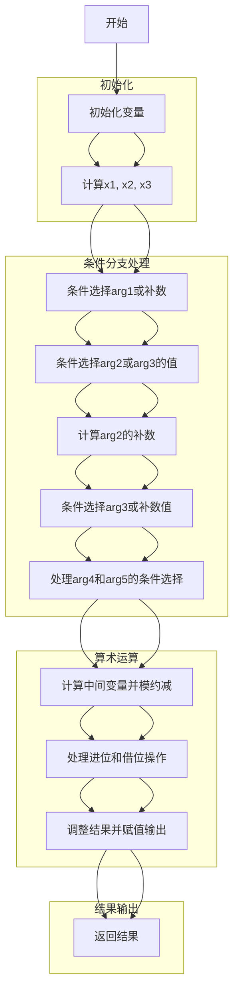

嗯，我需要画这个Zig函数的流程图。首先，这个函数叫做divstep，有很多参数和局部变量。看起来它处理的是椭圆曲线secp256k1的标量运算。不过我对Zig语言不是特别熟悉，但大概能看懂代码的结构。

首先，函数参数有out1到out5，都是指针或数组，作为输出参数。输入参数包括arg1和一些数组arg2到arg5。函数体里有很多变量声明，比如x1到x126，中间有很多addcarryxU64和cmovznzU64的调用，这些可能是处理进位和条件移动的操作。

我需要先理清代码的主要流程。可能这个函数是在执行某种循环或迭代的步骤，因为divstep可能指的是division step，可能和扩展欧几里得算法有关，用于计算模逆或者类似的运算。不过具体的数学细节可能不需要深入，但流程结构是关键。

首先，函数开始计算x1和x2，通过addcarryxU64计算~arg1 + 1，这可能是取补操作。然后x3是根据x1的高位和arg3[0]的最低位来决定的标志位。接着，通过cmovznzU64根据x3选择不同的值，这可能是在做条件判断后的变量赋值。

接下来有很多类似的步骤，计算各种中间变量，并进行条件移动。例如，x6到x11是根据x3选择arg2或arg3的元素。然后计算x12到x20，看起来是计算arg2数组的补数，可能用于减法运算。

之后，再次使用cmovznzU64来设置x22到x26，根据x3选择arg3或之前计算的补数。然后处理arg4和arg5，同样有条件和进位操作。

中间有一些位操作和进位处理，比如addcarryxU64和subborrowxU64，这些可能是在处理大整数的加减运算。例如，x31到x38是对x27到x30进行左移一位（即乘以2），然后减去一个常数（0xbfd25e8cd0364141等），这可能是在模约减步骤。

之后的部分涉及更多的条件移动和进位处理，可能是在调整中间结果以满足模数的约束。最后，将结果赋值给out1到out5的各个位置。

为了画流程图，我需要将这些步骤分解成块。可能的步骤包括：

1. 初始化步骤：计算初始条件，如补数、条件标志。
2. 条件选择：根据x3选择不同的参数路径。
3. 补数计算：处理arg2的补数。
4. 中间变量处理：各种加减和进位操作。
5. 模约减步骤：减去特定常数并进行条件调整。
6. 结果输出：将最终结果赋值给输出参数。

每个步骤之间通过条件判断（如cmovznzU64）连接，可能形成分支。但整体流程可能是一个线性处理，中间带有条件赋值，而不是典型的分支结构，因为函数体中没有明显的循环或if-else结构，而是通过条件移动来选择值。

因此，流程图可能是一个从上到下的流程，每个步骤处理一部分变量，通过条件选择不同的路径，最终输出结果。可能需要将每个大的操作块分开，并用箭头表示数据流向，特别是条件移动和进位如何影响后续步骤。
================================================

### 关键步骤说明：
1. **初始化**：计算初始补数`~arg1 + 1`并生成条件标志`x3`。
2. **条件选择**：通过`cmovznzU64`选择`arg1`或补数路径，并选择`arg2/arg3`的值。
3. **补数计算**：对`arg2`的每个元素取补数用于后续运算。
4. **模约减**：通过加减和借位操作处理中间变量，并减去secp256k1的模数常量。
5. **结果调整**：根据条件标志调整最终结果并赋值给`out1-out5`。
6. **输出**：将处理后的值写入输出参数，完成函数逻辑。