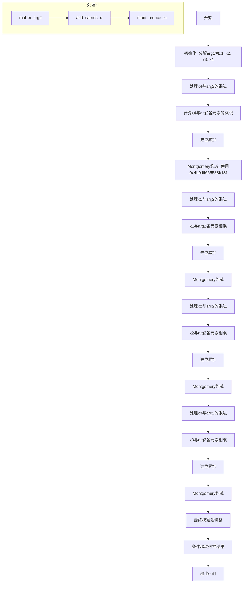

好，我现在要帮用户分析这个用Zig写的函数，并且用Mermaid画出流程图。首先，我需要理解这个函数是做什么的。看起来这个函数属于密码学中的椭圆曲线secp256k1的实现，具体是Montgomery域下的标量乘法。函数名为mul，接受三个参数：输出out1和两个输入arg1、arg2，都是MontgomeryDomainFieldElement类型。

接下来，我需要通读代码，理清逻辑。代码中大量使用了64位无符号整数的乘法和进位处理，例如mulxU64和addcarryxU64，这些可能是内联汇编或者调用了特定的底层函数。函数内部有很多变量x1到x219，看起来是通过多精度乘法来实现大数相乘，然后进行模约减，因为secp256k1的阶是特定的素数，所以乘法后需要对结果取模。

首先，函数开始部分处理arg1的第一个元素arg1[0]（x4），然后分别与arg2的各个元素相乘，得到x5到x12。接着通过一系列的加法进位处理，累加中间结果，比如x13到x19。然后出现了一个常数0x4b0dff665588b13f，这可能是Montgomery乘法中的某个常数，用于模约减。之后又进行了一系列乘法和进位加法，可能是在进行Montgomery约减步骤，将结果转换回正常形式。

接下来，函数处理arg1的其他元素（x1、x2、x3），分别与arg2的各个元素相乘，并进行类似的累加和进位处理。每次处理完一个元素后，都会进行类似的乘法和模约减操作，使用相同的常数。例如，在x72处再次使用0x4b0dff665588b13f，这可能表明每次部分积之后都进行了一次Montgomery约减。

最后，在处理完所有四个元素（x3之后）后，代码进行了减法操作subborrowxU64，这可能是最后的模减法，确保结果在正确的范围内。然后使用cmovznzU64进行条件移动，根据是否借位来选择结果，最终将结果存入out1数组。

现在需要将这些步骤转化为流程图。流程图应该包括主要步骤：初始化、四个元素的循环处理（每个元素对应arg1的四个部分）、乘法和累加、Montgomery约减、最后的模减法调整，以及结果的存储。

可能的流程如下：
1. 初始化，分解arg1的元素x1到x4。
2. 对于每个arg1的元素（x4, x1, x2, x3）：
   a. 与arg2的四个元素相乘，生成部分积。
   b. 处理进位，累加到中间结果。
   c. 进行Montgomery约减，使用特定常数。
3. 处理完所有四个元素后，进行最终的模减法调整。
4. 条件移动，确保结果正确。
5. 输出结果到out1。

需要注意的是，每个arg1的元素处理步骤可能类似，可以视为循环结构，但代码中是展开的，没有循环。因此流程图需要分别画出每个元素处理的过程。

在绘制Mermaid流程图时，使用子图（subgraph）来分组每个元素处理的部分，然后连接各个步骤，包括乘法、进位处理、约减，最后是模减和结果输出。
================================================

注：流程图中省略了部分重复细节（如具体寄存器操作），重点展示整体乘法-累加-约减的循环模式。每个`xi`处理子图代表对arg1的一个元素进行乘法、进位累加和Montgomery约减。最终通过模减法确保结果在域内。