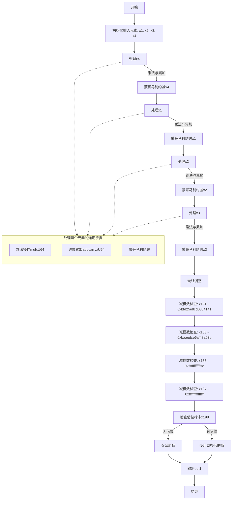

嗯，我现在需要理解这个用Zig写的函数，并画出它的流程图。首先，函数名为toMontgomery，看起来是将一个非蒙哥马利域的元素转换为蒙哥马利域的元素。这可能涉及到椭圆曲线加密中的运算，特别是secp256k1曲线。

首先，我注意到函数接受一个NonMontgomeryDomainFieldElement作为输入，输出到MontgomeryDomainFieldElement。参数arg1是一个数组，可能由四个u64组成，因为代码中引用了arg1[0]到arg1[3]。输出out1也是四个u64的数组。

接下来，函数内部有很多的变量定义和操作，比如mulxU64（可能是乘法并返回高位和低位的结果）、addcarryxU64（带进位的加法）、subborrowxU64（带借位的减法），以及cmovznzU64（条件移动指令，根据条件选择值）。这些操作通常是用于大数运算，特别是模运算，比如在有限域中的运算。

代码结构看起来是分阶段处理输入的每个元素（x4, x1, x2, x3），每个阶段都进行一系列的乘法和累加操作，然后进行模约减。例如，首先处理x4，然后x1，接着x2，最后x3。每个阶段可能会有类似的模式：乘法、累加、然后进行蒙哥马利约减。

例如，在处理x4的时候，代码执行了多次mulxU64，然后进行一系列的addcarryxU64来累加结果。接着，使用mulxU64和一些常量（如0x4b0dff665588b13f）进行乘法，这可能与蒙哥马利常数有关。然后再次进行累加，并处理进位。之后，类似的步骤在处理x1、x2、x3时重复，每次处理一个输入元素，并更新中间结果。

在最后的阶段，处理完x3后，进行了多次subborrowxU64操作，这可能是为了进行模减法，确保结果在正确的范围内。然后使用cmovznzU64来选择是否需要调整结果，以避免负数或超出模数的情况。

为了画流程图，我需要将每个主要步骤分解成块，并确定它们之间的流程。可能的步骤如下：

1. 初始化：获取输入arg1的各个元素x1, x2, x3, x4。
2. 对每个输入元素进行处理：
   a. 乘法操作，生成中间结果。
   b. 累加中间结果，处理进位。
   c. 蒙哥马利约减，使用特定的常量和模数。
3. 循环处理所有输入元素（x4, x1, x2, x3）。
4. 最终调整：进行减法操作，检查是否需要调整结果。
5. 输出结果到out1。

每个主要处理块可能包含多个步骤，比如乘法、进位处理、条件移动等。需要注意的是，代码中对每个输入元素（x4, x1, x2, x3）的处理可能都是类似的，因此在流程图中可能会有四个类似的块，或者一个循环结构。但根据代码中的变量命名，看起来是分别处理每个元素，而不是循环，因此可能需要四个不同的处理阶段。

此外，最后的减法步骤可能是一个条件调整，如果结果超过了模数，则减去模数，否则保持不变。这里使用了subborrowxU64来检测借位，然后根据条件选择是否保留调整后的值。

总结流程图的大致结构：

开始
|
初始化输入元素x1, x2, x3, x4
|
处理x4：
   - 乘法与常量
   - 累加与进位处理
   - 蒙哥马利约减
|
处理x1：
   - 类似x4的步骤
|
处理x2：
   - 类似步骤
|
处理x3：
   - 类似步骤
|
最终调整：
   - 四次减法检查
   - 条件移动选择正确值
|
输出结果到out1
结束

可能需要更详细地展开每个处理阶段，特别是乘法、累加、约减的具体步骤。例如，在每次处理输入元素时，先进行四次mulxU64（对应不同的常量），然后进行三次addcarryxU64来累加结果。接着使用另一个乘法（如x19, x67等）进行蒙哥马利约减，再进行累加和进位处理。每个阶段的结构可能相似，但使用的变量和常量不同。

在流程图中，每个处理阶段可能包括多个操作，如乘法、进位加法、存储中间结果等。最后的调整阶段需要判断是否需要减去模数，这可能涉及到多个subborrow步骤，然后根据借位标志决定是否使用调整后的值。

可能需要用条件判断框来表示最后的调整步骤，根据借位标志选择不同的路径。例如，如果借位发生（即结果需要调整），则选择减法后的值，否则保留原值。

总的来说，流程图需要反映代码中的数据处理步骤，包括乘法、加法、进位处理、约减以及最终的调整步骤。每个主要操作作为一个流程块，箭头表示执行顺序，条件判断用于选择不同的路径。
================================================

### 流程图说明：
1. **初始化**：提取输入的四个64位整数（x1, x2, x3, x4）。
2. **分阶段处理**：对每个输入元素（x4→x1→x2→x3）依次进行：
   - **乘法与累加**：通过`mulxU64`计算高位和低位，并通过`addcarryxU64`处理进位。
   - **蒙哥马利约减**：使用特定常量（如`0x4b0dff665588b13f`）进行模约减。
3. **最终调整**：通过四次`subborrowxU64`检查结果是否超过模数：
   - 若借位标志（x198）为真，说明结果需要调整，使用减法后的值。
   - 若为假，保留原值。
4. **条件选择**：通过`cmovznzU64`指令选择最终结果。
5. **输出**：将调整后的值写入`out1`数组。